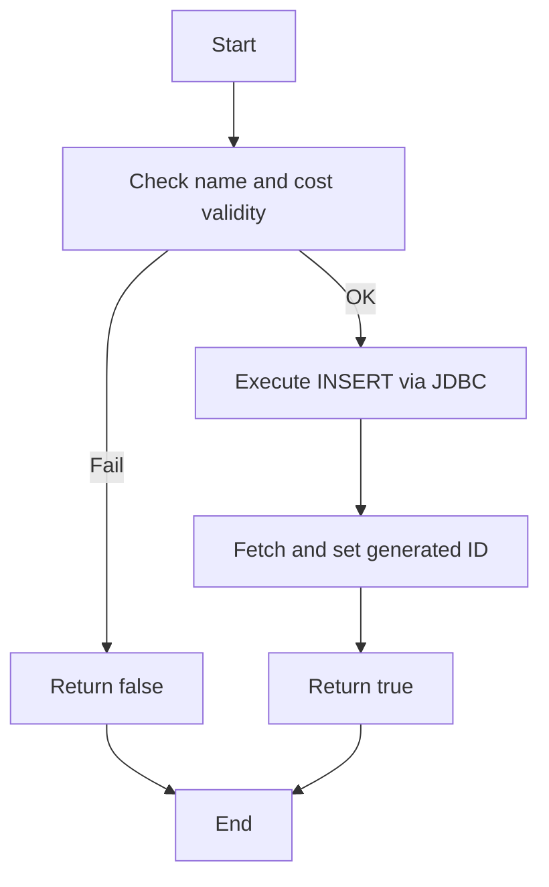
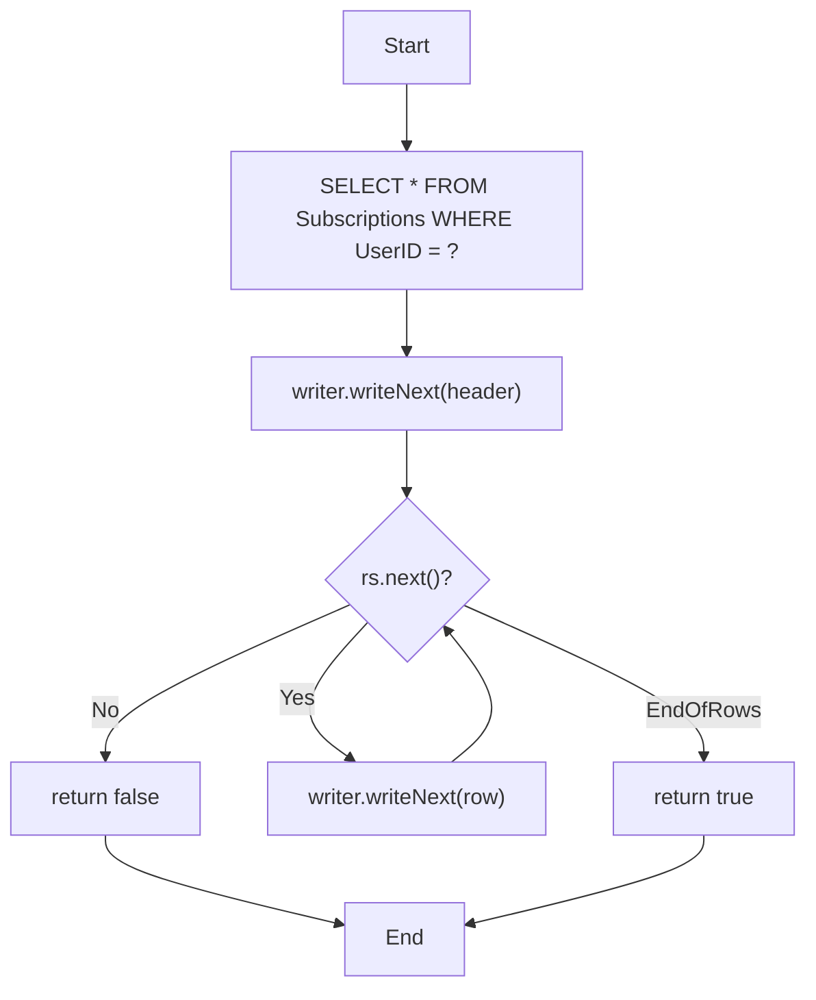
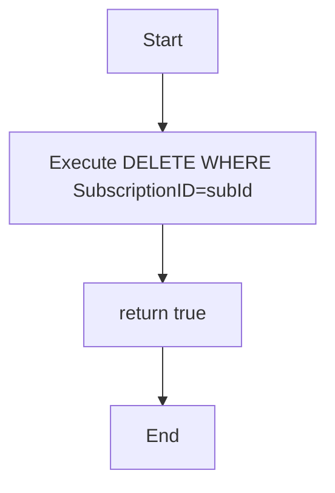
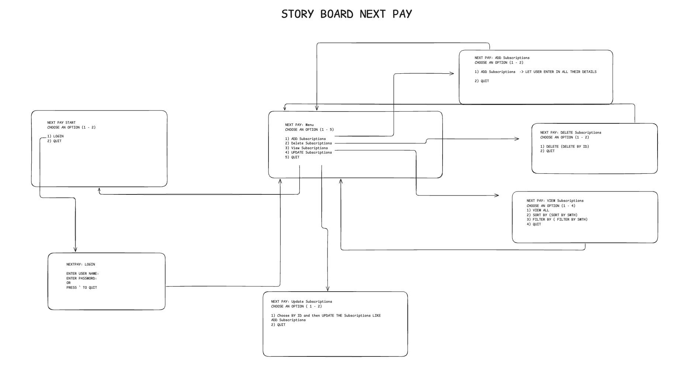

# NextPay: Your Subscriptions, Simplified

Hashir Owais ( 200483044)  
Muhammad Tariq (200464392) 
Simran Gahra (200484408)  

  

## Table of Contents

1. [Introduction](#1-introduction)  
2. [Design Problem](#2-design-problem)  
   2.1 [Problem Definition](#21-problem-definition)  
   2.2 [Design Requirements](#22-design-requirements)  
   - 2.2.1 [Functions](#221-functions)  
   - 2.2.2 [Objectives](#222-objectives)  
   - 2.2.3 [Constraints](#223-constraints)  
3. [Solution](#3-solution)  
   - 3.1 [Solution 1](#31-solution-1)  
   - 3.2 [Solution 2](#32-solution-2)  
   - 3.3 [Final Solution](#33-final-solution)  
     - [Components](#components)  
     - [Features](#features)  
     - [Environmental, Societal, Safety, and Economic Considerations](#environmental-societal-safety-and-economic-considerations)  
     - [Limitations](#limitations)  
4. [Team Work](#4-team-work)  
   - [Meeting 1](#meeting-1)  
   - [Meeting 2](#meeting-2)  
   - [Meeting 3](#meeting-3)  
   - [Meeting 4](#meeting-4)  
5. [Project Management](#5-project-management)  
6. [Conclusion and Future Work](#6-conclusion-and-future-work)  
7. [References](#7-references)  
8. [Appendix](#8-appendix)  

---

## 1. Introduction

In today's digital age, managing multiple subscription services - such as streaming platforms, cloud storage, productivity tools, and fitness memberships - can be challenging and often leads to overlooked renewals, unexpected charges, and limited financial oversight. Many users lack a simple and effective way to track these recurring expenses, resulting in financial inefficiencies and missed opportunities to optimize spending.

To address this need, our project, **NextPay**, introduces a Java-based Command-Line Interface (CLI) application that centralizes the tracking and management of user subscriptions. Developed as part of the ENSE 375 Software Testing and Validation course, NextPay emphasizes rigorous test-driven development (TDD) using Java and JUnit, with all data securely stored locally via SQLite.

The application's design supports key features such as adding and removing subscriptions, filtering and sorting, cost calculations, renewal reminders, and CSV export/import. These features not only streamline subscription management but also serve as practical domains for applying systematic software testing methodologies required by the course, including boundary value, equivalence class, state transition, and use case testing.

The sections that follow in this report detail the design problem and requirements, document alternative and final solutions, explain team collaboration and management practices, and summarize testing approaches and project outcomes. This structure provides a comprehensive overview of our engineering and testing process, ensuring both practical effectiveness and alignment with ENSE 375 objectives.

---

## 2. Design Problem

### 2.1 Problem Definition

With the growing reliance on digital services, individuals increasingly subscribe to multiple platforms including streaming services, cloud storage, productivity tools, and fitness memberships. Managing these subscriptions manually often leads to challenges such as overlooked renewal dates, forgotten free trials, redundant services, and unexpected charges. These issues not only result in financial inefficiencies but also reduce user control over personal finances.

The goal of this project is to design and implement a Subscription Tracking Application that centralizes the management of recurring subscriptions. The application will allow users to input and monitor their active subscriptions, receive notifications for upcoming payments or trial expirations, and gain insights into their recurring spending patterns. By streamlining subscription oversight, the application aims to enhance financial awareness, reduce unnecessary expenditures, and provide a user centric solution to a common modern problem.

### 2.2 Design Requirements

#### 2.2.1 Functions

The Subscription Tracking Application will include a set of core features aimed at simplifying subscription management for users:

- **Add and remove subscriptions**  
  Users are be able to easily add new subscriptions by entering details such as name, cost, billing, and renewal date. Subscriptions that are no longer needed are removable with a simple command.

- **View previous subscriptions**  
  Users can access a history of previously tracked subscriptions, in turn helping in analyzing long-term expenditure.

- **Sorting feature**  
  Subscriptions can be sorted based on the defined criteria to improve organization and readability.

- **Filtering feature**  
  Users will be able to filter subscriptions by dates and costs.

- **Calculate total/monthly/yearly cost**  
  The system will automatically calculate and display the total cost of all active subscriptions, broken down by monthly and yearly values.

- **Exporting to a CSV**  
  Users can export their subscription data Excel formats, enabling easy backup.

#### 2.2.2 Objectives

- **User-friendly**  
  The system should be intuitive and simple to use, even for users with limited technical background.

- **Efficient**  
  Features should execute quickly, with minimal input required to perform essential actions like adding or updating a subscription.

- **Reliable**  
  The application must function consistently and correctly, maintaining data accuracy and stability throughout use.

- **Functioning**  
  All features described in the design must be implemented fully and operate as expected in real-world scenarios.

- **Passes software tests**  
  The system should be validated through unit testing to ensure that all components work as intended and handle edge cases properly.

#### 2.2.3 Constraints

- **Limited development and testing experience**  
  The team has limited prior experience with Java and formal software testing, which may affect implementation depth and testing coverage.

- **Application must be developed in a Java-based environment**  
  The entire application must be developed using Java, and all testing must be conducted with the JUnit framework to meet project requirements.

- **Must follow systematic testing principles**  
  All testing must follow the systematic testing principles and be integrated throughout the development lifecycle. The following testing methodoligies must be applied where applicable:
  - Boundary Value Testing
  - Equivalence Class Testing
  - Decision Tables Testing
  - State Transition Testing
  - Use Case Testing 
  - Integration Testing 
  
  In addition to these, **Path Testing** and **Data Flow Testing** must also be employed for certain individual functions.

- **All data must be stored locally**  
  The application will store all user and subscription data on the local machine - no external or cloud storage is permitted.  

---

## 3. Solution

This section details various brainstormed solutions, their testing potential, and the rationale for the final choice.
Testing

### 3.1 Solution 1 (Web Application)

Our first proposed solution involved building a full-stack web application with the following architecture:
  -    Frontend: React.js
  -    Backend: Java Spring Boot
  -    Database: PostgreSQL
  -    ORM: Hibernate
  -    Deployment: AWS Infrastructure

While this solution provided a scalable, modern, and user-friendly platform, it introduced substantial complexity in terms of testing. To properly validate this architecture, we would have required multiple testing tools and strategies:
  -    UI Testing using Jest, Selenium, or React Testing Library
  -    Backend API Testing with Spring Boot Test, Postman, and Mockito
  -    Database Integration Testing using containers (e.g., TestContainers)
  -    End-to-End Testing to validate full workflows

Due to this layered complexity, conducting focused JUnit-based unit testing on the core logic became more difficult and would detract from meeting the course’s emphasis on systematic, isolated testing techniques such as:
  -    **Boundary Value Testing**
  -    **Equivalence Class Testing**
  -    **Use Case Testing**

Furthermore, setting up and validating test environments across frontend, backend, and deployment layers would significantly slow down development. Given the limited timeframe and scope of ENSE 375, we decided not to proceed with this solution.

### 3.2 Solution 2 (Mobile Application)
The second idea was to build a mobile application using either React Native or Android Studio (Java/Kotlin). This would provide an intuitive interface and better portability for users.

However, similar to solution 1 this design came with its own testing challenges:
- Testing across multiple devices and operating systems reduces repeatability.
- UI workflows would rely on tools like Espresso or Detox, which are out of scope for this project.
- Core logic would still require JUnit testing, but isolating logic from UI in mobile development adds extra overhead.
- Integration and state validation are harder to automate due to simulator/emulator reliance.

This architecture limited our ability to apply structured testing techniques, particularly:
- Performing boundary and equivalence class testing without direct access to raw data inputs
- Executing repeatable use case tests in a headless/automated way

Since ENSE 375 places strong emphasis on test-driven development using JUnit and clear, structured testing strategies, this solution did not align well with our goals. We therefore chose not to implement the mobile architecture.

 
### 3.3 Final Solution

After evaluating the web and mobile application designs, we selected a Command-Line Interface (CLI) Java Application with an SQLite local database as our final solution. This decision was driven primarily by the project’s focus on test-driven development (TDD) using Maven and structured testing techniques such as:
  - Boundary value testing
  - Equivalence class testing
  - Use case testing

Compared to the other solutions, the CLI approach provides the simplest and most controllable environment for systematic testing while meeting all functional requirements.

##### Comparison Table

| Criteria                  | Solution 1 (Web App)      | Solution 2 (Mobile)     | Final Solution (CLI App) |
|---------------------------|---------------------------|--------------------------|---------------------------|
| Ease of JUnit Testing     | Low                       | Medium                   | High                      |
| Testing Complexity        | High                      | High                     | Low                       |
| Setup/Deployment Complexity | High (AWS, Docker)       | Medium                   | Low (local only)          |
| Data Storage              | PostgreSQL                | SQLite/Local             | SQLite (Local)            |
| User Interface            | GUI (Web)                 | GUI (Mobile)             | CLI (Text-based)          |
| Meets Course Constraints  | Partially                 | Partially                | Fully                     |
| Learning Curve for Team   | High                      | Medium                   | Low                       |
| Development Time          | High                      | Medium                   | Low                       |

---

#### 3.3.1 Components

- **Java Classes**: App logic (CRUD, login, filters)  
  → JUnit: unit, path, data flow, boundary, equivalence, state

- **SQLite DB**: Local data storage  
  → Integration testing (DAO)

- **CLI Interface**: User interaction  
  → Use case + manual testing

- **File I/O (CSV)**: Import/export subs  
  → Boundary + use case testing

Block Diagram (Fig. 1)

                +------------------+
                |   CLI Interface   |
                +---------+--------+
                          |
              +-----------v-----------+
              |   Application Logic    | (CRUD, Filters, Login)
              +-----------+-----------+
                          |
              +-----------v-----------+
              |  Database Manager      | (SQLite)
              +------------------------+

---

#### 3.3.2 Features

- User Account Creation & Login
- CRUD for Subscriptions (Add, Edit, Delete, View)
- Filter and Sort Subscriptions by Date, Cost, or Name
- Countdown to Next Payment
- Monthly and Yearly Cost Summaries
- Export to CSV (Excel-compatible)
- Import from CSV
- Local Data Storage using SQLite

---

#### 3.3.3 Environmental, Societal, Safety, and Economic Considerations

- **Environmental**: Local application—no server deployment reduces energy use compared to cloud-hosted solutions.
- **Societal**: Enhances user financial literacy and control over digital spending; accessible due to its lightweight CLI format.
- **Safety**: Local data storage mitigates data breach risks associated with cloud-based services.
- **Economic**: Free, open-source tools (Java, SQLite) with zero deployment costs; designed for personal finance management.
- **Reliability**: Fully tested with systematic unit and integration tests to ensure correctness and stability.

---

#### 3.3.4 Limitations

- No Graphical User Interface (GUI) – Might be less intuitive for non-technical users.
- No Cloud Backup – All data is local; risk of data loss without manual backups.
- Single-User Local Storage – No multi-user online support.
- Limited Error Handling – Basic error handling for CLI; advanced validation could be improved.
- Manual Export/Import for Backup – Automation for backups is not implemented.

---

#### 3.3.5 Solution Overview:

Our final solution is a Java-based Command Line Interface (CLI) application backed by an SQLite database. This approach was selected because it allows us to apply rigorous JUnit-based testing techniques without the complexity introduced by front-end frameworks, mobile environments, or web deployment layers. It aligns perfectly with ENSE 375’s focus on systematic testing, including boundary value analysis, equivalence class testing, use case testing, decision tables, state transition testing, path testing, and data flow testing.

The CLI design minimizes setup overhead, improves development speed, and makes the core logic highly testable in isolation. Our solution is efficient, reliable, cost-effective, environmentally sustainable (due to no server resources), and safe with localized data storage.

While the lack of a graphical user interface is a limitation, the focus on correctness, functionality, and systematic testing fully satisfies the course requirements.

#### Final Considerations Comparison Table

| Criterion                        | Solution 1 (Web App)                                                  | Solution 2 (Mobile App)                                              | Final Solution (CLI App)                                                  |
|----------------------------------|------------------------------------------------------------------------|------------------------------------------------------------------------|-----------------------------------------------------------------------------|
| Environmental Impact         | High – Cloud hosting and deployment use more energy                   | Medium – Device-dependent, moderate energy use                         | Low – Local app, no server deployment                                 |
| Societal Benefit             | Moderate – GUI accessible, but high complexity                        | High – User-friendly interface, good accessibility                     | High – Improves financial literacy via lightweight CLI                 |
| Safety (Data Security)       | Moderate – Hosted DB with potential breach risks                      | Moderate – App data stored locally, but less secure                    | High – Local storage reduces breach risks                              |
| Economic Cost                | High – Requires cloud infra, devops, third-party tools                | Medium – Platform-dependent, some free tools used                      | Low – Open-source tools, no deployment costs                           |
| Reliability (Testing)        | Low – Complex integration makes systematic testing harder             | Medium – Some automated testing, but emulator/device issues            | High – Fully tested with JUnit and structured techniques               |
| GUI Availability             | Yes – Web GUI                                                         | Yes – Mobile GUI                                                       | No – CLI only                                                          |
| Cloud Backup                 | Yes – Built-in through hosting                                        | Partial – Depends on implementation                                    | No – Local only; manual backups required                               |
| Multi-User Support           | Yes – Account-based via backend                                       | Partial – Some mobile apps support this                                | No – Single-user local only                                            |
| Error Handling               | Moderate – Backend can handle exceptions                              | Moderate – Platform-dependent                                          | Basic – CLI-based, limited validation                                  |
| Automation for Backups       | Possible – Through backend scripts                                    | Limited – Could be automated with OS tools                             | Not Implemented – Manual export/import required                        |

---
### 3.4 Test Cases And Solution Implimentaion

#### MVP 1: `db_module.addSubscription(Subscription s)`

**Prime Paths**

* **P1**: Start → Validate(OK) → Insert → SetID → ReturnTrue → End
* **P2**: Start → Validate(Fail) → ReturnFalse → End

**Test Cases**

| ID  | Path | Description                                 | Source Tests                                              | Expected                 |
| --- | ---- | ------------------------------------------- | --------------------------------------------------------- | ------------------------ |
| TC1 | P1   | Valid subscription (non‑empty name, cost≥0) | `db_moduleTest.addSubscription_ValidSubscription_True`    | returns true; row in DB  |
| TC2 | P2   | Empty name                                  | `db_moduleTest.addSubscription_EmptyName_ReturnsFalse`    | returns false; no insert |
| TC3 | P2   | Negative cost                               | `db_moduleTest.addSubscription_NegativeCost_ReturnsFalse` | returns false; no insert |

---

#### MVP 2: `db_module.exportSubscriptions(int userId)`

**Prime Paths**

* **P1** (no rows): Start → Query → WriteHeader → Loop(No) → ReturnFalse → End
* **P2** (some rows): Start → Query → WriteHeader → Loop(Yes…) → WriteRow→…→ ReturnTrue → End

**Test Cases**

| ID  | Path | Description                     | Source Tests                                                                                                     | Expected                                |
| --- | ---- | ------------------------------- | ---------------------------------------------------------------------------------------------------------------- | --------------------------------------- |
| TC4 | P1   | No subscriptions for user       | `UITest.testExportToCSV_NoSubscriptions_ReturnsFalse`                                                            | returns false; only header              |
| TC5 | P2   | One or more subscriptions exist | `UITest.testExportToCSV_WithSubscriptions_ReturnsTrue` `db_moduleTest.exportSubscriptions_WithValidUser_True` | returns true; CSV file with header+rows |

---

#### MVP 3: `db_module.deleteSubscription(int subId)`

**Prime Paths**

* **P1**: Start → Delete → ReturnTrue → End

**Test Cases**

| ID  | Path | Description                                      | Source Tests                                                                                                                                                                | Expected                                              |
| --- | ---- | ------------------------------------------------ | --------------------------------------------------------------------------------------------------------------------------------------------------------------------------- | ----------------------------------------------------- |
| TC6 | P1   | Direct delete on existing ID                     | `db_moduleTest.deleteSubscription_ValidId_True`                                                                                                                             | returns true; row removed                             |
| TC7 | P1   | Direct delete on non‑existent ID                 | `db_moduleTest.deleteSubscription_NonExistentId_ReturnsFalse` *(note: test method name)*                                                                                    | returns true/false per implementation; row unaffected |
| TC8 | P1   | UI‑level delete with ownership and non‑ownership | `UITest.testDeleteSubscription_ValidDeletion_True` `UITest.testDeleteSubscription_NonExistentSubscription_False` `UITest.testDeleteSubscription_NotOwnedByUser_False` | UI returns correct boolean and DB state               |

### 3.5 Test Paths and Test Cases

---

## 4. Team Work

### Meeting 1

**Time**: May 12, 2025, 12:15pm – 12:55pm  
**Agenda**: Project Idea Discusssion

| Team Member     | Previous Task | Completion State | Next Task |
|------------------|----------------|------------------|------------|
| Hashir Owais | N/A            | N/A              | Create repository and share with Dr Sharma     |
| Muhammad Tariq | N/A            | N/A              | Add REPORT.md into repository    |
| Simran Gahra | N/A            | N/A              | Ensure timelines are being met/ make note of deadlines     |

**Meeting Outcome**:The outcome of this meeting was us finalzing the idea for the project. We concluded that our application will be a subscription tracking app.

### Meeting 2

**Time**: May 22, 2025, 04:35pm – 05:pm  
**Agenda**: Completion of Deliverables

| Team Member     | Previous Task                                      | Completion State | Next Task                                                                                      |
|------------------|----------------------------------------------------|------------------|-------------------------------------------------------------------------------------------------|
| Hashir Owais     | Created the repository and shared it with Dr. Sharma | Completed        | Schedule a meeting with Yogesh Sharma to discuss the project design and assist in finalizing the design section of the report. |
| Muhammad Tariq   | Added `REPORT.md` to the repository                | Completed        | Collaborate on completing the project design section of the report.                            |
| Simran Gahra     | Tracked deadlines and ensured timeline adherence   | Completed        | Review and finalize the project design section, proofread it, and ensure it is pushed to GitHub before the submission deadline. |

### Meeting 3

**Time**: June 4th 2025, 12:15pm – 1:15:pm  
**Agenda**: Solutions Delegation Session

| Team Member     | Previous Task                                      | Completion State | Next Task                                                                                      |
|------------------|----------------------------------------------------|------------------|-------------------------------------------------------------------------------------------------|
| Hashir Owais     | Schedule a meeting with Yogesh Sharma to discuss the project design and assist in finalizing the design section of the report. | Completed        | Assist team to work on section 3 and determine what solutions can be approached. |
| Muhammad Tariq   | Collaborate on completing the project design section of the report.                | Completed        | Collaborate with the team to work on section 3 and push the updated report to the repository by the deadline.                            |
| Simran Gahra     | Review and finalize the project design section, proofread it, and ensure it is pushed to GitHub before the submission deadline.   | Completed        | Work with team to brainstorm new ideas for section 3. |

### Meeting 4

**Time**: June 20th 2025, 3:15pm – 4:15pm  
**Agenda**: Finalize solution for project and do comparisons with other solutions.

| Team Member     | Previous Task                                      | Completion State | Next Task                                                                                      |
|------------------|----------------------------------------------------|------------------|-------------------------------------------------------------------------------------------------|
| Hashir Owais     | Assist team to work on section 3 and determine what solutions can be approached. | In Progress - 75%        | Complete the pending tasks and start the MVP for the project to better visualize user flow. |
| Muhammad Tariq   | Collaborate with the team to work on section 3 and push the updated report to the repository by the deadline.                | In Progress - 75%        |   Complete current tasks, assist team with any pending tasks and start making the ERD for the relational database.                         |
| Simran Gahra     | Work with team to brainstorm new ideas for section 3.   | In Progress - 80%    |Wrap up current task and assist with MVPs and ERD's. |

---

### Meeting 5

**Time**: June 30th, 2025, 6:15pm - 8:00pm  
**Agenda**: Initial Project Config

| Team Member     | Previous Task                                      | Completion State | Next Task                                                                                      |
|------------------|----------------------------------------------------|------------------|-------------------------------------------------------------------------------------------------|
| Hashir Owais | Complete the pending tasks and start the MVP for the project to better visualize user flow. | In Progress - 60% | Complete current and previous assigned tasks. |
| Muhammad Tariq   | Complete current tasks, assist team with any pending tasks and start making the ERD for the relational database. |   In Progress - 70% | Complete current and previous assigned tasks. |
| Simran Gahra     | Wrap up current task and assist with MVPs and ERD's. | In Progress - 70% | Complete current and previous assigned tasks. |

---

### Meeting 6

**Time**: July 02th, 2025, 12:15pm - 3:10pm  
**Agenda**: Junit Project Config and Module Brainstorm

| Team Member     | Previous Task                                      | Completion State | Next Task                                                                                      |
|------------------|----------------------------------------------------|------------------|-------------------------------------------------------------------------------------------------|
| Hashir Owais     | Complete current and previous assigned tasks. | Completed | Lead the discussions for project structure and mangement. |
| Muhammad Tariq   | Complete current and previous assigned tasks. | Completed | Initialize Maven project and setup modules. |
| Simran Gahra     | Complete current and previous assigned tasks. | Completed | Brainsorm methods/modules for Nextpay and assist with Maven folder structure. |

---

### Meeting 7

**Time**: July 05th, 2025, 2:30pm - 7:25pm  
**Agenda**: Impliment DB_Module

| Team Member     | Previous Task                                      | Completion State | Next Task                                                                                      |
|------------------|----------------------------------------------------|------------------|-------------------------------------------------------------------------------------------------|
| Hashir Owais     | Lead the discussions for project structure and mangement. | Completed | Implement and test functions for updating, filtering subscriptions by name and date. |
| Muhammad Tariq   | Initialized Maven project and setup modules. | Completed | Implement and test functions to add, delete, and view subscriptions. |
| Simran Gahra     | Brainsorm methods/modules for Nextpay and assist with Maven folder structure. | Completed | Implement and test functions for DB creation and initialization, user authentication, and exporting subscriptions to CSV. |

---

### Meeting 8

**Time**: July 09th, 2025, 5:10pm - 7:05pm  
**Agenda**: Initilze and brainstorm functions for UI_module and Subscriptions_module

| Team Member     | Previous Task                                      | Completion State | Next Task                                                                                      |
|------------------|----------------------------------------------------|------------------|-------------------------------------------------------------------------------------------------|
| Hashir Owais     | Implement and test functions for updating, filtering subscriptions by name and date. | Completed | Brainstorm pseudo functions and their parameters for UI_module and Subscriptions_module. |
| Muhammad Tariq   | Implement and test functions to add, delete, and view subscriptions. | Completed | Brainstorm pseudo functions and their parameters for UI_module and Subscriptions_module. |
| Simran Gahra     | Implement and test functions for DB creation and initialization, user authentication, and exporting subscriptions to CSV. | Completed | Brainstorm pseudo functions and their parameters for UI_module and Subscriptions_module. |

---

### Meeting 9

**Time**: July 16th, 2025, 10:25am - 1:55pm  
**Agenda**: Impliment functions for UI_module and Subscriptions_module

| Team Member     | Previous Task                                      | Completion State | Next Task                                                                                      |
|------------------|----------------------------------------------------|------------------|-------------------------------------------------------------------------------------------------|
| Hashir Owais     | Brainstorm pseudo functions and their parameters for UI_module and Subscriptions_module. | Completed | Merge your git branch with dev branch. Refactor and resolve bugs resultant of the branch merges. |
| Muhammad Tariq   | Brainstorm pseudo functions and their parameters for UI_module and Subscriptions_module. | Completed | Merge your git branch with dev branch. Refactor and resolve bugs resultant of the branch merges. |
| Simran Gahra     | Brainstorm pseudo functions and their parameters for UI_module and Subscriptions_module. | Completed | Merge your git branch with dev branch. Refactor and resolve bugs resultant of the branch merges. Complete meeting minutes to ensure everything up to date. |

---

### Meeting 10

**Time**: July 22nd, 2025, 5:25pm - 7:30pm  
**Agenda**: Merge All Code for UI_module and Subscriptions_module.

| Team Member     | Previous Task                                      | Completion State | Next Task                                                                                      |
|------------------|----------------------------------------------------|------------------|-------------------------------------------------------------------------------------------------|
| Hashir Owais     | Merge your git branch with dev branch. Refactor and resolve bugs resultant of the branch merges. | Completed | Begin work on the project mangement aspect of this project. |
| Muhammad Tariq   | Merge your git branch with dev branch. Refactor and resolve bugs resultant of the branch merges. | Completed | Begin work on the project mangement aspect of this project. |
| Simran Gahra     | Merge your git branch with dev branch. Refactor and resolve bugs resultant of the branch merges. Complete meeting minutes to ensure everything up to date. | Completed | Begin work on the project mangement aspect of this project. |

---

### Meeting 11

**Time**: July 24nd, 2025, 2:00pm - 3:15pm  
**Agenda**: Overall Code Coverage for NextPay Application

| Team Member     | Previous Task                                      | Completion State | Next Task                                                                                      |
|------------------|----------------------------------------------------|------------------|-------------------------------------------------------------------------------------------------|
| Hashir Owais     | Begin work on the project mangement aspect of this project. | In Progress | Focus on writing and improving app test cases with the goal of pushing overall test coverage beyond 75%. Also begin outlining and planning upcoming documentation work. |
| Muhammad Tariq   | Begin work on the project mangement aspect of this project. | In Progress | Focus on writing and improving app test cases with the goal of pushing overall test coverage beyond 75%. Also begin outlining and planning upcoming documentation work. |
| Simran Gahra     | Begin work on the project mangement aspect of this project. | In Progress | Focus on writing and improving app test cases with the goal of pushing overall test coverage beyond 75%. Also begin outlining and planning upcoming documentation work. |

---
## 5. Project Management

The following Gantt chart outlines all major tasks, their dependencies, slack time, and the critical path for the NextPay project.

  

---

## 6. Conclusion and Future Work

### Conclusion
The NextPay subscription tracking application succesfully achieved all primary design functions and objectives while satisifying the comprehensive testing requirements of ENSE 375. Our team brought there minds together to develope a fully functional Java Based CLI Application that addresses the core problem of subscription management throguh systematic softare developemt and rigirous testing practices such as Test Driven Development (TDD). The key achievements include:
- Efficently adding, updating, deleting user subscriptions with completed CRUD fucntionality.
- Managing user accounts.
- Sorting subscriptions by billing dates in ascending or descending order.
- Calculating and displaying subscription costs that occur monthly or yearly with comprehensive summaries.
- Allowing users to export their subscription data to CSV format, for any external purposes.
- Storing all data securely in a local SQLite database system
- Providing an intuitive CLI for streamlined subscription management.

By achieving thes objectives, we satisfied the goals of Java based develoment. systematic JUnit testing, local data storage, and user friendliness while meeting all ENSE 375 testing requirements.

### Future Work
While the final solution meets the current needs of individual subscription management, there are opportunies for future improvements:
1) **Web Application Development**: Develop a full-stack web application using Spring Boot backend with REST APIs and React frontend for cross platform accessibility and modern user experience.
2) **Multi User Support**: Enhancing the architecture to support multiple accounts with shared subscription management and collaborative budgeting features.
3) **Advanced Analytics**: Extend the analytics to include more details of subscription habits. Adding notification support to email and SMS for subscription renewals can also be implemented.
4) **Subscription Category Management**: Build upon the current subscription data model to include categorization features, allowing users to group subscriptions and view category-based spending summaries similar to the existing monthly summary feature.
5) **AI Integration**: Implement machine learning algorithms to analyze user subscription patterns and provide personalized financial education recommendations.

---

## 7. References

Use **IEEE style** citations. Only include items that are cited in the report.

---

## 8. Appendix

### UI Module Diagram

  

### Subscriptions Module Diagram

  

### Database Module Diagram

  

### Storyboard

  

### Database ERD

  

---
