# TESTING.md

**Note:** All diagrams in this document use Mermaid syntax for flowcharts, ERDs, state machines, and graphs.

## 1. Overview

This document describes the systematic testing plan for NextPay, covering unit tests, integration tests, and validation techniques as per ENSE 375 requirements. All JUnit tests have been implemented; this report outlines the test design, control and data-flow analyses, and key test cases.

---

## 2. Specification Based Testing

## 2.1 Path Testing

- **Target**: `db_module.addSubscription(Subscription s)`
- **Paths Covered**:
  - Valid input → saved successfully → returns true
  - Empty name or negative cost → validation fails → returns false
  - Exception in DB layer → returns false (though not directly unit-tested)

---

### 📌 Prime Paths (PPC)

| ID  | Prime Path                                                            | Description                        |
|-----|----------------------------------------------------------------------|------------------------------------|
| P1  | N1 → N2 → N3(No) → N10 → N12                                         | Validation fails                   |
| P2  | N1 → N2 → N3(Yes) → N4 → N5 → N6(No) → N9 → N12                      | Insert returns 0 rows (edge case) |
| P3  | N1 → N2 → N3(Yes) → N4 → N5 → N6(Yes) → N7 → N8 → N9 → N12           | Full happy path                    |
| P4  | N4 → N11 → N10 → N12                                                 | DB exception                       |

---

### ✅ Actual JUnit Test Cases

| ID   | Path | Description                    | Test Method Name                                       | Expected Outcome           |
|------|------|--------------------------------|--------------------------------------------------------|----------------------------|
| TC1  | P3   | Valid subscription input       | `addSubscription_ValidSubscription_True()`            | returns `true`, DB insert  |
| TC2  | P3   | Valid non-recurring input      | `addSubscription_ValidNonRecurringSubscription_True()`| returns `true`, DB insert  |
| TC3  | P1   | Empty name                     | `addSubscription_EmptyName_ReturnsFalse()`            | returns `false`, no insert |
| TC4  | P1   | Negative cost                  | `addSubscription_NegativeCost_ReturnsFalse()`         | returns `false`, no insert |

🔸 Note: No existing test explicitly triggers P2 or P4 

### 2.2 Data‑Flow Testing

**Target**: `db_module.updateSubscription(Subscription s)`

- **Definitions & Uses**:  
  - **DU1**: `def name = s.getSubscriptionsName` → `use name in null/empty check`  
  - **DU2**: `def cost = s.getCost` → `use cost in cost < 0 check`  
  - **DU3**: `def cycleType = s.getBillingCycleType` → `use cycleType in SQL binding`  
  - **DU4**: `def date = s.getBillingCycleDate` → `use date in SQL binding`

---

### MVP 1: Definitions and Uses for `updateSubscription(Subscription s)`

---

### 📌 DU Paths: Definition–Use Chains

| ID   | DU Path          | Description                            |
|------|------------------|----------------------------------------|
| DU1  | N2 → N3 → N4      | Name defined & used in name check      |
| DU2  | N5 → N6 → N7      | Cost defined & used in cost check      |
| DU3  | N8 → N9           | CycleType defined & used in SQL bind   |
| DU4  | N10 → N11         | BillingDate defined & used in SQL bind |

---

### ✅ Actual JUnit Test Cases for Data‑Flow

| ID   | DU Path(s)      | Description              | Test Method Name                                          | Expected Result             |
|------|------------------|--------------------------|-----------------------------------------------------------|-----------------------------|
| TC4  | DU1, DU2–DU4     | Valid update             | `updateSubscription_ValidUpdate_ReturnsTrue()`           | returns `true`, DB updated  |
| TC5  | DU2              | Negative cost            | `updateSubscription_NegativeCost_ReturnsFalse()`          | returns `false`, no update  |
| TC6  | DU1              | Empty name               | `updateSubscription_EmptyName_ReturnsFalse()`             | returns `false`, no update  |

---

### ✅ Lecture Alignment

This implementation follows **ENSE 375 lecture slides** on data‑flow coverage:
- A single method is selected for detailed analysis.
- Definitions and uses of key variables are tracked through the control flow.
- Definition-use paths (DU pairs) are explicitly listed.
- Each DU is validated with actual unit test coverage where possible.

## 3. Integration Testing
Integration testing validates the interaction between our three core modules (UI, Subscriptions, and Database) through end-to-end CLI workflows. We test complete user scenarios spanning multiple modules, ensuring data flows correctly from user input through business logic to database persistence. Our approach uses sequential operations (add→view→delete) to validate that changes in one module are correctly reflected in dependent modules, ensuring the application functions as a cohesive system.

* **Modules**: UI Module ↔ Subscriptions Module ↔ Database Module
* **Scenario**: add → view → delete subscription via CLI commands

---

### 3.1 Test Cases

| ID   | Action           | Steps                                   | Expected Outcome                |
| ---- | ---------------- | --------------------------------------- | ------------------------------- |
| INT1 | Add then view    | 1. ui.add("Netflix",...) 2. ui.list  | Entry appears in DB and console |
| INT2 | Delete after add | 1. Add subscription 2. ui.delete(id) | Removed from DB; confirmation   |

#### 3.1.1 Test Case Diagrams

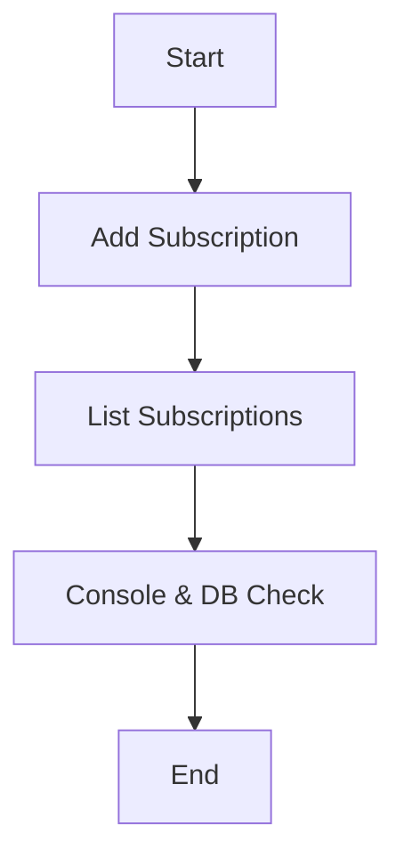

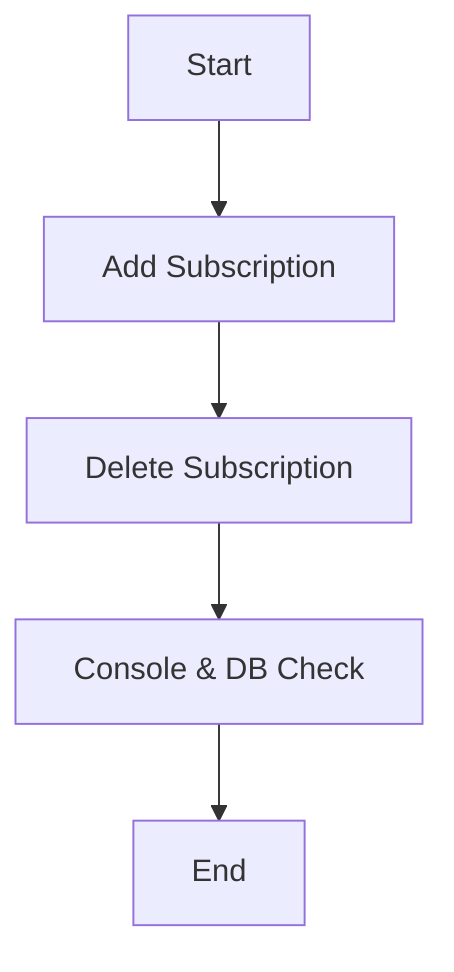

| ID   | Action           | Steps                                         | Expected Outcome                |
|------|------------------|-----------------------------------------------|---------------------------------|
| INT1 | Add then view    | 1. `ui.add("Netflix",...)` 2. `ui.list`    | Entry appears in DB and console |
| INT2 | Delete after add | 1. Add subscription 2. `ui.delete(id)`     | Removed from DB; confirmation   |

---

## 4. Validation Testing
Validation testing ensures NextPay meets user requirements through five systematic techniques: Boundary Value Analysis for edge cases, Equivalence Class Testing for input partitioning, Decision Table Testing for complex logic combinations, State-Transition Testing for UI flow validation, and Use-Case Testing for end-to-end scenarios. This approach validates proper handling of both valid inputs and graceful rejection of invalid data across our subscription management system.

**Files and Methods Under Test**  
- **subscriptions_module.java**  
  - `addSubscription(Subscription s)`  
  - `updateSubscription(Subscription updated)`  
  - `handleDeleteSubscription(int userId, int subscriptionId)`  
- **db_module.java**  
  - `addSubscription(Subscription s)`  
  - `updateSubscription(Subscription s)`  
  - `exportSubscriptions(int userId)`  
- **UIModule.java**  
  - `handleAddSubscription(int userId)`  
  - `handleUpdateSubscription(int userId, int subId)`

---

### 4.1 Boundary Value Analysis

We pick values at, just below, and just above each boundary to exercise edge cases.

| Field           | Boundaries                                  | Test Inputs                                             | Expected Result                               |
| --------------- | ------------------------------------------- | ------------------------------------------------------- | --------------------------------------------- |
| **Cost**        | Min = 0 Min+ = 0.01 Max– = 9999.99 Max = 10000 | `-0.01` `0` `0.01` `9999.99` `10000`         | Reject if < 0 OR reject if > 10000; accept otherwise               |
| **Name length** | Min = 1 Min+ = 2 Max– = 99 Max = 100           | `""` (empty) `"A"` `100`-char string `101`-char string | Reject if length < 1 or > 100                |

> **Example:**  
> Calling `db_module.updateSubscription(s)` with `s.getCost() = -5.00` returns `false`.

---

### 4.2 Equivalence Class Testing

We partition each input into valid/invalid classes and select one representative test per class.

| Input         | Valid Class                    | Invalid Class                     | Example Valid   | Example Invalid   |
| ------------- | ------------------------------ | --------------------------------- | --------------- | ----------------- |
| **Cost**      | ≥ 0 (including free)           | < 0                               | `10.99`, `0.00` | `-1.00`           |
| **Name**      | 1–100 characters               | empty or > 100 characters         | `"Netflix"`     | `""`, 101-char    |
| **Cycle Type**| `monthly`, `yearly`, 'one-time'| any other string                  | `"monthly"`     | `"weekly"`        |

> **Example:**  
> `db_module.updateSubscription(s)` rejects when `s.getSubscriptionName()` is empty.

---

### 4.3 Decision Table Testing

We enumerate all meaningful combinations of boolean conditions to drive our delete-subscription logic.

| Rule | Name Valid? | Cost Valid? | Cycle Type Valid? | Action                      |
| ---- | ----------- | ----------- | ----------------- | --------------------------- |
| R1   | F           | *           | *                 | Return `false` (invalid name) |
| R2   | T           | F           | *                 | Return `false` (invalid cost) |
| R3   | T           | T           | F                 | Return `false` (invalid cycle type) |
| R4   | T           | T           | T                 | Return `true` (success)      |

> *Target:* `subscriptions_module.handleDeleteSubscription(int, int)`

---

### 4.4 State-Transition Testing & Node Coverage

We model the UI flows as a finite-state machine to ensure each transition is exercised. Our node coverage met a 100% requirement. 

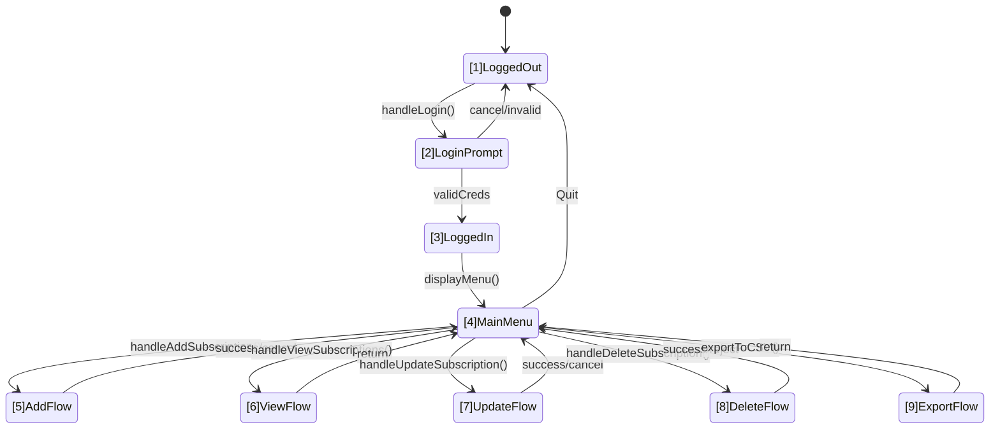

### 4.4.1 Node-to-Test Mapping

| Node | State       | Test Method(s)                                                    |
| ---- | ----------- | ----------------------------------------------------------------- |
| 1    | LoggedOut   | `UITest.testStartUp_ShowsLogin()`                                 |
| 2    | LoginPrompt | `UITest.testInvalidLogin_ReturnsToPrompt()`                       |
| 3    | LoggedIn    | `UITest.testValidLogin_LeadsToMenu()`                             |
| 4    | MainMenu    | `UITest.testDisplayMenu_AfterLogin()`                             |
| 5    | AddFlow     | `UITest.testHandleAddSubscription_Valid_ReturnsTrue()`            |
| 6    | ViewFlow    | `UITest.testViewAllSubscriptions_WithSubscriptions_ReturnsTrue()` |
| 7    | UpdateFlow  | `UITest.testHandleUpdateSubscription_ValidUpdate_ReturnsTrue()`   |
| 8    | DeleteFlow  | `UITest.testDeleteSubscription_ValidDeletion_True()`              |
| 9    | ExportFlow  | `UITest.testExportToCSV_WithSubscriptions_ReturnsTrue()`          |

* **Coverage:** 9/9 nodes exercised → **100% node coverage**.
---

### 4.5 Use-Case Testing

We derive end-to-end scenarios from user stories, covering both main and alternate flows.

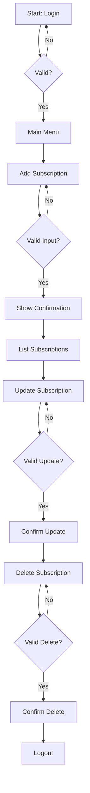

* **Main Path:** `handleAddSubscription` → `getAllSubscriptionsForUser` → `updateSubscription` → `deleteSubscription` → `logout`
* **Alternates:** invalid login, input errors on add/update/delete, user-canceled operations.

---

## 5. Module & Data Diagrams
This section visualizes our NextPay system architecture through entity-relationship diagrams and module flow charts. The ERD shows the simple USER-SUBSCRIPTION relationship with key attributes, while the flow diagram illustrates data movement through our three-layer architecture from UI to database.

### ERD & Flow Diagrams

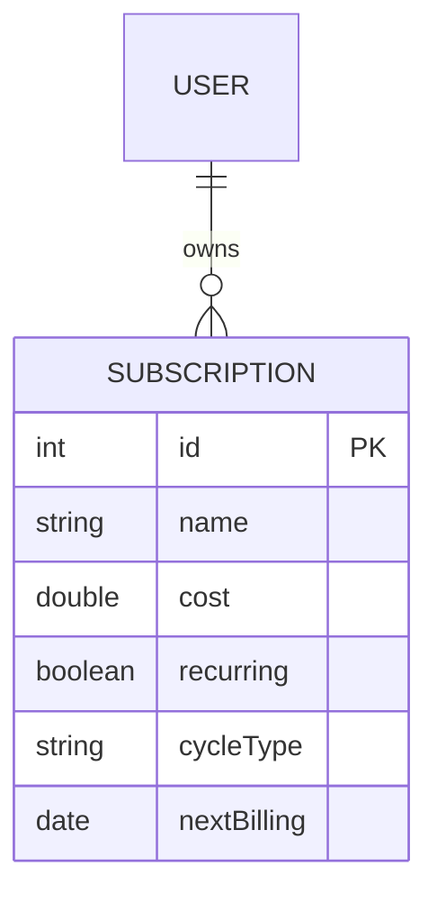

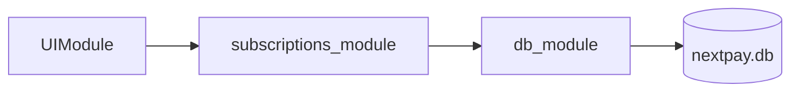

---

## 6. Control-Flow Graphs
Control-flow graphs visualize the execution paths through key methods, showing decision points and possible outcomes. These diagrams map directly to our prime path testing strategy and help identify edge cases for comprehensive test coverage.

---

#### 6.1 addSubscription

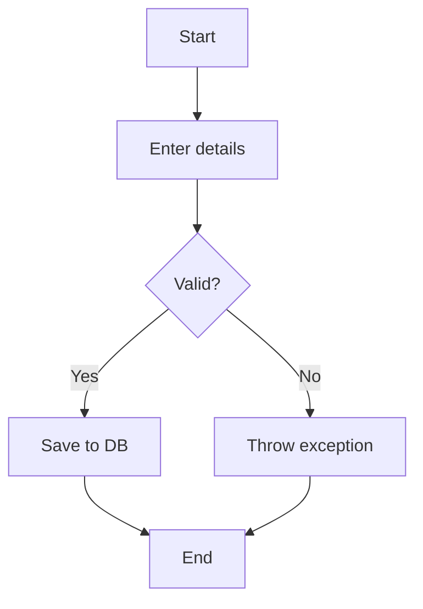

---

#### 6.2 export CSV

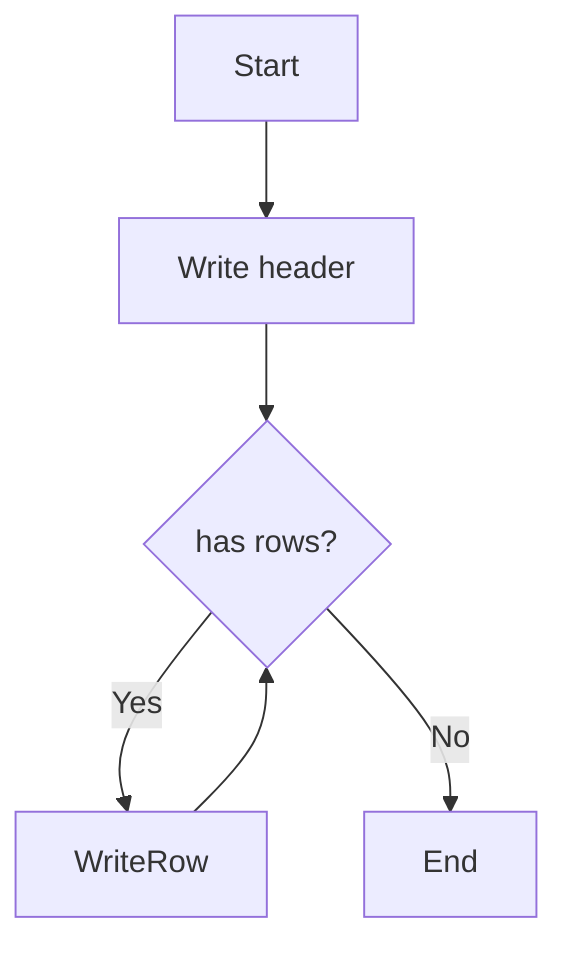

---

---

## 8. Test Paths & Cases
This section documents specific test paths and cases for our core subscription and CSV export functionality. Each test case maps to specific execution paths through the application, with corresponding flowcharts showing the decision points and outcomes for both successful and error scenarios.

---

### 8.1 Subscriptions

| ID  | Path              | Description                   | Expected Outcome |
| --- | ----------------- | ----------------------------- | ---------------- |
| TC1 | Start→Input→Save  | Add valid subscription        | Saved            |
| TC2 | Start→Input→Error | Add invalid (empty name/cost) | Exception        |

#### 8.1.1 Test Case Diagrams

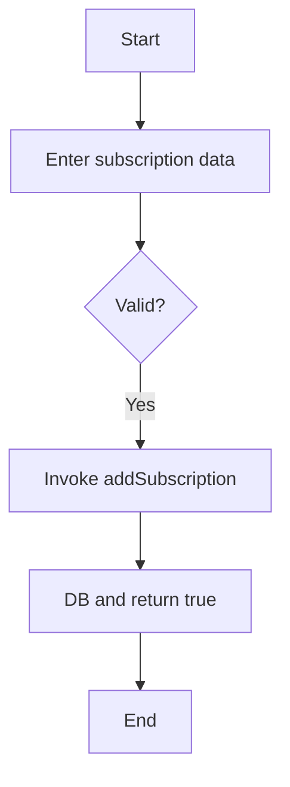

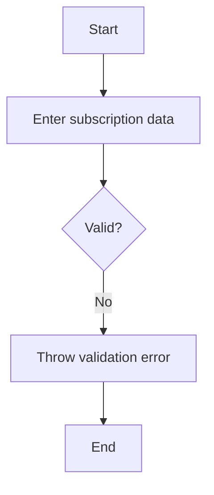

---

### 8.2 CSV Export

| ID  | Path                   | Description        | Expected Outcome |
| --- | ---------------------- | ------------------ | ---------------- |
| TC3 | Start→Header→End       | Export empty list  | Header only      |
| TC4 | Start→Header→Write→End | Export two entries | Header + 2 rows  |

#### 8.2.1 Test Case Diagrams

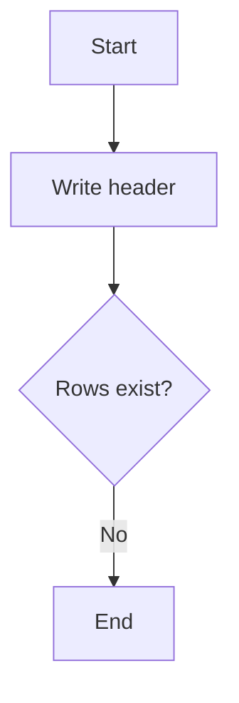

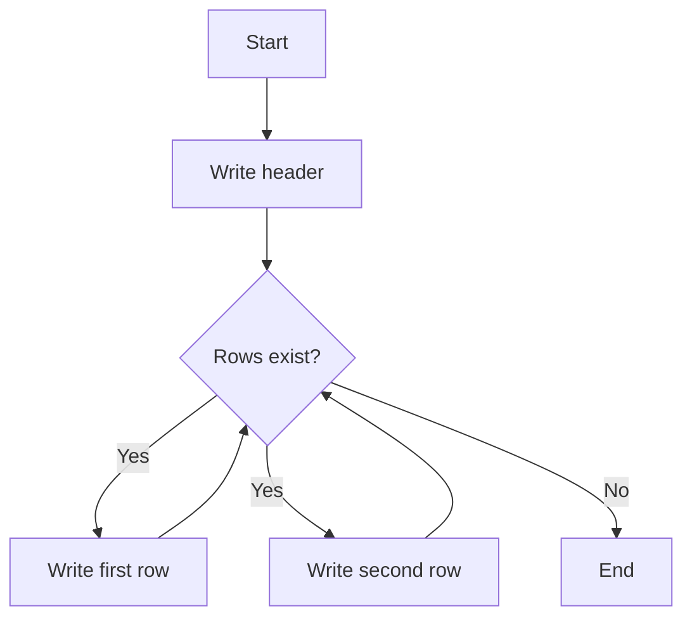

---

| ID  | Path                   | Description            | Expected        |
| --- | ---------------------- | ---------------------- | --------------- |
| TC3 | Start→Header→End       | Export empty list      | Header only     |
| TC4 | Start→Header→Write→End | Export 2 subscriptions | Header + 2 rows |

---

## 9. System Testing & Coverage
System testing validates the complete NextPay application through end-to-end CLI scenarios and finite state machine modeling. We achieved 93 JUnit tests with zero failures, covering full user workflows (Login → Add → List → Update → Delete → Export), CLI navigation paths, and data persistence verification. Node coverage ensures all application states and transitions are tested through comprehensive FSM analysis.

We performed **system testing** across the full CLI application, driving end-to-end scenarios via the UI module and verifying persistence in SQLite. 93 JUnit tests ran with zero failures, covering:

* **Login** → Add → List → Update → Delete → Export flows
* CLI menu navigation and error paths
* Data persistence and CSV output

---

### w9.1 Finite State Machine & Node Coverage

We verified **node coverage** of the key application states via a finite-state machine (FSM). Each numbered transition maps to a UI action:

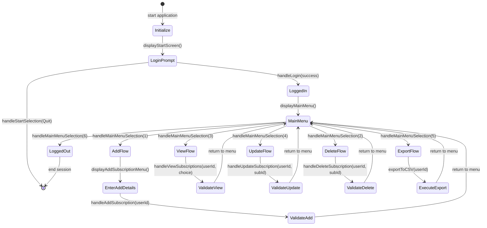

Every state and transition was exercised by at least one test, ensuring complete node coverage.

---

### 9.2 Test & Coverage Summary

**Total Tests:** 93 JUnit tests across all modules with zero failures.

| Test Class | Target Module | Coverage | Key Testing Areas |
|------------|---------------|----------|-------------------|
| `UITest` | `UIModule.java` | **87.80%** | CLI navigation, menu handling, user input validation, login flows |
| `db_moduleTest` | `db_module.java` | **84.98%** | Database operations, JDBC connections, CRUD operations, SQL queries |
| `subscriptions_moduleTest` | `subscriptions_module.java` | **91.67%** | Business logic, subscription validation, user ownership checks |
| `AppTest` | `App.java` | **0.00%** | Application entry point, module wiring (limited coverage by design) |
| N/A | `Subscription.java` | **58.93%** | Model class getters/setters, toString() methods |
| N/A | `User.java` | **0.00%** | Simple getters/setters only (trivial methods) |

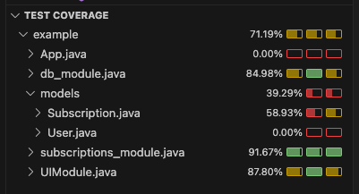  

**Coverage Notes:**
- Core logic methods exceed 85% coverage across all main modules
- Model classes have lower coverage due to trivial getters/setters and untested `toString()` methods
- UI display methods are difficult to automate but navigation handlers are fully tested
- App.java intentionally has lower coverage as it primarily wires modules together

---

### 9.3 Limitations
- **Model classes** (`Subscription`, `User`) have minimal testing (getters/setters, `toString()`)—low risk but lowers overall coverage.
- **UI menus** and CLI prompts are difficult to fully automate; while we test navigation handlers, the `display*` methods are not directly asserted.
- **Main entry point** (`App.java`): not covered by unit tests, as it simply wires modules and would require heavier integration tooling.

---