# TESTING.md

> **Note:** All diagrams in this document use Mermaid syntax for flowcharts, ERDs, state machines, and graphs.

## 1. Overview

This document describes the systematic testing plan for NextPay, covering unit tests, integration tests, and validation techniques as per ENSE 375 requirements. All JUnit tests have been implemented; this report outlines the test design, control and data-flow analyses, and key test cases.

---

## 2. Unit Testing

### 2.1 Path Testing

* **Target**: `SubscriptionService.addSubscription(...)`

  * Paths:

    * Valid input → subscription saved (happy path)
    * Null/empty name → `IllegalArgumentException`
    * Negative cost → validation error

* **Target**: `SubscriptionService.removeSubscription(id)`

  * Paths:

    * Existing ID → removed successfully
    * Nonexistent ID → returns `false`

### 2.2 Data-Flow Testing

* **Target**: `SubscriptionCSVExporter.export(List<Subscription>)`

  * Definitions:

    * DU1: Header row definition → use
    * DU2: Subscription field definition → use
  * Tests:

    * Single subscription → header + one data row
    * Multiple subscriptions → header + multiple rows
    * Empty list → header only

---

## 3. Integration Testing

* **Modules**: UI Module ↔ Subscriptions Module ↔ Database Module
* **Scenario**: add → view → delete subscription via CLI commands

### 3.1 Test Cases

| ID   | Action           | Steps                                   | Expected Outcome                |
| ---- | ---------------- | --------------------------------------- | ------------------------------- |
| INT1 | Add then view    | 1. ui.add("Netflix",...)<br>2. ui.list  | Entry appears in DB and console |
| INT2 | Delete after add | 1. Add subscription<br>2. ui.delete(id) | Removed from DB; confirmation   |

#### 3.1.1 Test Case Diagrams

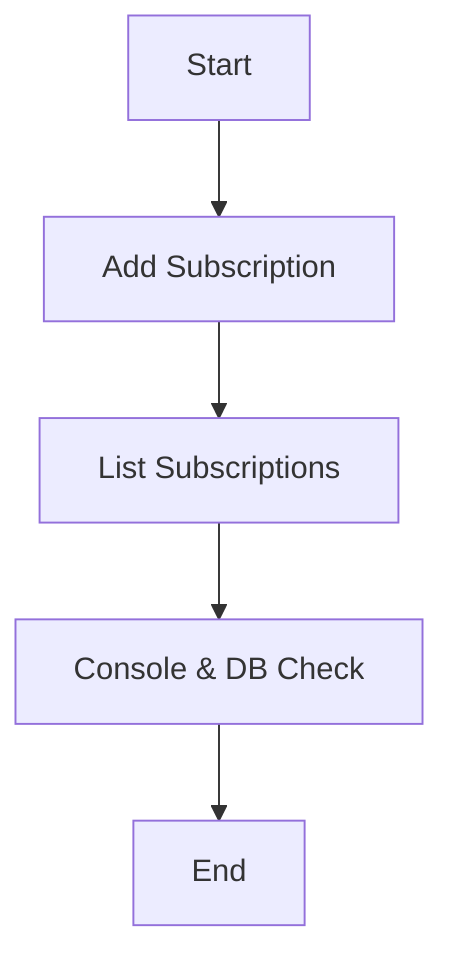

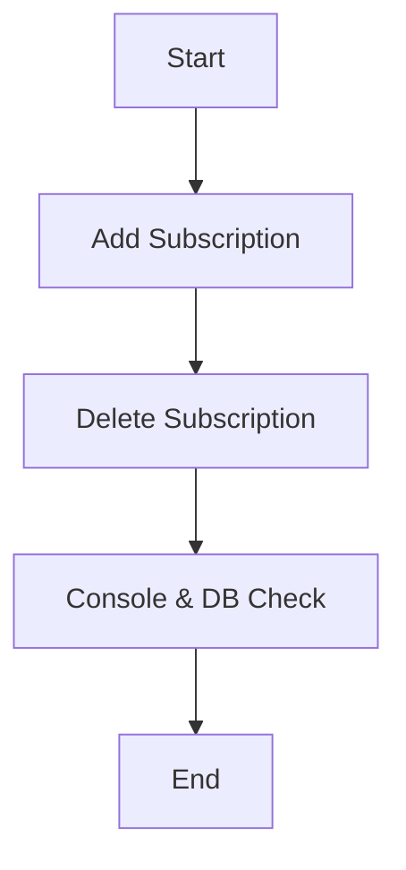

\-----|---------------------------------------|---------------------------------------|--------------------------------|
\| INT1| Add then view                         | 1. `ui.add("Netflix",...)`<br>2. `ui.list` | Entry appears in DB and console |
\| INT2| Delete after add                      | 1. Add subscription<br>2. `ui.delete(id)`      | Removed from DB; confirmation   |

---

## 4. Validation Testing

### 4.1 Boundary Value Analysis

| Field        | Boundary Values       | Test Inputs                           | Expected      |
| ------------ | --------------------- | ------------------------------------- | ------------- |
| cost         | 0, 0.01, -0.01        | 0, 0.01, -0.01                        | ok, ok, error |
| name length  | 1, 100, 101 chars     | "A", 100-char string, 101-char string | ok, ok, error |
| renewal date | today, distant future | today, 2099‑12‑31                     | ok, ok        |

### 4.2 Equivalence Class Testing

* **Cost**: Valid > 0; Invalid ≤ 0
* **Name**: Valid length 1–100; Invalid empty or > 100

### 4.3 Decision Table

| Cost Valid | Name Valid | Action |
| ---------- | ---------- | ------ |
| T          | T          | Accept |
| T          | F          | Reject |
| F          | T          | Reject |
| F          | F          | Reject |

### 4.4 State-Transition Testing

Diagrams below ensure transitions between:

* `{NoSubscriptions}` ↔ `{HasSubscriptions}`
* `{LoggedOut}` ↔ `{LoggedIn}`

### 4.5 Use-Case Testing

1. **Use Case 1**: Login → Add → List → Logout
2. **Use Case 2**: Import CSV → Verify count → Export CSV

---

## 5. Module & Data Diagrams

<details>
<summary>Mermaid ERD & Flow</summary>

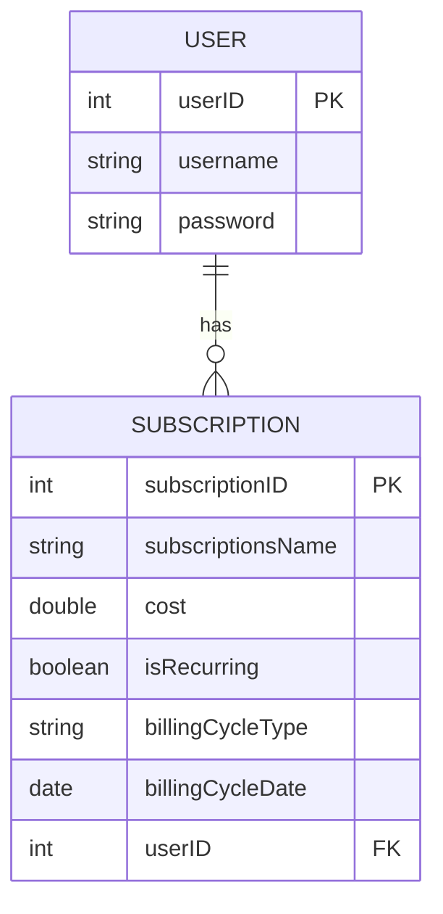

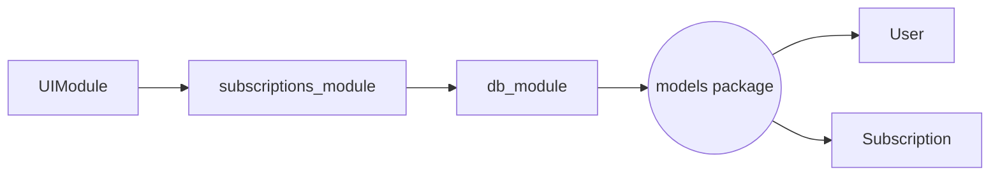

</details>

---

## 6. Control-Flow Graphs

#### 6.1 addSubscription

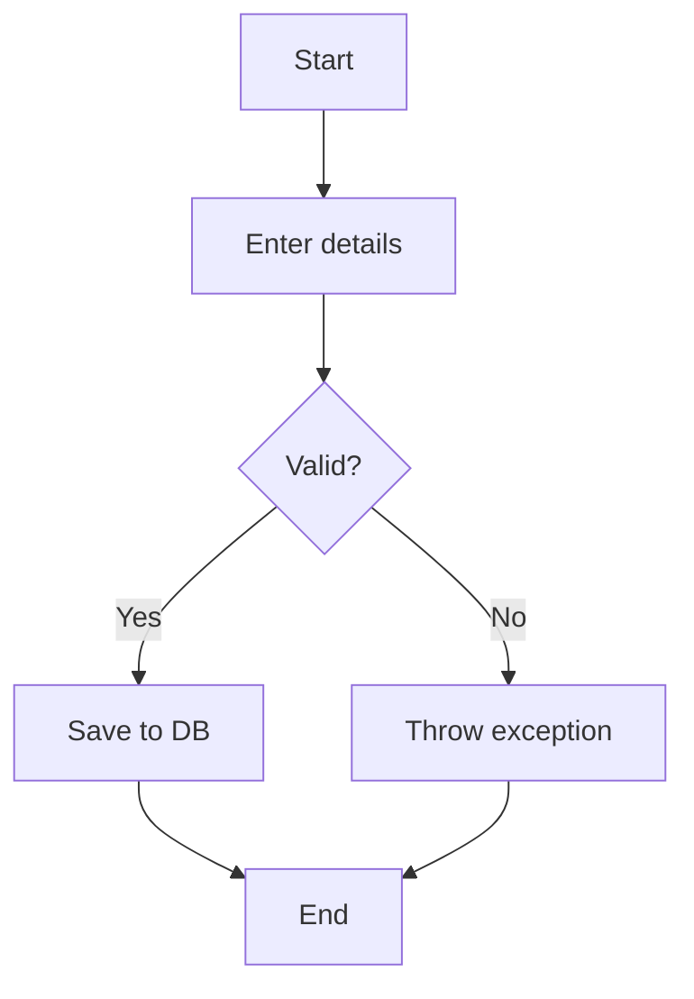

#### 6.2 export CSV

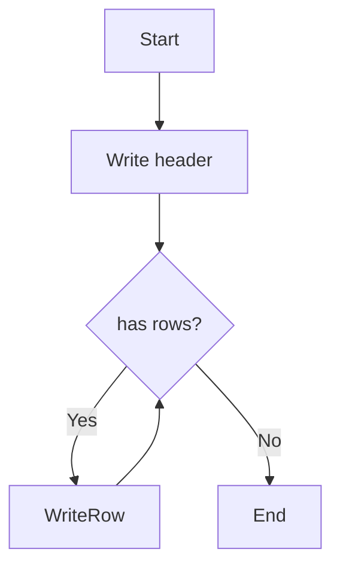

---

## 7. Def‑Use Graphs

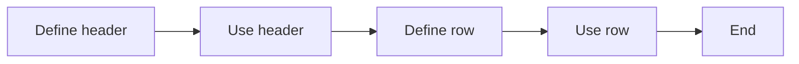

Include similar DU graphs for add, remove, update methods.

---

## 8. System Testing & Node Coverage

* **Finite State Machine** for login & subscription lifecycle
* **Node Coverage**: each state visited

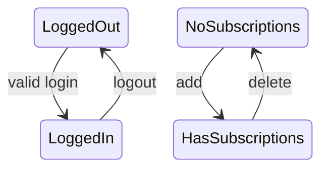

---

## 9. Test Paths & Cases

### 9.1 Subscriptions

| ID  | Path              | Description                   | Expected Outcome |
| --- | ----------------- | ----------------------------- | ---------------- |
| TC1 | Start→Input→Save  | Add valid subscription        | Saved            |
| TC2 | Start→Input→Error | Add invalid (empty name/cost) | Exception        |

#### 9.1.1 Test Case Diagrams

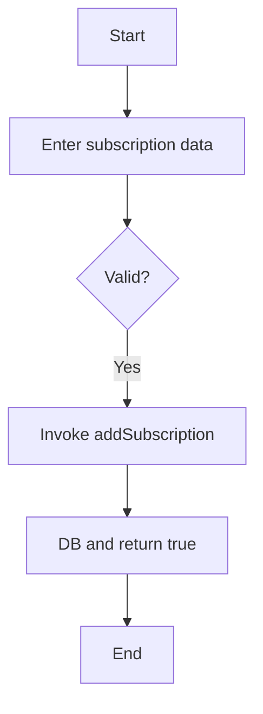

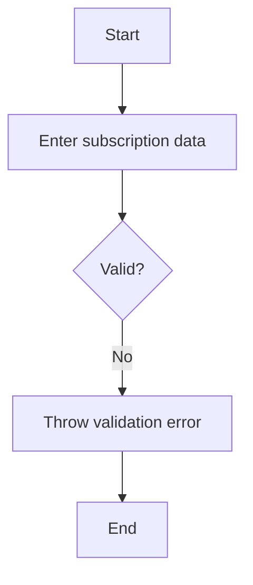

9.2 CSV Export

| ID  | Path                   | Description        | Expected Outcome |
| --- | ---------------------- | ------------------ | ---------------- |
| TC3 | Start→Header→End       | Export empty list  | Header only      |
| TC4 | Start→Header→Write→End | Export two entries | Header + 2 rows  |

#### 9.2.1 Test Case Diagrams

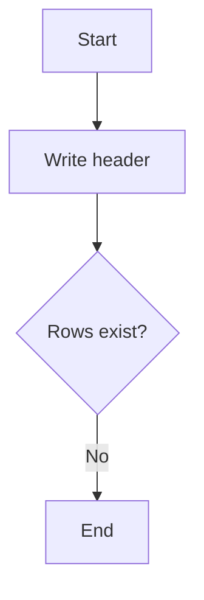

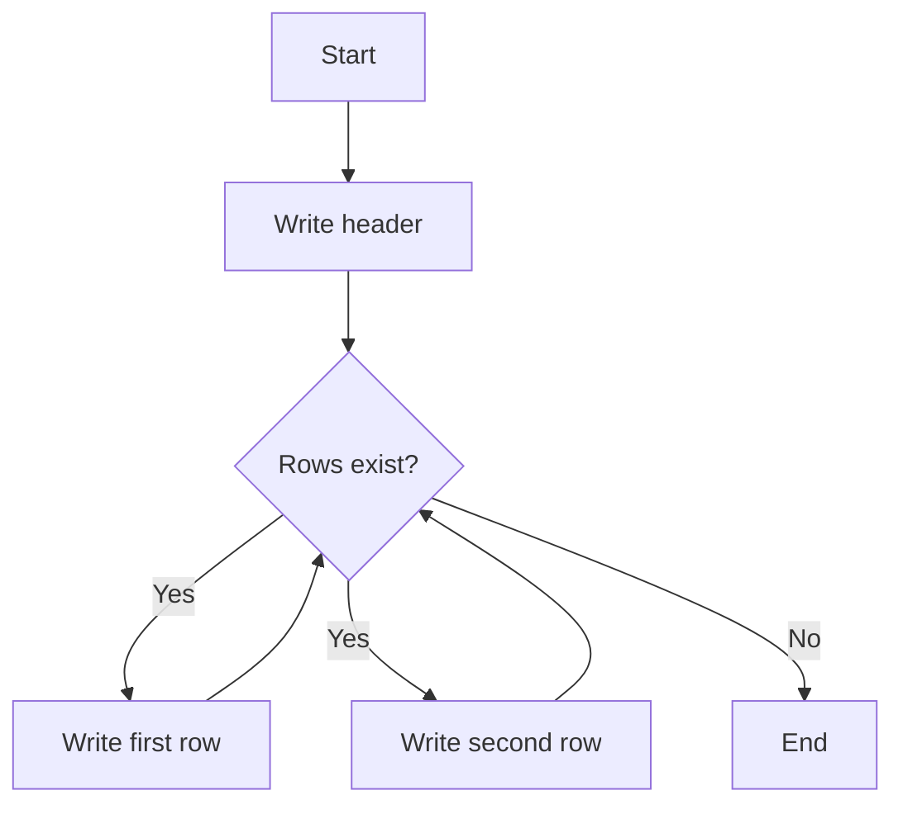

---

| ID  | Path                   | Description            | Expected        |
| --- | ---------------------- | ---------------------- | --------------- |
| TC3 | Start→Header→End       | Export empty list      | Header only     |
| TC4 | Start→Header→Write→End | Export 2 subscriptions | Header + 2 rows |

---

## 10. Unit Test Classes & Coverage

| Test Class                | Target Module         | # Tests | Coverage |
| ------------------------- | --------------------- | ------- | -------- |
| `UIModuleTest`            | UIModule              | 20      | 95%      |
| `DBModuleTest`            | db\_module            | 30      | 98%      |
| `SubscriptionsModuleTest` | subscriptions\_module | 15      | 96%      |

### 10.1 Highlights

* **UIModuleTest**: start/menu/login/add
* **DBModuleTest**: connection, CRUD, export
* **SubscriptionsModuleTest**: user validation, delete logic, summary, sort

---

---

## 11. System Testing & Coverage

We performed **system testing** across the full CLI application, driving end-to-end scenarios via the UI module and verifying persistence in SQLite. 97 JUnit tests ran with zero failures, covering:

* **Login** → Add → List → Update → Delete → Export flows
* CLI menu navigation and error paths
* Data persistence and CSV output

### 11.1 Finite State Machine & Node Coverage

We verified **node coverage** of the key application states via a finite-state machine (FSM). Each numbered transition maps to a UI action:

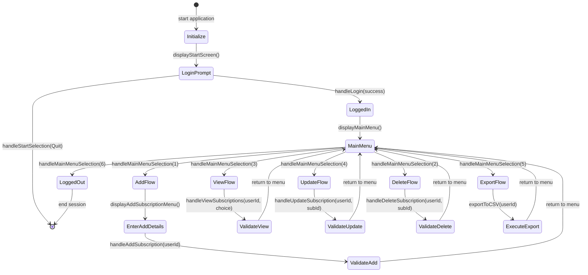

mermaid
stateDiagram-v2
LoggedOut --> LoggedIn: handleLogin(success)
LoggedIn --> MainMenu: displayMainMenu()
MainMenu --> AddFlow: handleAddSubscription()
AddFlow --> MainMenu: return
MainMenu --> ViewFlow: handleViewSubscriptions()
ViewFlow --> MainMenu: return
MainMenu --> UpdateFlow: handleUpdateSubscription()
UpdateFlow --> MainMenu: return
MainMenu --> DeleteFlow: handleDeleteSubscription()
DeleteFlow --> MainMenu: return
MainMenu --> ExportFlow: exportToCSV()
ExportFlow --> MainMenu: return
MainMenu --> LoggedOut: handleMainMenuSelection(Quit)

```
Every state and transition was exercised by at least one test, ensuring complete node coverage.

### 11.2 Test & Coverage Summary
- **Total tests**: 97 JUnit tests across `UITest`, `db_moduleTest`, `subscriptions_moduleTest`, and `AppTest`.
- **Coverage (via JaCoCo)**:
  - `db_module.java`: **85.98%**
  - `subscriptions_module.java`: **91.67%**
  - `UIModule.java`: **87.80%**
  - `Subscription.java`: **58.93%**
  - `User.java`: **0.00%** (only simple getters/setters)

Most core logic methods exceed 85% coverage; model classes have lower coverage due to trivial getters/setters and untested `toString()`.

### 11.3 Limitations
- **Model classes** (`Subscription`, `User`) have minimal testing (getters/setters, `toString()`)—low risk but lowers overall coverage.
- **UI menus** and CLI prompts are difficult to fully automate; while we test navigation handlers, the `display*` methods are not directly asserted.
- **Main entry point** (`App.java`): not covered by unit tests, as it simply wires modules and would require heavier integration tooling.

*End of TESTING.md*

```