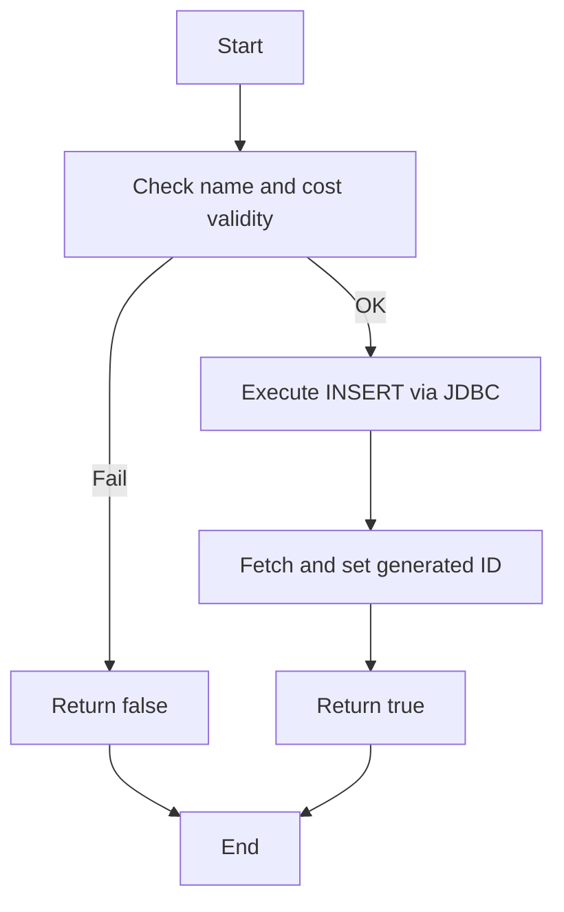
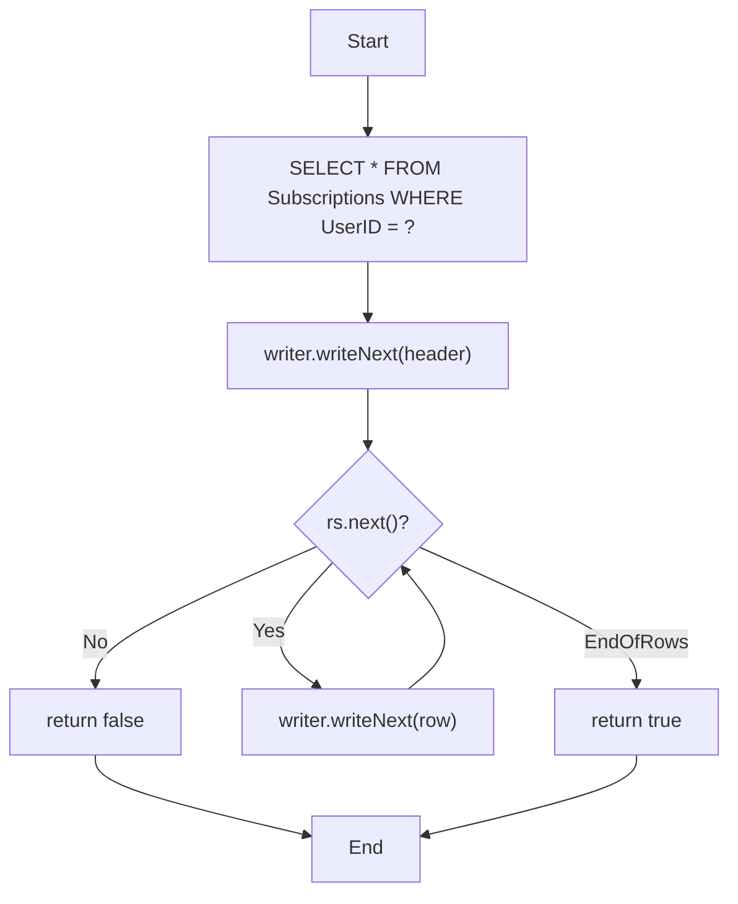
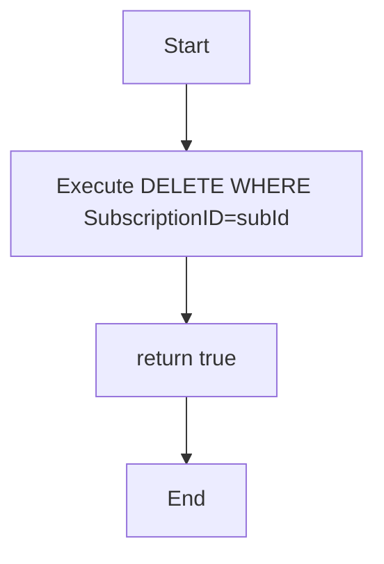

---

### MVP 1: `db_module.addSubscription(Subscription s)`

**Prime Paths**

* **P1**: Start → Validate(OK) → Insert → SetID → ReturnTrue → End
* **P2**: Start → Validate(Fail) → ReturnFalse → End

**Test Cases**

| ID  | Path | Description                                 | Source Tests                                              | Expected                 |
| --- | ---- | ------------------------------------------- | --------------------------------------------------------- | ------------------------ |
| TC1 | P1   | Valid subscription (non‑empty name, cost≥0) | `db_moduleTest.addSubscription_ValidSubscription_True`    | returns true; row in DB  |
| TC2 | P2   | Empty name                                  | `db_moduleTest.addSubscription_EmptyName_ReturnsFalse`    | returns false; no insert |
| TC3 | P2   | Negative cost                               | `db_moduleTest.addSubscription_NegativeCost_ReturnsFalse` | returns false; no insert |

---

### MVP 2: `db_module.exportSubscriptions(int userId)`

**Prime Paths**

* **P1** (no rows): Start → Query → WriteHeader → Loop(No) → ReturnFalse → End
* **P2** (some rows): Start → Query → WriteHeader → Loop(Yes…) → WriteRow→…→ ReturnTrue → End

**Test Cases**

| ID  | Path | Description                     | Source Tests                                                                                                     | Expected                                |
| --- | ---- | ------------------------------- | ---------------------------------------------------------------------------------------------------------------- | --------------------------------------- |
| TC4 | P1   | No subscriptions for user       | `UITest.testExportToCSV_NoSubscriptions_ReturnsFalse`                                                            | returns false; only header              |
| TC5 | P2   | One or more subscriptions exist | `UITest.testExportToCSV_WithSubscriptions_ReturnsTrue` `db_moduleTest.exportSubscriptions_WithValidUser_True` | returns true; CSV file with header+rows |

---

### MVP 3: `db_module.deleteSubscription(int subId)`

*(Note: your code always returns true on JDBC execution, but subscriptions\_module enforces ownership.)*

**Prime Paths**

* **P1**: Start → Delete → ReturnTrue → End

**Test Cases**

| ID  | Path | Description                                      | Source Tests                                                                                                                                                                | Expected                                              |
| --- | ---- | ------------------------------------------------ | --------------------------------------------------------------------------------------------------------------------------------------------------------------------------- | ----------------------------------------------------- |
| TC6 | P1   | Direct delete on existing ID                     | `db_moduleTest.deleteSubscription_ValidId_True`                                                                                                                             | returns true; row removed                             |
| TC7 | P1   | Direct delete on non‑existent ID                 | `db_moduleTest.deleteSubscription_NonExistentId_ReturnsFalse` *(note: test method name)*                                                                                    | returns true/false per implementation; row unaffected |
| TC8 | P1   | UI‑level delete with ownership and non‑ownership | `UITest.testDeleteSubscription_ValidDeletion_True` `UITest.testDeleteSubscription_NonExistentSubscription_False` `UITest.testDeleteSubscription_NotOwnedByUser_False` | UI returns correct boolean and DB state               |

---

