# TESTING.md

**Note:** All diagrams in this document use Mermaid syntax for flowcharts, ERDs, state machines, and graphs.

## 1. Overview

This document describes the systematic testing plan for NextPay, covering unit tests, integration tests, and validation techniques as per ENSE 375 requirements. All JUnit tests have been implemented; this report outlines the test design, control and data-flow analyses, and key test cases.

---

## 2. Unit Testing

---

### MVP 1: `db_module.addSubscription(Subscription s)`

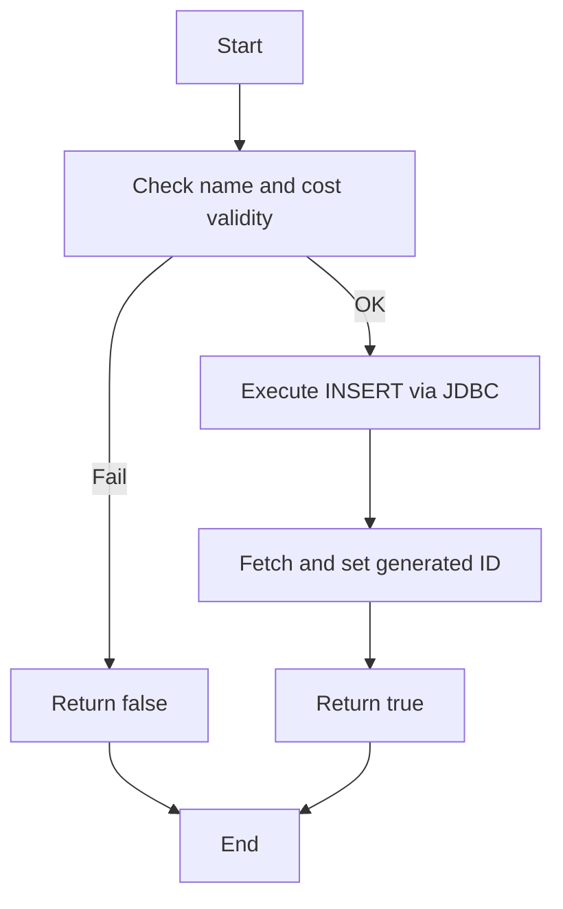

**Prime Paths**

- **P1**: Start → Validate(OK) → Insert → SetID → ReturnTrue → End
- **P2**: Start → Validate(Fail) → ReturnFalse → End

**Test Cases**

| ID  | Path | Description                                 | Source Tests                                              | Expected                 |
|-----|------|---------------------------------------------|----------------------------------------------------------|--------------------------|
| TC1 | P1   | Valid subscription (non‑empty name, cost≥0) | `db_moduleTest.addSubscription_ValidSubscription_True`    | returns true; row in DB  |
| TC2 | P2   | Empty name                                  | `db_moduleTest.addSubscription_EmptyName_ReturnsFalse`    | returns false; no insert |
| TC3 | P2   | Negative cost                               | `db_moduleTest.addSubscription_NegativeCost_ReturnsFalse` | returns false; no insert |

---

### MVP 2: `db_module.exportSubscriptions(int userId)`

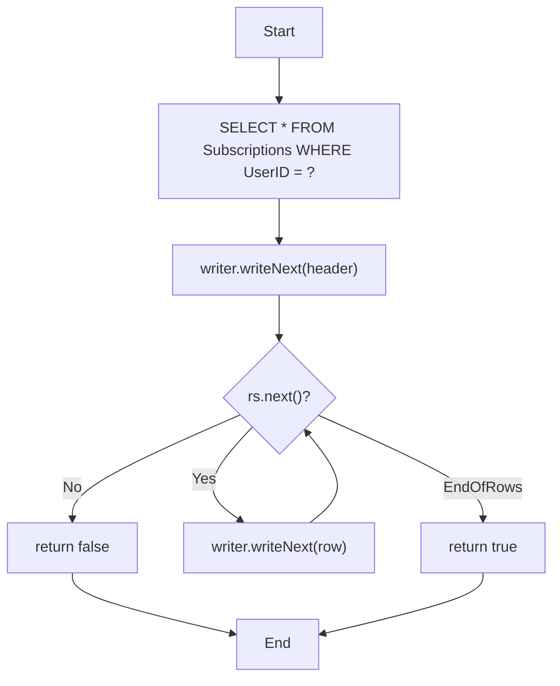

**Prime Paths**

- **P1** (no rows): Start → Query → WriteHeader → Loop(No) → ReturnFalse → End
- **P2** (some rows): Start → Query → WriteHeader → Loop(Yes…) → WriteRow→…→ ReturnTrue → End

**Test Cases**

| ID  | Path | Description                     | Source Tests                                                                                                     | Expected                                |
|-----|------|---------------------------------|------------------------------------------------------------------------------------------------------------------|-----------------------------------------|
| TC4 | P1   | No subscriptions for user       | `UITest.testExportToCSV_NoSubscriptions_ReturnsFalse`                                                            | returns false; only header              |
| TC5 | P2   | One or more subscriptions exist | `UITest.testExportToCSV_WithSubscriptions_ReturnsTrue` `db_moduleTest.exportSubscriptions_WithValidUser_True` | returns true; CSV file with header+rows |

---

### MVP 3: `db_module.deleteSubscription(int subId)`

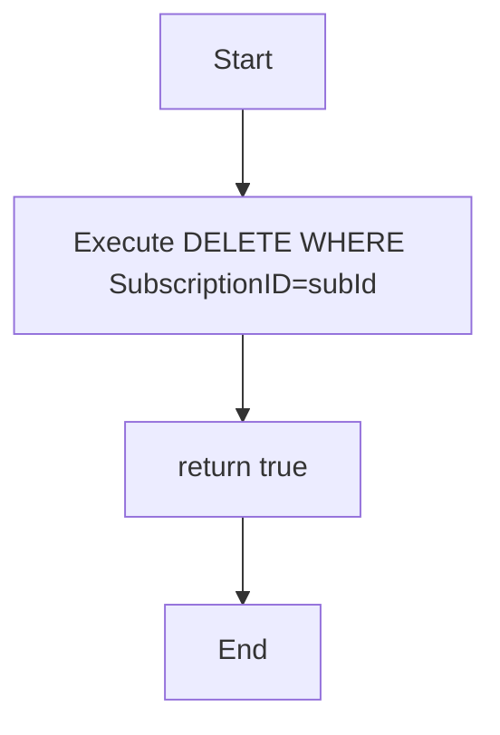

**Prime Paths**
- **P1**: Start → Delete → ReturnTrue → End

**Test Cases**

| ID  | Path | Description                                      | Source Tests                                                                                                                                                                | Expected                                              |
|-----|------|--------------------------------------------------|----------------------------------------------------------------------------------------------------------------------------------------------------------------------------|-------------------------------------------------------|
| TC6 | P1   | Direct delete on existing ID                     | `db_moduleTest.deleteSubscription_ValidId_True`                                                                                                                            | returns true; row removed                             |
| TC7 | P1   | Direct delete on non‑existent ID                 | `db_moduleTest.deleteSubscription_NonExistentId_ReturnsFalse` *(note: test method name)*                                                                                   | returns true/false per implementation; row unaffected |
| TC8 | P1   | UI‑level delete with ownership and non‑ownership | `UITest.testDeleteSubscription_ValidDeletion_True` `UITest.testDeleteSubscription_NonExistentSubscription_False` `UITest.testDeleteSubscription_NotOwnedByUser_False` | UI returns correct boolean and DB state               |

---

### 2.1 Path Testing

* **Target**: `SubscriptionModule.addSubscription(Subscription s)`
  * Paths:
    * Valid input → subscription saved (happy path)
    * Null/empty name → `IllegalArgumentException`
    * Negative cost → validation error

* **Target**: `SubscriptionModule.removeSubscription(id)`
  * Paths:
    * Existing ID → removed successfully
    * Nonexistent ID → returns `false`

### 2.2 Data-Flow Testing

* **Target**: `SubscriptionCSVExporter.export(List<Subscription>)`
  * Definitions:
    * DU1: Header row definition → use
    * DU2: Subscription field definition → use
  * Tests:
    * Single subscription → header + one data row
    * Multiple subscriptions → header + multiple rows
    * Empty list → header only

---

## 3. Integration Testing

* **Modules**: UI Module ↔ Subscriptions Module ↔ Database Module
* **Scenario**: add → view → delete subscription via CLI commands

### 3.1 Test Cases

| ID   | Action           | Steps                                   | Expected Outcome                |
| ---- | ---------------- | --------------------------------------- | ------------------------------- |
| INT1 | Add then view    | 1. ui.add("Netflix",...) 2. ui.list  | Entry appears in DB and console |
| INT2 | Delete after add | 1. Add subscription 2. ui.delete(id) | Removed from DB; confirmation   |

#### 3.1.1 Test Case Diagrams

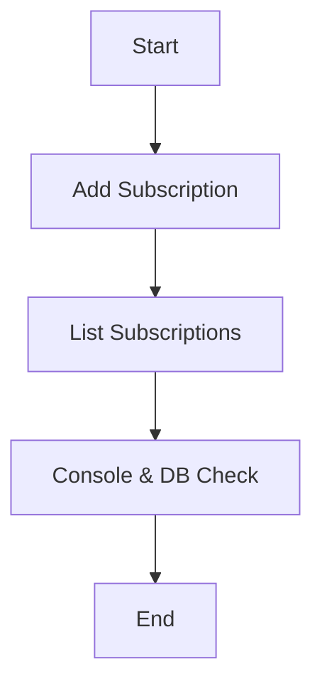

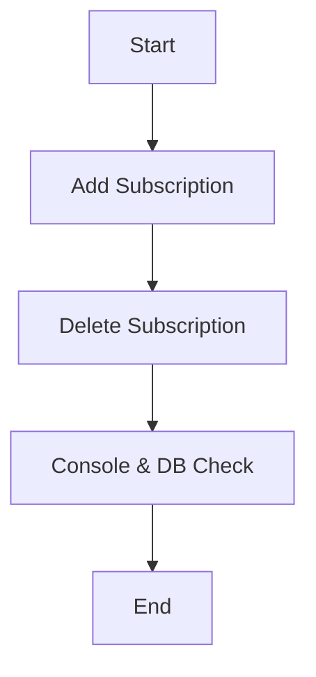

| ID   | Action           | Steps                                         | Expected Outcome                |
|------|------------------|-----------------------------------------------|---------------------------------|
| INT1 | Add then view    | 1. `ui.add("Netflix",...)` 2. `ui.list`    | Entry appears in DB and console |
| INT2 | Delete after add | 1. Add subscription 2. `ui.delete(id)`     | Removed from DB; confirmation   |

---

## 4. Validation Testing

### 4.1 Boundary Value Analysis

| Field        | Boundary Values       | Test Inputs                           | Expected      |
| ------------ | --------------------- | ------------------------------------- | ------------- |
| cost         | 0, 0.01, -0.01        | 0, 0.01, -0.01                        | ok, ok, error |
| name length  | 1, 100, 101 chars     | "A", 100-char string, 101-char string | ok, ok, error |
| renewal date | today, distant future | today, 2099‑12‑31                     | ok, ok        |

### 4.2 Equivalence Class Testing

* **Cost**: Valid > 0; Invalid ≤ 0
* **Name**: Valid length 1–100; Invalid empty or > 100

### 4.3 Decision Table

| Cost Valid | Name Valid | Action |
| ---------- | ---------- | ------ |
| T          | T          | Accept |
| T          | F          | Reject |
| F          | T          | Reject |
| F          | F          | Reject |

### 4.4 State-Transition Testing

Diagrams below ensure transitions between:

* `{NoSubscriptions}` ↔ `{HasSubscriptions}`
* `{LoggedOut}` ↔ `{LoggedIn}`

### 4.5 Use-Case Testing

1. **Use Case 1**: Login → Add → List → Logout
2. **Use Case 2**: Import CSV → Verify count → Export CSV

---

## 5. Module & Data Diagrams

Mermaid ERD & Flow

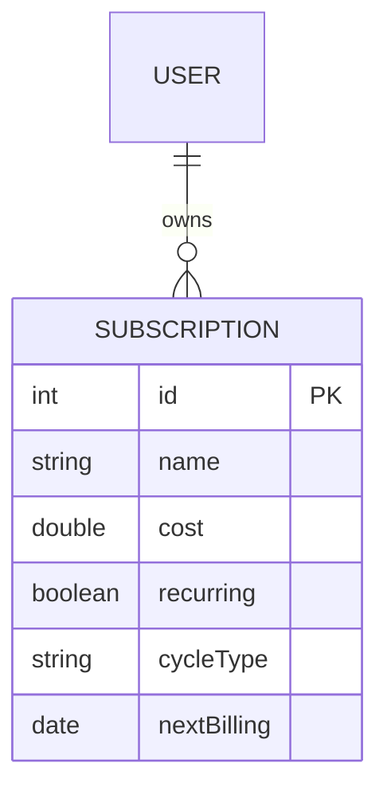

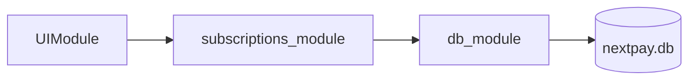

---

## 6. Control-Flow Graphs

#### 6.1 addSubscription

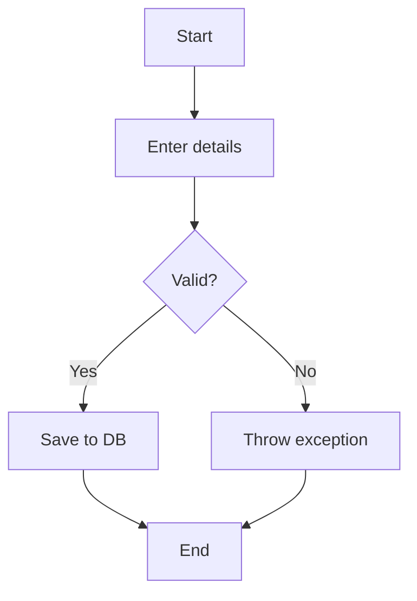

#### 6.2 export CSV

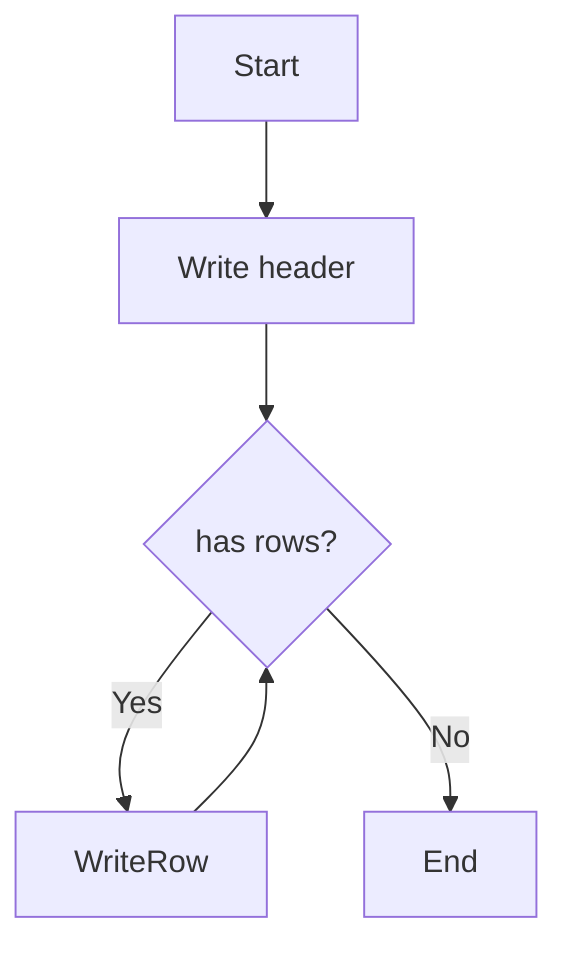

---

---

## 7.1 DU Paths & Test Cases

Below are the key definition–use paths for our NextPay core flows, along with corresponding test cases referencing the actual JUnit methods and source files.

### 7.1.1 addSubscription

**DU Path 1 (happy path):**  
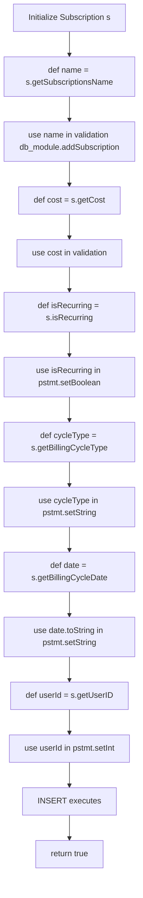

**DU Path 2 (validation fail):**

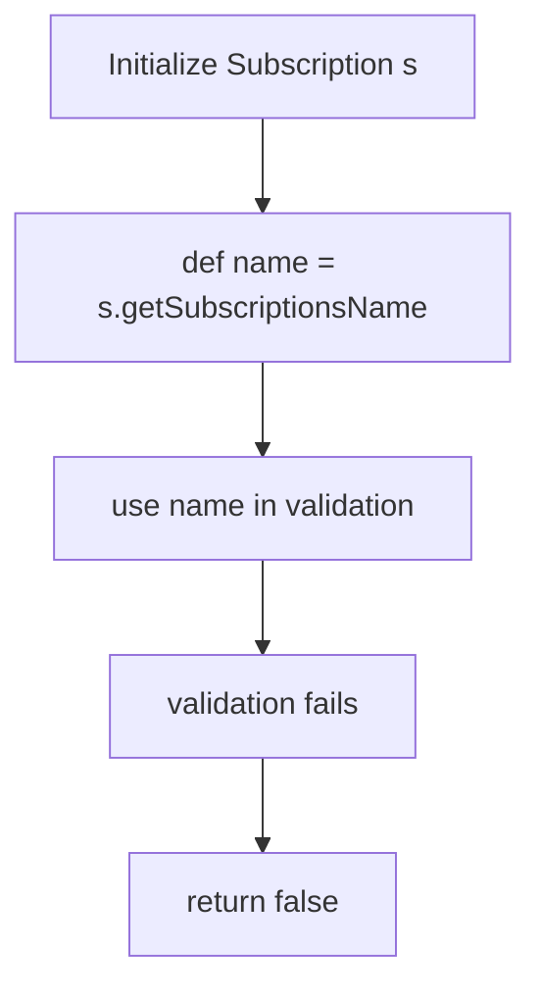

| TC  | Path | Description              | Source Tests                                                               | Expected Result            |
| --- | ---- | ------------------------ | -------------------------------------------------------------------------- | -------------------------- |
| TC1 | P1   | Valid sub → inserted     | `db_moduleTest.addSubscription_ValidSubscription_True()` (db\_module.java) | returns `true` & row in DB |
| TC2 | P2   | Empty name → rejected    | `db_moduleTest.addSubscription_EmptyName_ReturnsFalse()`                   | returns `false`, no insert |
| TC3 | P2   | Negative cost → rejected | `db_moduleTest.addSubscription_NegativeCost_ReturnsFalse()`                | returns `false`, no insert |

---

### 7.1.2 updateSubscription

**DU Path 1 (happy path):**

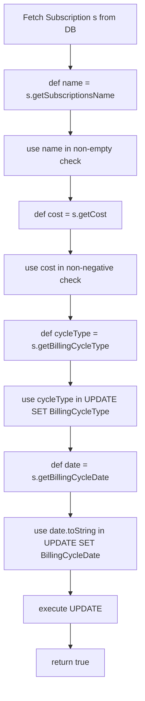

**DU Path 2 (validation fail):**

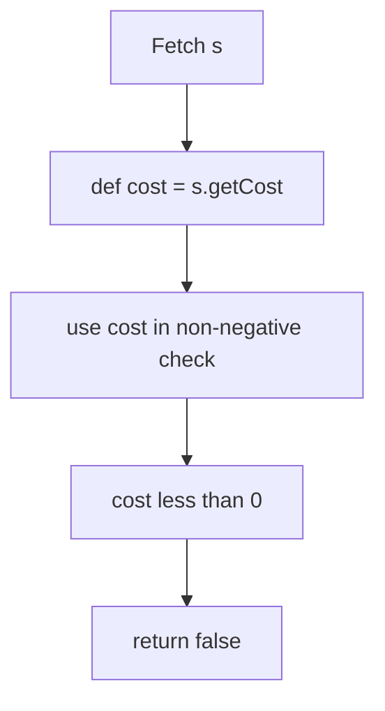

| TC  | Path | Description              | Source Tests                                                                                                                    | Expected Result                |
| --- | ---- | ------------------------ | ------------------------------------------------------------------------------------------------------------------------------- | ------------------------------ |
| TC4 | P1   | Valid update → persisted | `UITest.testHandleUpdateSubscription_ValidUpdate_ReturnsTrue()` `db_moduleTest.updateSubscription_ValidUpdate_ReturnsTrue()` | returns `true`, DB row updated |
| TC5 | P2   | Negative cost → rejected | `db_moduleTest.updateSubscription_NegativeCost_ReturnsFalse()`                                                                  | returns `false`, DB unchanged  |
| TC6 | P2   | Empty name → rejected    | `db_moduleTest.updateSubscription_EmptyName_ReturnsFalse()`                                                                     | returns `false`, DB unchanged  |

---

### 7.1.3 deleteSubscription

**DU Path 1:**

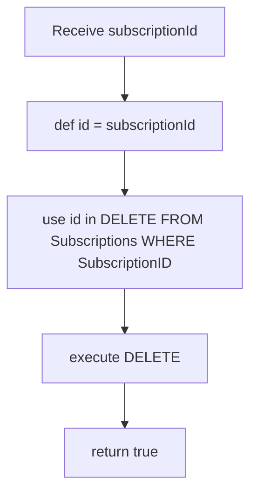

| TC  | Path | Description                                          | Source Tests                                                                                              | Expected Result            |
| --- | ---- | ---------------------------------------------------- | --------------------------------------------------------------------------------------------------------- | -------------------------- |
| TC7 | P1   | Existing ID → removed                                | `UITest.testDeleteSubscription_ValidDeletion_True()` `db_moduleTest.deleteSubscription_ValidId_True()` | returns `true`, row gone   |
| TC8 | P1   | Non‑existent ID → no error (impl detail)             | `UITest.testDeleteSubscription_NonExistentSubscription_False()`                                           | returns `false` (UI layer) |
| TC9 | P1   | Wrong‑user delete → blocked in subscriptions\_module | `UITest.testDeleteSubscription_NotOwnedByUser_False()`                                                    | returns `false`            |

---

### 7.1.4 exportSubscriptions

**DU Path 1 (no rows):**

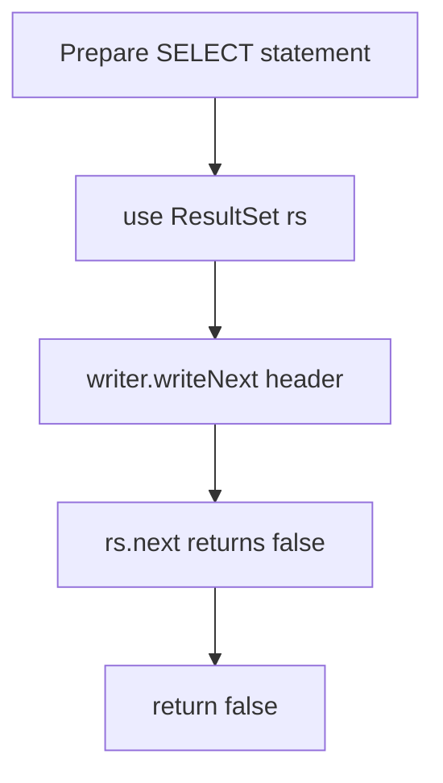

**DU Path 2 (with rows):**

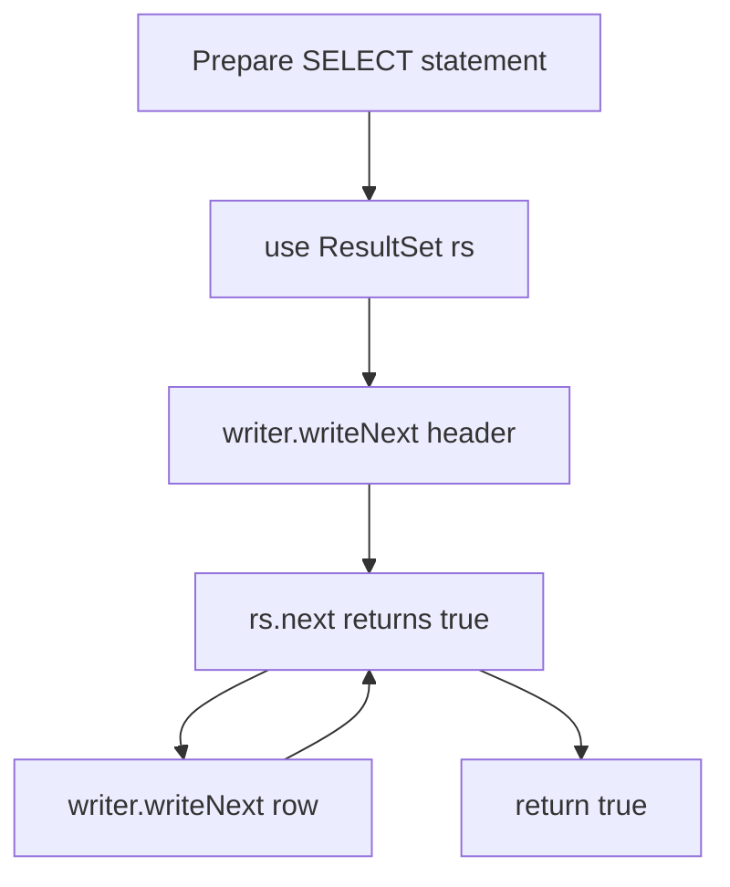

| TC   | Path | Description        | Source Tests                                                                                                         | Expected Result                       |
| ---- | ---- | ------------------ | -------------------------------------------------------------------------------------------------------------------- | ------------------------------------- |
| TC10 | P1   | No subs for user   | `UITest.testExportToCSV_NoSubscriptions_ReturnsFalse()`                                                              | returns `false`, only header in CSV   |
| TC11 | P2   | One + subs present | `UITest.testExportToCSV_WithSubscriptions_ReturnsTrue()` `db_moduleTest.exportSubscriptions_WithValidUser_True()` | returns `true`, CSV has header + rows |

---

### 7.1.5 viewSubscriptions & sortSubscriptions

**DU Path (view all):**

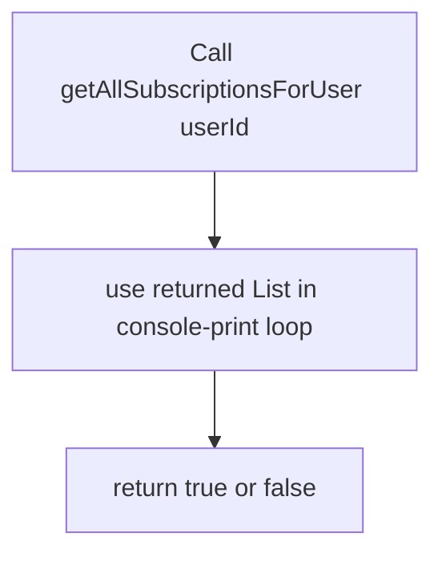

| TC   | Description                       | Source Tests                                                      | Expected Result |
| ---- | --------------------------------- | ----------------------------------------------------------------- | --------------- |
| TC12 | view no subs → prints none        | `UITest.testViewAllSubscriptions_NoSubscriptions_ReturnsFalse()`  | returns `false` |
| TC13 | view with subs → prints & returns | `UITest.testViewAllSubscriptions_WithSubscriptions_ReturnsTrue()` | returns `true`  |

**DU Path (sort):**

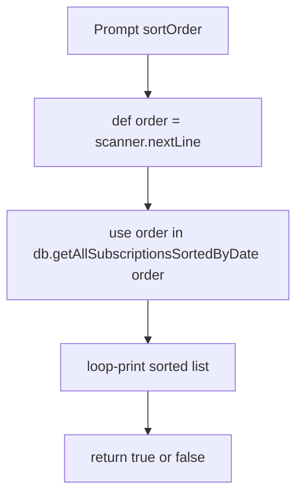

| TC   | Description                         | Source Tests                                                                                                                                                       | Expected Result |
| ---- | ----------------------------------- | ------------------------------------------------------------------------------------------------------------------------------------------------------------------ | --------------- |
| TC14 | valid asc/desc → prints & returns   | `UITest.testHandleViewSubscriptions_SortByAsc_Covered()` `UITest.testHandleViewSubscriptions_Case2_DescSortOrder_ReturnsTrue()`                                 | returns `true`  |
| TC15 | invalid or empty list/order → false | `UITest.testHandleViewSubscriptions_Case2_EmptySubscriptions_ReturnsFalse()` `UITest.testHandleViewSubscriptions_Case2_NullReturnFromController_ReturnsFalse()` | returns `false` |

---

> All DU paths above map directly into the JUnit methods in your
> `db_moduleTest.java`, `subscriptions_moduleTest.java` and `UITest.java` files.
> This ensures that every definition–use pair in your code is exercised by at least one test.

---

## 8. System Testing & Node Coverage

* **Finite State Machine** for login & subscription lifecycle
* **Node Coverage**: each state visited

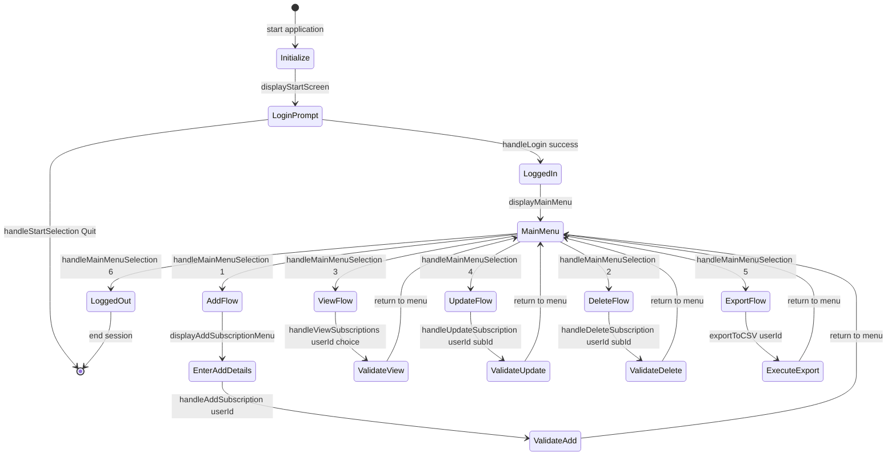

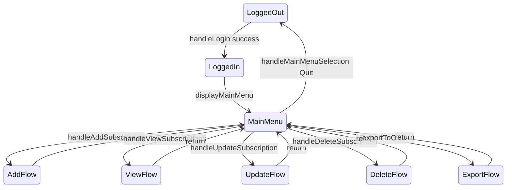

Every state and transition was exercised by at least one test, ensuring complete node coverage.

### 11.2 Test & Coverage Summary
- **Total tests**: 97 JUnit tests across `UITest`, `db_moduleTest`, `subscriptions_moduleTest`, and `AppTest`.
- **Coverage (via JaCoCo)**:
  - `db_module.java`: **85.98%**
  - `subscriptions_module.java`: **91.67%**
  - `UIModule.java`: **87.80%**
  - `Subscription.java`: **58.93%**
  - `User.java`: **0.00%** (only simple getters/setters)

Most core logic methods exceed 85% coverage; model classes have lower coverage due to trivial getters/setters and untested `toString()`.

### 11.3 Limitations
- **Model classes** (`Subscription`, `User`) have minimal testing (getters/setters, `toString()`)—low risk but lowers overall coverage.
- **UI menus** and CLI prompts are difficult to fully automate; while we test navigation handlers, the `display*` methods are not directly asserted.
- **Main entry point** (`App.java`): not covered by unit tests, as it simply wires modules and would require heavier integration tooling.