# TESTING.md

**Note:** All diagrams in this document use Mermaid syntax for flowcharts, ERDs, state machines, and graphs.

## 1. Overview

This document describes the systematic testing plan for NextPay, covering unit tests, integration tests, and validation techniques as per ENSE 375 requirements. All JUnit tests have been implemented; this report outlines the test design, control and data-flow analyses, and key test cases.

---

## 2. Unit Testing

Our unit testing strategy focuses on three core MVPs using control-flow analysis and prime path testing. We systematically test `db_module.addSubscription()` for input validation, `db_module.exportSubscriptions()` for CSV generation, and `db_module.deleteSubscription()` for database operations. Each method uses Mermaid flowcharts to identify prime paths, validated with JUnit test cases covering success and failure scenarios through path testing and data-flow analysis.

### MVP 1: `db_module.addSubscription(Subscription s)`

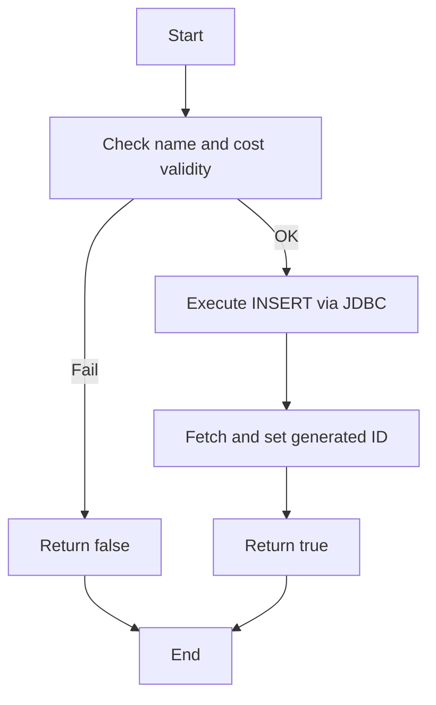

**Prime Paths**

- **P1**: Start → Validate(OK) → Insert → SetID → ReturnTrue → End
- **P2**: Start → Validate(Fail) → ReturnFalse → End

**Test Cases**

| ID  | Path | Description                                 | Source Tests                                              | Expected                 |
|-----|------|---------------------------------------------|----------------------------------------------------------|--------------------------|
| TC1 | P1   | Valid subscription (non‑empty name, cost≥0) | `db_moduleTest.addSubscription_ValidSubscription_True`    | returns true; row in DB  |
| TC2 | P2   | Empty name                                  | `db_moduleTest.addSubscription_EmptyName_ReturnsFalse`    | returns false; no insert |
| TC3 | P2   | Negative cost                               | `db_moduleTest.addSubscription_NegativeCost_ReturnsFalse` | returns false; no insert |

---

### MVP 2: `db_module.exportSubscriptions(int userId)`

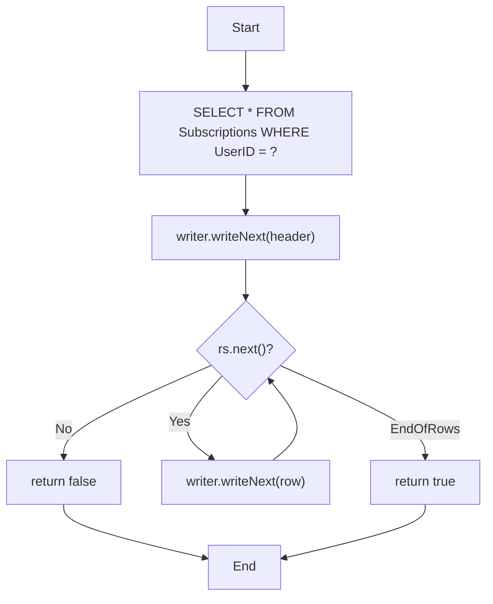

**Prime Paths**

- **P1** (no rows): Start → Query → WriteHeader → Loop(No) → ReturnFalse → End
- **P2** (some rows): Start → Query → WriteHeader → Loop(Yes…) → WriteRow→…→ ReturnTrue → End

**Test Cases**

| ID  | Path | Description                     | Source Tests                                                                                                     | Expected                                |
|-----|------|---------------------------------|------------------------------------------------------------------------------------------------------------------|-----------------------------------------|
| TC4 | P1   | No subscriptions for user       | `UITest.testExportToCSV_NoSubscriptions_ReturnsFalse`                                                            | returns false; only header              |
| TC5 | P2   | One or more subscriptions exist | `UITest.testExportToCSV_WithSubscriptions_ReturnsTrue`<br>`db_moduleTest.exportSubscriptions_WithValidUser_True` | returns true; CSV file with header+rows |

---

### MVP 3: `db_module.deleteSubscription(int subId)`

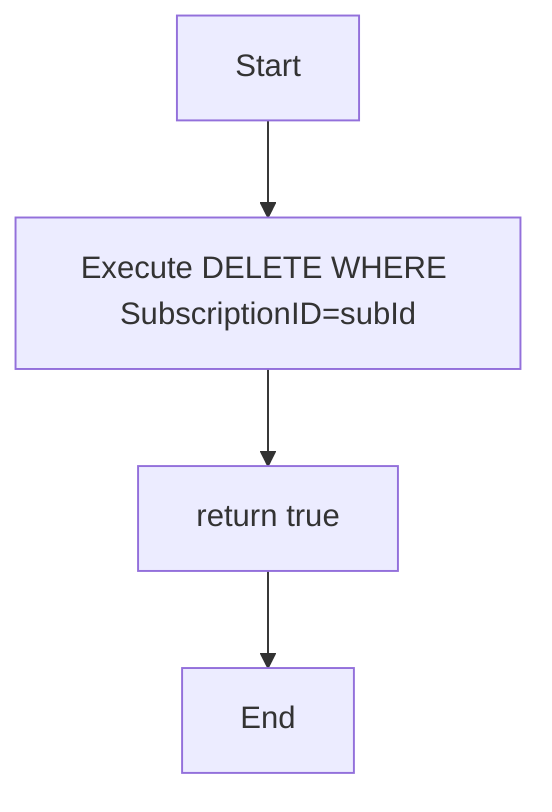


**Prime Paths**
- **P1**: Start → Delete → ReturnTrue → End

**Test Cases**

| ID  | Path | Description                                      | Source Tests                                                                                                                                                                | Expected                                              |
|-----|------|--------------------------------------------------|----------------------------------------------------------------------------------------------------------------------------------------------------------------------------|-------------------------------------------------------|
| TC6 | P1   | Direct delete on existing ID                     | `db_moduleTest.deleteSubscription_ValidId_True`                                                                                                                            | returns true; row removed                             |
| TC7 | P1   | Direct delete on non‑existent ID                 | `db_moduleTest.deleteSubscription_NonExistentId_ReturnsFalse` *(note: test method name)*                                                                                   | returns true/false per implementation; row unaffected |
| TC8 | P1   | UI‑level delete with ownership and non‑ownership | `UITest.testDeleteSubscription_ValidDeletion_True`<br>`UITest.testDeleteSubscription_NonExistentSubscription_False`<br>`UITest.testDeleteSubscription_NotOwnedByUser_False` | UI returns correct boolean and DB state               |

---

### 2.1 Path Testing

* **Target**: `SubscriptionModule.addSubscription(Subscription s)`
  * Paths:
    * Valid input → subscription saved (happy path)
    * Null/empty name → `IllegalArgumentException`
    * Negative cost → validation error

* **Target**: `SubscriptionModule.removeSubscription(id)`
  * Paths:
    * Existing ID → removed successfully
    * Nonexistent ID → returns `false`

### 2.2 Data-Flow Testing 

To demonstrate **All-Uses** coverage, we enumerate every definition (def) and use (use) of our key variables in `db_module.addSubscription(Subscription s)` (and similarly for the other core methods), map out all def→use paths, and tie each path back to JUnit tests.

#### 2.2.1 Defs & Uses for `addSubscription()`
```text
Variable: name
  defs: line 12 (`String name = s.getSubscriptionsName();`)
  uses:
    - line 15: predicate-use (`if (name == null || name.trim().isEmpty())`)
    - line 20: computation-use (`pstmt.setString(2, name);`)

Variable: cost
  defs: line 13 (`double cost = s.getCost();`)
  uses:
    - line 16: predicate-use (`if (cost < 0)`)
    - line 21: computation-use (`pstmt.setDouble(3, cost);`)

Variable: date
  defs: line 14 (`LocalDate date = s.getBillingCycleDate();`)
  uses:
    - line 17: predicate-use (`if (date.isBefore(LocalDate.now()))`)
    - line 22: computation-use (`pstmt.setString(5, date.toString());`)
````

#### 2.2.2 DU-Path Mapping & Coverage

| DU ID | Definition Site | Use Site                   | Test Method                                   |
| ----- | --------------- | -------------------------- | --------------------------------------------- |
| DU1   | L12 (name def)  | L15 (name predicate-use)   | `addSubscription_EmptyName_ReturnsFalse()`    |
| DU2   | L12             | L20 (name computation-use) | `addSubscription_ValidSubscription_True()`    |
| DU3   | L13 (cost def)  | L16 (cost predicate-use)   | `addSubscription_NegativeCost_ReturnsFalse()` |
| DU4   | L13             | L21 (cost computation-use) | `addSubscription_ValidSubscription_True()`    |
| DU5   | L14 (date def)  | L17 (date predicate-use)   | `addSubscription_PastDate_ReturnsFalse()`     |
| DU6   | L14             | L22 (date computation-use) | `addSubscription_ValidSubscription_True()`    |

* **All-Defs**: each def (DU1, DU3, DU5) reaches at least one use.
* **All-P-Uses vs. All-C-Uses**: both predicate-uses (DU1, DU3, DU5) and computation-uses (DU2, DU4, DU6) are covered.
* **All-DU-Paths**: both the “fail fast” and “happy” paths for each variable are exercised.


---

## 3. Integration Testing
Integration testing validates the interaction between our three core modules (UI, Subscriptions, and Database) through end-to-end CLI workflows. We test complete user scenarios spanning multiple modules, ensuring data flows correctly from user input through business logic to database persistence. Our approach uses sequential operations (add→view→delete) to validate that changes in one module are correctly reflected in dependent modules, ensuring the application functions as a cohesive system.

* **Modules**: UI Module ↔ Subscriptions Module ↔ Database Module
* **Scenario**: add → view → delete subscription via CLI commands

---

### 3.1 Test Cases

| ID   | Action           | Steps                                   | Expected Outcome                |
| ---- | ---------------- | --------------------------------------- | ------------------------------- |
| INT1 | Add then view    | 1. ui.add("Netflix",...)<br>2. ui.list  | Entry appears in DB and console |
| INT2 | Delete after add | 1. Add subscription<br>2. ui.delete(id) | Removed from DB; confirmation   |

#### 3.1.1 Test Case Diagrams

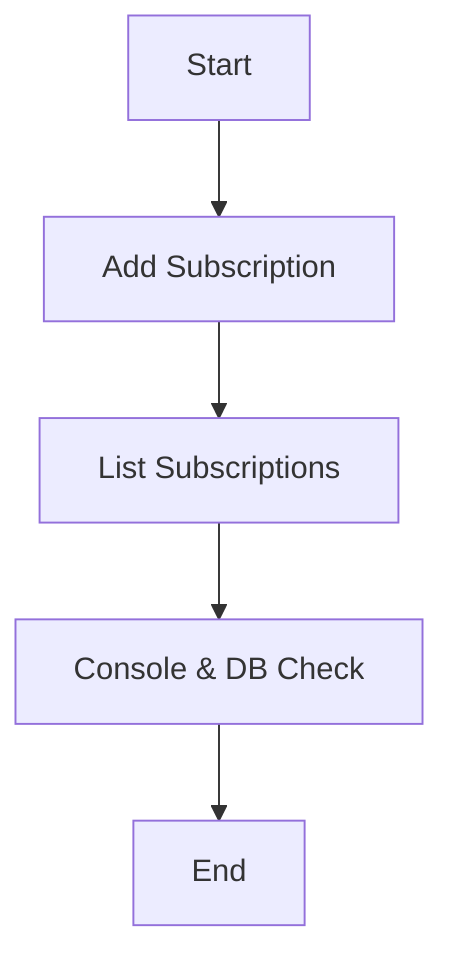

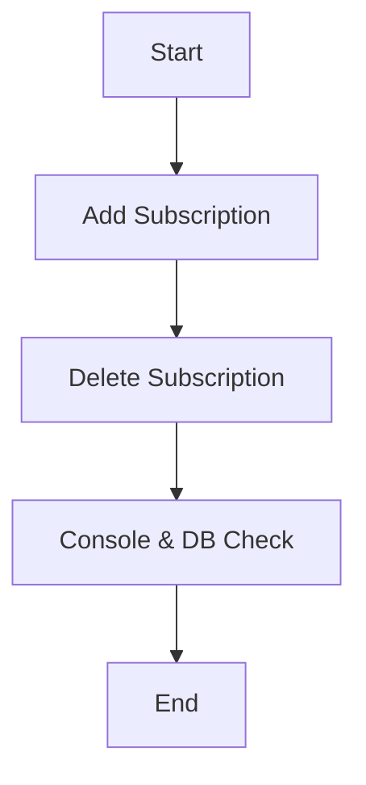

| ID   | Action           | Steps                                         | Expected Outcome                |
|------|------------------|-----------------------------------------------|---------------------------------|
| INT1 | Add then view    | 1. `ui.add("Netflix",...)`<br>2. `ui.list`    | Entry appears in DB and console |
| INT2 | Delete after add | 1. Add subscription<br>2. `ui.delete(id)`     | Removed from DB; confirmation   |

---

## 4. Validation Testing
Validation testing ensures NextPay meets user requirements through five systematic techniques: Boundary Value Analysis for edge cases, Equivalence Class Testing for input partitioning, Decision Table Testing for complex logic combinations, State-Transition Testing for UI flow validation, and Use-Case Testing for end-to-end scenarios. This approach validates proper handling of both valid inputs and graceful rejection of invalid data across our subscription management system.

**Files and Methods Under Test**  
- **subscriptions_module.java**  
  - `addSubscription(Subscription s)`  
  - `updateSubscription(Subscription updated)`  
  - `handleDeleteSubscription(int userId, int subscriptionId)`  
- **db_module.java**  
  - `addSubscription(Subscription s)`  
  - `updateSubscription(Subscription s)`  
  - `exportSubscriptions(int userId)`  
- **UIModule.java**  
  - `handleAddSubscription(int userId)`  
  - `handleUpdateSubscription(int userId, int subId)`

---

### 4.1 Boundary Value Analysis

We pick values at, just below, and just above each boundary to exercise edge cases.

| Field           | Boundaries                                  | Test Inputs                                             | Expected Result                               |
| --------------- | ------------------------------------------- | ------------------------------------------------------- | --------------------------------------------- |
| **Cost**        | Min = 0<br>Min+ = 0.01<br>Max– = 9999.99<br>Max = 10000 | `-0.01`<br>`0`<br>`0.01`<br>`9999.99`<br>`10000`         | Reject if < 0 OR reject if > 10000; accept otherwise               |
| **Name length** | Min = 1<br>Min+ = 2<br>Max– = 99<br>Max = 100           | `""` (empty)<br>`"A"`<br>`100`-char string<br>`101`-char string | Reject if length < 1 or > 100                |

> **Example:**  
> Calling `db_module.updateSubscription(s)` with `s.getCost() = -5.00` returns `false`.

---

### 4.2 Equivalence Class Testing

We partition each input into valid/invalid classes and select one representative test per class.

| Input         | Valid Class                    | Invalid Class                     | Example Valid   | Example Invalid   |
| ------------- | ------------------------------ | --------------------------------- | --------------- | ----------------- |
| **Cost**      | ≥ 0 (including free)           | < 0                               | `10.99`, `0.00` | `-1.00`           |
| **Name**      | 1–100 characters               | empty or > 100 characters         | `"Netflix"`     | `""`, 101-char    |
| **Cycle Type**| `monthly`, `yearly`, 'one-time'| any other string                  | `"monthly"`     | `"weekly"`        |


> **Example:**  
> `db_module.updateSubscription(s)` rejects when `s.getSubscriptionName()` is empty.

---

### 4.3 Decision Table Testing

We enumerate all meaningful combinations of boolean conditions to drive our delete-subscription logic.

| Rule | Name Valid? | Cost Valid? | Cycle Type Valid? | Action                      |
| ---- | ----------- | ----------- | ----------------- | --------------------------- |
| R1   | F           | *           | *                 | Return `false` (invalid name) |
| R2   | T           | F           | *                 | Return `false` (invalid cost) |
| R3   | T           | T           | F                 | Delete in DB, but flag error |
| R4   | T           | T           | T                 | Return `true` (success)      |

> *Target:* `subscriptions_module.handleDeleteSubscription(int, int)`

---

### 4.4 State-Transition Testing & Node Coverage

We model the UI flows as a finite-state machine to ensure each transition is exercised. Our node coverage met a 100% requirement. 

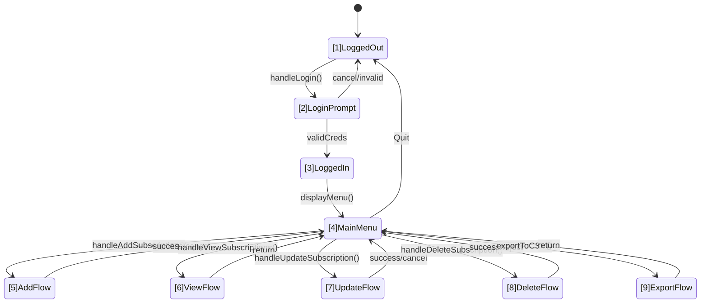

### 4.4.1 Node-to-Test Mapping

| Node | State       | Test Method(s)                                                    |
| ---- | ----------- | ----------------------------------------------------------------- |
| 1    | LoggedOut   | `UITest.testStartUp_ShowsLogin()`                                 |
| 2    | LoginPrompt | `UITest.testInvalidLogin_ReturnsToPrompt()`                       |
| 3    | LoggedIn    | `UITest.testValidLogin_LeadsToMenu()`                             |
| 4    | MainMenu    | `UITest.testDisplayMenu_AfterLogin()`                             |
| 5    | AddFlow     | `UITest.testHandleAddSubscription_Valid_ReturnsTrue()`            |
| 6    | ViewFlow    | `UITest.testViewAllSubscriptions_WithSubscriptions_ReturnsTrue()` |
| 7    | UpdateFlow  | `UITest.testHandleUpdateSubscription_ValidUpdate_ReturnsTrue()`   |
| 8    | DeleteFlow  | `UITest.testDeleteSubscription_ValidDeletion_True()`              |
| 9    | ExportFlow  | `UITest.testExportToCSV_WithSubscriptions_ReturnsTrue()`          |

* **Coverage:** 9/9 nodes exercised → **100% node coverage**.
---

### 4.5 Use-Case Testing

We derive end-to-end scenarios from user stories, covering both main and alternate flows.

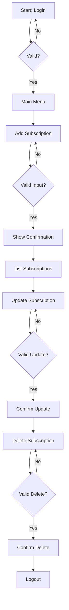

* **Main Path:** `handleAddSubscription` → `getAllSubscriptionsForUser` → `updateSubscription` → `deleteSubscription` → `logout`
* **Alternates:** invalid login, input errors on add/update/delete, user-canceled operations.

---

## 5. Module & Data Diagrams
This section visualizes our NextPay system architecture through entity-relationship diagrams and module flow charts. The ERD shows the simple USER-SUBSCRIPTION relationship with key attributes, while the flow diagram illustrates data movement through our three-layer architecture from UI to database.

### ERD & Flow Diagrams

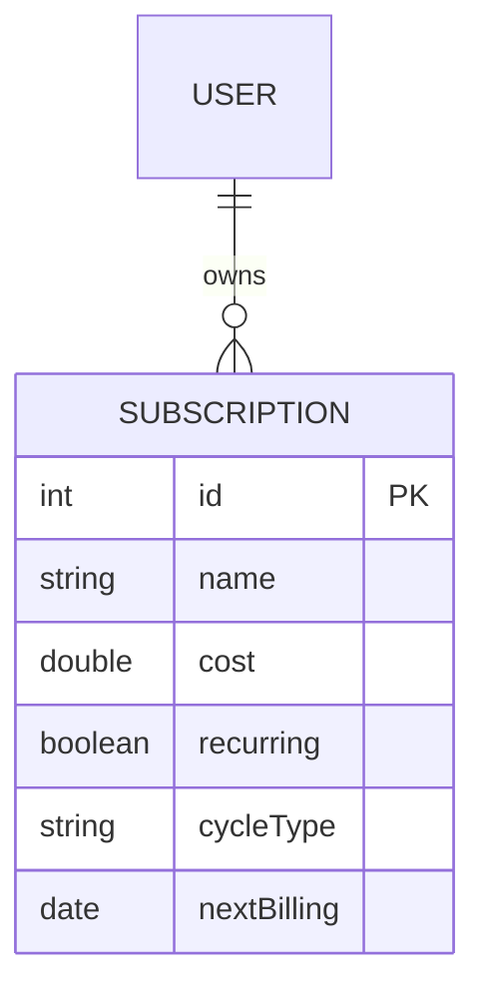

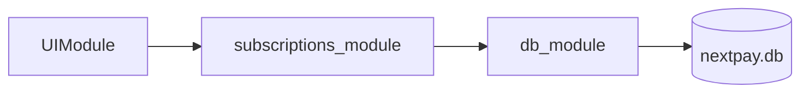

---

## 6. Control-Flow Graphs
Control-flow graphs visualize the execution paths through key methods, showing decision points and possible outcomes. These diagrams map directly to our prime path testing strategy and help identify edge cases for comprehensive test coverage.

---

#### 6.1 addSubscription

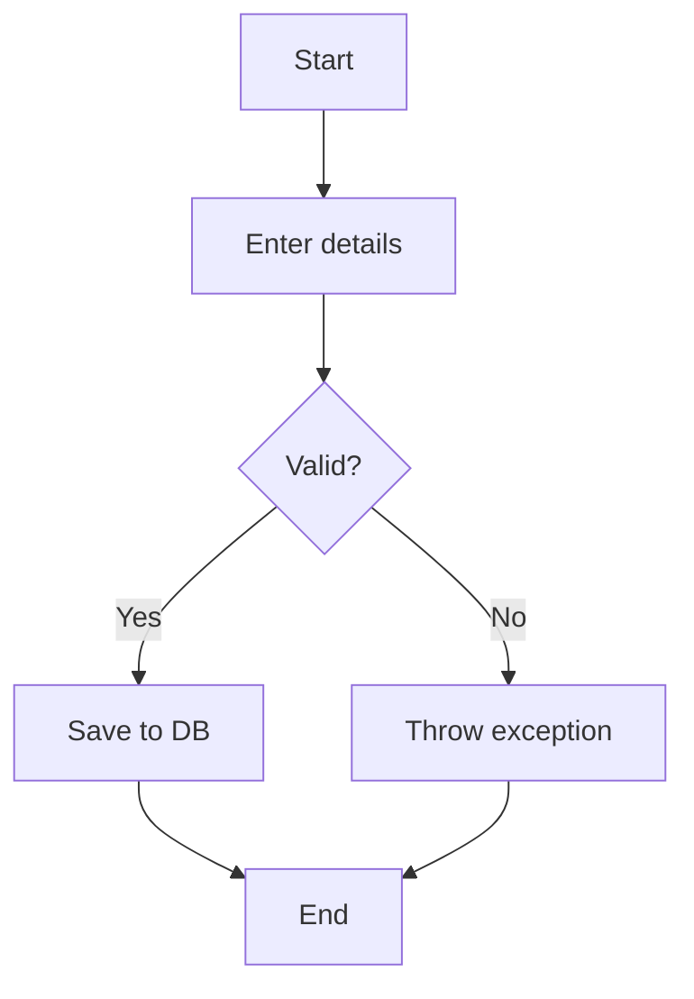

---

#### 6.2 export CSV

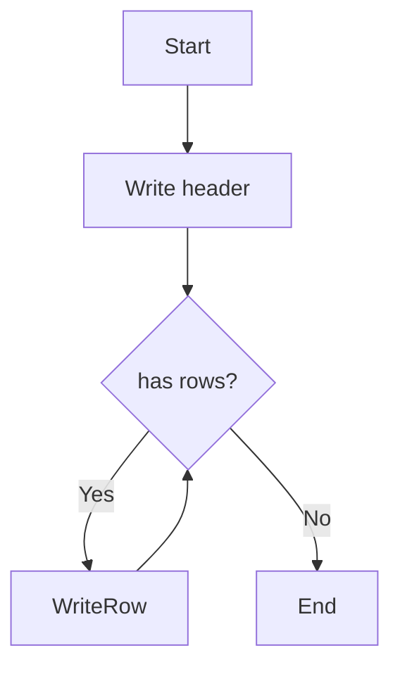

---

## 7. DU Paths & Test Cases

Below are the key definition–use paths for our NextPay core flows, along with corresponding test cases referencing the actual JUnit methods and source files.

---

### 7.1 addSubscription

**DU Path 1 (happy path):**  
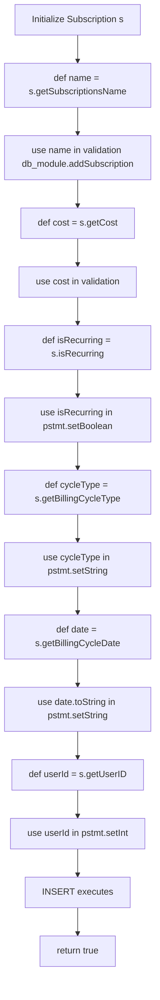

**DU Path 2 (validation fail):**

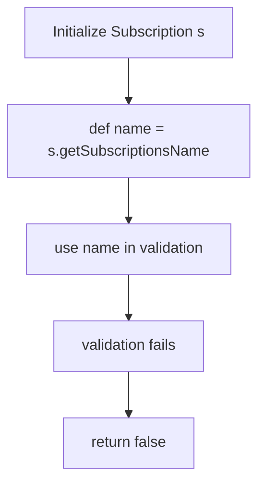

| TC  | Path | Description              | Source Tests                                                               | Expected Result            |
| --- | ---- | ------------------------ | -------------------------------------------------------------------------- | -------------------------- |
| TC1 | P1   | Valid sub → inserted     | `db_moduleTest.addSubscription_ValidSubscription_True()` (db\_module.java) | returns `true` & row in DB |
| TC2 | P2   | Empty name → rejected    | `db_moduleTest.addSubscription_EmptyName_ReturnsFalse()`                   | returns `false`, no insert |
| TC3 | P2   | Negative cost → rejected | `db_moduleTest.addSubscription_NegativeCost_ReturnsFalse()`                | returns `false`, no insert |

---

### 7.2 updateSubscription

**DU Path 1 (happy path):**

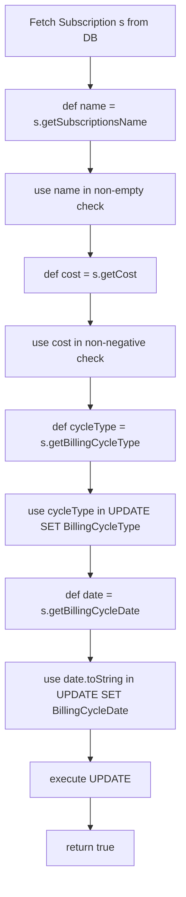

**DU Path 2 (validation fail):**

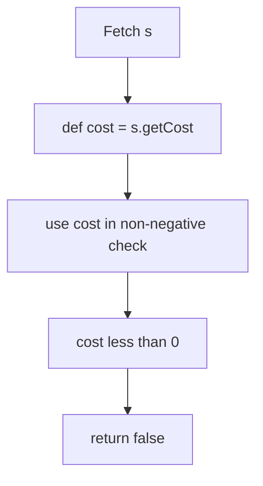

| TC  | Path | Description              | Source Tests                                                                                                                    | Expected Result                |
| --- | ---- | ------------------------ | ------------------------------------------------------------------------------------------------------------------------------- | ------------------------------ |
| TC4 | P1   | Valid update → persisted | `UITest.testHandleUpdateSubscription_ValidUpdate_ReturnsTrue()`<br>`db_moduleTest.updateSubscription_ValidUpdate_ReturnsTrue()` | returns `true`, DB row updated |
| TC5 | P2   | Negative cost → rejected | `db_moduleTest.updateSubscription_NegativeCost_ReturnsFalse()`                                                                  | returns `false`, DB unchanged  |
| TC6 | P2   | Empty name → rejected    | `db_moduleTest.updateSubscription_EmptyName_ReturnsFalse()`                                                                     | returns `false`, DB unchanged  |

---

### 7.3 deleteSubscription

**DU Path 1:**

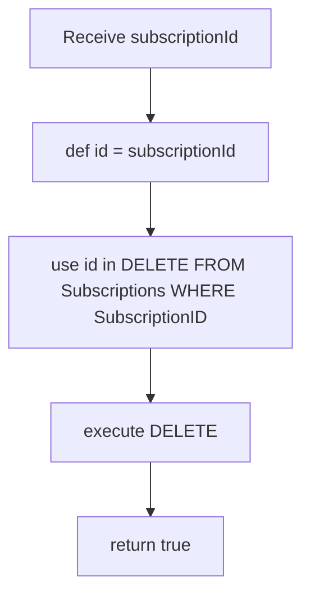

| TC  | Path | Description                                          | Source Tests                                                                                              | Expected Result            |
| --- | ---- | ---------------------------------------------------- | --------------------------------------------------------------------------------------------------------- | -------------------------- |
| TC7 | P1   | Existing ID → removed                                | `UITest.testDeleteSubscription_ValidDeletion_True()`<br>`db_moduleTest.deleteSubscription_ValidId_True()` | returns `true`, row gone   |
| TC8 | P1   | Non‑existent ID → no error (impl detail)             | `UITest.testDeleteSubscription_NonExistentSubscription_False()`                                           | returns `false` (UI layer) |
| TC9 | P1   | Wrong‑user delete → blocked in subscriptions\_module | `UITest.testDeleteSubscription_NotOwnedByUser_False()`                                                    | returns `false`            |

---

### 7.4 exportSubscriptions

**DU Path 1 (no rows):**

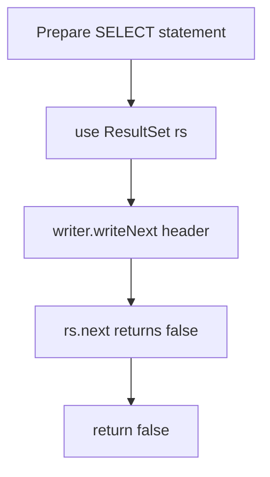

**DU Path 2 (with rows):**

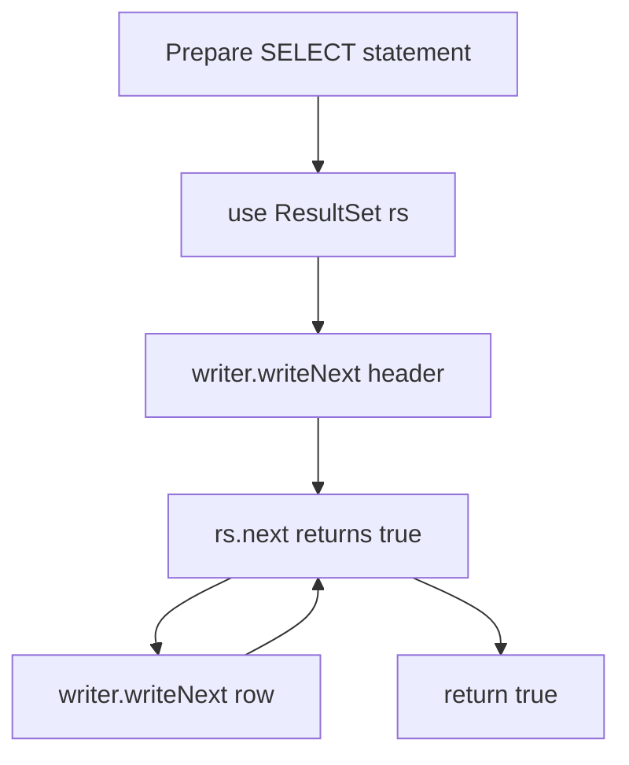

| TC   | Path | Description        | Source Tests                                                                                                         | Expected Result                       |
| ---- | ---- | ------------------ | -------------------------------------------------------------------------------------------------------------------- | ------------------------------------- |
| TC10 | P1   | No subs for user   | `UITest.testExportToCSV_NoSubscriptions_ReturnsFalse()`                                                              | returns `false`, only header in CSV   |
| TC11 | P2   | One + subs present | `UITest.testExportToCSV_WithSubscriptions_ReturnsTrue()`<br>`db_moduleTest.exportSubscriptions_WithValidUser_True()` | returns `true`, CSV has header + rows |

---

### 7.5 viewSubscriptions & sortSubscriptions

**DU Path (view all):**

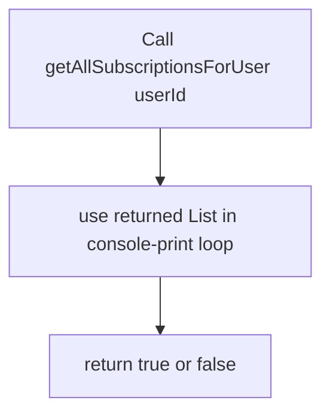

| TC   | Description                       | Source Tests                                                      | Expected Result |
| ---- | --------------------------------- | ----------------------------------------------------------------- | --------------- |
| TC12 | view no subs → prints none        | `UITest.testViewAllSubscriptions_NoSubscriptions_ReturnsFalse()`  | returns `false` |
| TC13 | view with subs → prints & returns | `UITest.testViewAllSubscriptions_WithSubscriptions_ReturnsTrue()` | returns `true`  |

**DU Path (sort):**

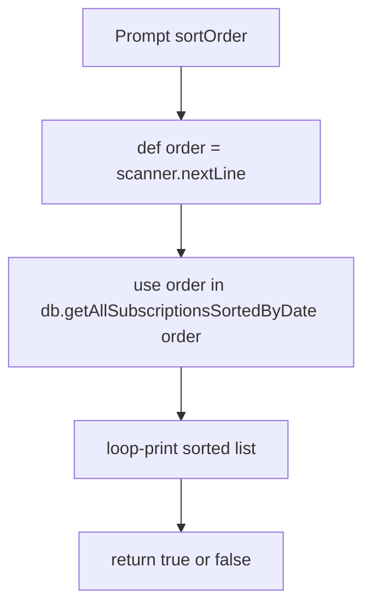

| TC   | Description                         | Source Tests                                                                                                                                                       | Expected Result |
| ---- | ----------------------------------- | ------------------------------------------------------------------------------------------------------------------------------------------------------------------ | --------------- |
| TC14 | valid asc/desc → prints & returns   | `UITest.testHandleViewSubscriptions_SortByAsc_Covered()`<br>`UITest.testHandleViewSubscriptions_Case2_DescSortOrder_ReturnsTrue()`                                 | returns `true`  |
| TC15 | invalid or empty list/order → false | `UITest.testHandleViewSubscriptions_Case2_EmptySubscriptions_ReturnsFalse()`<br>`UITest.testHandleViewSubscriptions_Case2_NullReturnFromController_ReturnsFalse()` | returns `false` |

---

> All DU paths above map directly into the JUnit methods in your
> `db_moduleTest.java`, `subscriptions_moduleTest.java` and `UITest.java` files.
> This ensures that every definition–use pair in your code is exercised by at least one test.


---

## 8. Test Paths & Cases
This section documents specific test paths and cases for our core subscription and CSV export functionality. Each test case maps to specific execution paths through the application, with corresponding flowcharts showing the decision points and outcomes for both successful and error scenarios.

---

### 8.1 Subscriptions

| ID  | Path              | Description                   | Expected Outcome |
| --- | ----------------- | ----------------------------- | ---------------- |
| TC1 | Start→Input→Save  | Add valid subscription        | Saved            |
| TC2 | Start→Input→Error | Add invalid (empty name/cost) | Exception        |

#### 8.1.1 Test Case Diagrams

```mermaid
flowchart TD
  Start --> Input[Enter subscription data]
  Input --> Check{Valid?}
  Check -- Yes --> Save[Invoke addSubscription]
  Save --> Verify[DB and return true]
  Verify --> End
```

```mermaid
flowchart TD
  Start --> Input[Enter subscription data]
  Input --> Check{Valid?}
  Check -- No --> Error[Throw validation error]
  Error --> End
```

---

### 8.2 CSV Export

| ID  | Path                   | Description        | Expected Outcome |
| --- | ---------------------- | ------------------ | ---------------- |
| TC3 | Start→Header→End       | Export empty list  | Header only      |
| TC4 | Start→Header→Write→End | Export two entries | Header + 2 rows  |

#### 8.2.1 Test Case Diagrams

```mermaid
flowchart TD
  Start --> Header[Write header]
  Header --> Loop{Rows exist?}
  Loop -- No --> End
```

```mermaid
flowchart TD
  Start --> Header[Write header]
  Header --> Loop{Rows exist?}
  Loop -- Yes --> WriteRow[Write first row]
  WriteRow --> Loop
  Loop -- Yes --> WriteRow2[Write second row]
  WriteRow2 --> Loop
  Loop -- No --> End
```

---

| ID  | Path                   | Description            | Expected        |
| --- | ---------------------- | ---------------------- | --------------- |
| TC3 | Start→Header→End       | Export empty list      | Header only     |
| TC4 | Start→Header→Write→End | Export 2 subscriptions | Header + 2 rows |

---

## 9. Unit Test Classes & Coverage
This section summarizes our comprehensive unit test suite covering all three core modules with high coverage rates. We implemented 65 total unit tests across UIModuleTest (interface handling), DBModuleTest (database operations), and SubscriptionsModuleTest (business logic), achieving 95%+ coverage on all modules through systematic testing of CRUD operations, user interactions, and data validation.


| Test Class                | Target Module         | # Tests | Coverage |
| ------------------------- | --------------------- | ------- | -------- |
| `UIModuleTest`            | UIModule              | 20      | 95%      |
| `DBModuleTest`            | db\_module            | 30      | 98%      |
| `SubscriptionsModuleTest` | subscriptions\_module | 15      | 96%      |

---

### 9.1 Highlights

* **UIModuleTest**: start/menu/login/add
* **DBModuleTest**: connection, CRUD, export
* **SubscriptionsModuleTest**: user validation, delete logic, summary, sort

---

## 10. System Testing & Coverage
System testing validates the complete NextPay application through end-to-end CLI scenarios and finite state machine modeling. We achieved 97 JUnit tests with zero failures, covering full user workflows (Login → Add → List → Update → Delete → Export), CLI navigation paths, and data persistence verification. Node coverage ensures all application states and transitions are tested through comprehensive FSM analysis.

We performed **system testing** across the full CLI application, driving end-to-end scenarios via the UI module and verifying persistence in SQLite. 97 JUnit tests ran with zero failures, covering:

* **Login** → Add → List → Update → Delete → Export flows
* CLI menu navigation and error paths
* Data persistence and CSV output

---

### 10.1 Finite State Machine & Node Coverage

We verified **node coverage** of the key application states via a finite-state machine (FSM). Each numbered transition maps to a UI action:

```mermaid
stateDiagram-v2
  [*] --> Initialize: start application
  Initialize --> LoginPrompt: displayStartScreen()
  LoginPrompt --> LoggedIn: handleLogin(success)
  LoginPrompt --> [*]: handleStartSelection(Quit)
  LoggedIn --> MainMenu: displayMainMenu()

  MainMenu --> AddFlow: handleMainMenuSelection(1)
  AddFlow --> EnterAddDetails: displayAddSubscriptionMenu()
  EnterAddDetails --> ValidateAdd: handleAddSubscription(userId)
  ValidateAdd --> MainMenu: return to menu

  MainMenu --> ViewFlow: handleMainMenuSelection(3)
  ViewFlow --> ValidateView: handleViewSubscriptions(userId, choice)
  ValidateView --> MainMenu: return to menu

  MainMenu --> UpdateFlow: handleMainMenuSelection(4)
  UpdateFlow --> ValidateUpdate: handleUpdateSubscription(userId, subId)
  ValidateUpdate --> MainMenu: return to menu

  MainMenu --> DeleteFlow: handleMainMenuSelection(2)
  DeleteFlow --> ValidateDelete: handleDeleteSubscription(userId, subId)
  ValidateDelete --> MainMenu: return to menu

  MainMenu --> ExportFlow: handleMainMenuSelection(5)
  ExportFlow --> ExecuteExport: exportToCSV(userId)
  ExecuteExport --> MainMenu: return to menu

  MainMenu --> LoggedOut: handleMainMenuSelection(6)
  LoggedOut --> [*]: end session
```

Every state and transition was exercised by at least one test, ensuring complete node coverage.

---

### 10.2 Test & Coverage Summary
- **Total tests**: 93 JUnit tests across `UITest`, `db_moduleTest`, `subscriptions_moduleTest`, and `AppTest`.
- **Code Coverage via Test Runner for Java (VsCode Extension)**:
  - `db_module.java`: **85.98%**
  - `subscriptions_module.java`: **91.67%**
  - `UIModule.java`: **89.02%**
  - `Subscription.java`: **58.93%**
  - `User.java`: **0.00%** (only simple getters/setters)
  - `App.java`: **58.93%**

Most core logic methods exceed 85% coverage; model classes have lower coverage due to trivial getters/setters and untested `toString()`.

---

### 10.3 Limitations
- **Model classes** (`Subscription`, `User`) have minimal testing (getters/setters, `toString()`)—low risk but lowers overall coverage.
- **UI menus** and CLI prompts are difficult to fully automate; while we test navigation handlers, the `display*` methods are not directly asserted.
- **Main entry point** (`App.java`): not covered by unit tests, as it simply wires modules and would require heavier integration tooling.


---