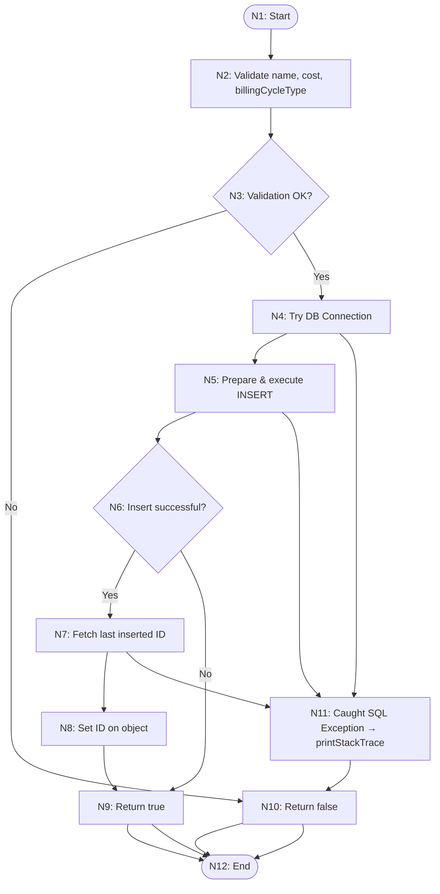
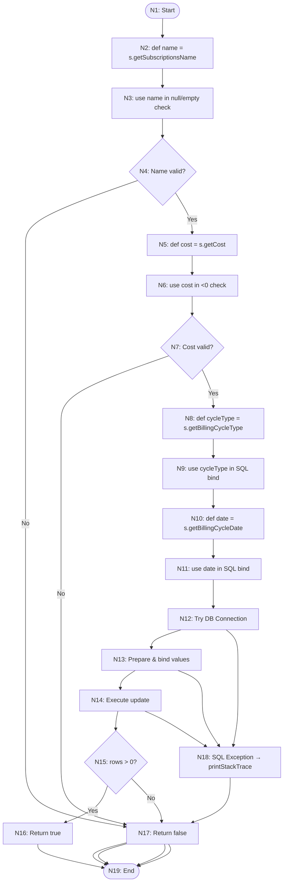
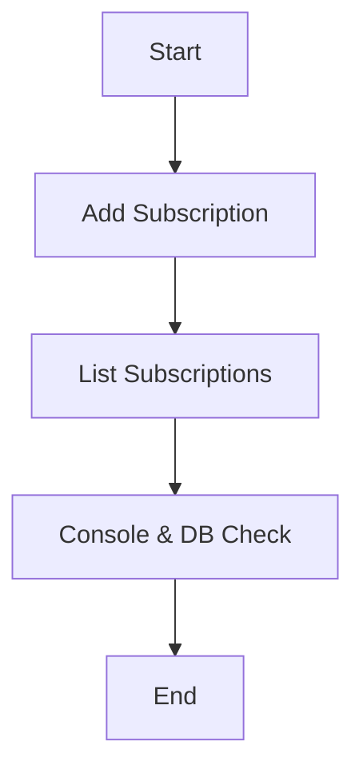
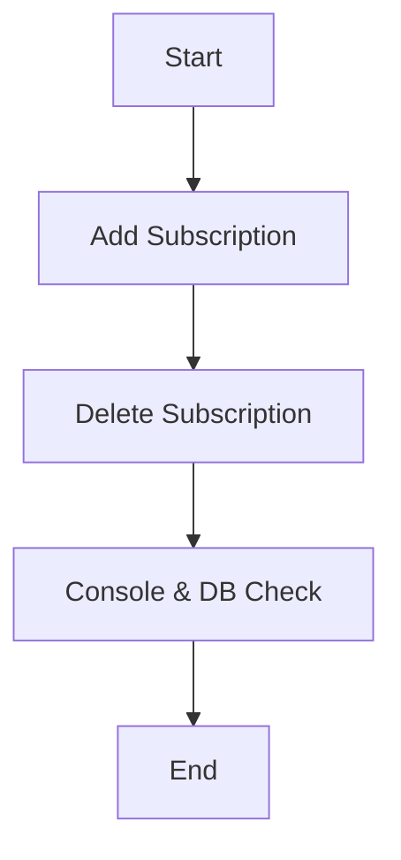
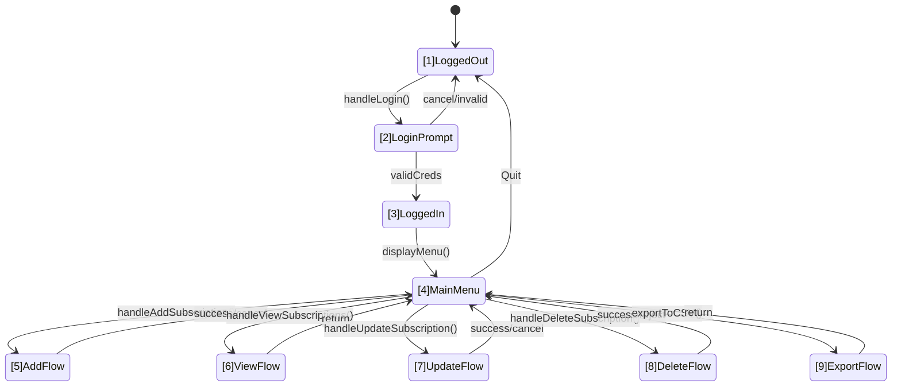
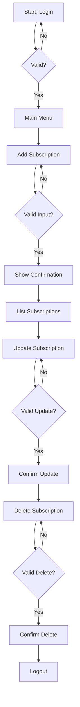

# TESTING.md

**Note:** All diagrams in this document use Mermaid syntax for flowcharts, ERDs, state machines, and graphs.

## 1. Overview

This document describes the systematic testing plan for NextPay, covering unit tests, integration tests, and validation techniques as per ENSE 375 requirements. All JUnit tests have been implemented; this report outlines the test design, control and data-flow analyses, and key test cases.

---

## 2. Specification Based Testing

### 2.1 Path Testing

- **Target**: `db_module.addSubscription(Subscription s)`
- **Paths Covered**:
  - Valid input → saved successfully → returns true
  - Empty name or negative cost → validation fails → returns false
  - Exception in DB layer → returns false (though not directly unit-tested)

---

####  Prime Paths (PPC)

| ID  | Prime Path                                                            | Description                        |
|-----|----------------------------------------------------------------------|------------------------------------|
| P1  | N1 → N2 → N3(No) → N10 → N12                                         | Validation fails                   |
| P2  | N1 → N2 → N3(Yes) → N4 → N5 → N6(No) → N9 → N12                      | Insert returns 0 rows (edge case) |
| P3  | N1 → N2 → N3(Yes) → N4 → N5 → N6(Yes) → N7 → N8 → N9 → N12           | Full happy path                    |
| P4  | N4 → N11 → N10 → N12                                                 | DB exception                       |

---

####  Actual JUnit Test Cases

| ID   | Path | Description                    | Test Method Name                                       | Expected Outcome           |
|------|------|--------------------------------|--------------------------------------------------------|----------------------------|
| TC1  | P3   | Valid subscription input       | `addSubscription_ValidSubscription_True()`            | returns `true`, DB insert  |
| TC2  | P3   | Valid non-recurring input      | `addSubscription_ValidNonRecurringSubscription_True()`| returns `true`, DB insert  |
| TC3  | P1   | Empty name                     | `addSubscription_EmptyName_ReturnsFalse()`            | returns `false`, no insert |
| TC4  | P1   | Negative cost                  | `addSubscription_NegativeCost_ReturnsFalse()`         | returns `false`, no insert |

🔸 Note: No existing test explicitly triggers P2 or P4 

### 2.2 Data‑Flow Testing

**Target**: `db_module.updateSubscription(Subscription s)`

- **Definitions & Uses**:  
  - **DU1**: `def name = s.getSubscriptionsName` → `use name in null/empty check`  
  - **DU2**: `def cost = s.getCost` → `use cost in cost < 0 check`  
  - **DU3**: `def cycleType = s.getBillingCycleType` → `use cycleType in SQL binding`  
  - **DU4**: `def date = s.getBillingCycleDate` → `use date in SQL binding`

---

### MVP 1: Definitions and Uses for `updateSubscription(Subscription s)`

---

####  DU Paths: Definition–Use Chains

| ID   | DU Path          | Description                            |
|------|------------------|----------------------------------------|
| DU1  | N2 → N3 → N4      | Name defined & used in name check      |
| DU2  | N5 → N6 → N7      | Cost defined & used in cost check      |
| DU3  | N8 → N9           | CycleType defined & used in SQL bind   |
| DU4  | N10 → N11         | BillingDate defined & used in SQL bind |

---

####  Actual JUnit Test Cases for Data‑Flow

| ID   | DU Path(s)      | Description              | Test Method Name                                          | Expected Result             |
|------|------------------|--------------------------|-----------------------------------------------------------|-----------------------------|
| TC4  | DU1, DU2–DU4     | Valid update             | `updateSubscription_ValidUpdate_ReturnsTrue()`           | returns `true`, DB updated  |
| TC5  | DU2              | Negative cost            | `updateSubscription_NegativeCost_ReturnsFalse()`          | returns `false`, no update  |
| TC6  | DU1              | Empty name               | `updateSubscription_EmptyName_ReturnsFalse()`             | returns `false`, no update  |

---

## 3. Integration Testing
Integration testing validates the interaction between our three core modules (UI, Subscriptions, and Database) through end-to-end CLI workflows. We test complete user scenarios spanning multiple modules, ensuring data flows correctly from user input through business logic to database persistence. Our approach uses sequential operations (add→view→delete) to validate that changes in one module are correctly reflected in dependent modules, ensuring the application functions as a cohesive system.

* **Modules**: UI Module ↔ Subscriptions Module ↔ Database Module
* **Scenario**: add → view → delete subscription via CLI commands

---

### 3.1 Test Cases

| ID   | Action           | Steps                                   | Expected Outcome                |
| ---- | ---------------- | --------------------------------------- | ------------------------------- |
| INT1 | Add then view    | 1. ui.add("Netflix",...) 2. ui.list  | Entry appears in DB and console |
| INT2 | Delete after add | 1. Add subscription 2. ui.delete(id) | Removed from DB; confirmation   |

#### 3.1.1 Test Case Diagrams

| ID   | Action           | Steps                                         | Expected Outcome                |
|------|------------------|-----------------------------------------------|---------------------------------|
| INT1 | Add then view    | 1. `ui.add("Netflix",...)` 2. `ui.list`    | Entry appears in DB and console |
| INT2 | Delete after add | 1. Add subscription 2. `ui.delete(id)`     | Removed from DB; confirmation   |

---

## 4. Validation Testing
Validation testing ensures NextPay meets user requirements through five systematic techniques: Boundary Value Analysis for edge cases, Equivalence Class Testing for input partitioning, Decision Table Testing for complex logic combinations, State-Transition Testing for UI flow validation, and Use-Case Testing for end-to-end scenarios. This approach validates proper handling of both valid inputs and graceful rejection of invalid data across our subscription management system.

**Files and Methods Under Test**  
- **subscriptions_module.java**  
  - `addSubscription(Subscription s)`  
  - `updateSubscription(Subscription updated)`  
  - `handleDeleteSubscription(int userId, int subscriptionId)`  
- **db_module.java**  
  - `addSubscription(Subscription s)`  
  - `updateSubscription(Subscription s)`  
  - `exportSubscriptions(int userId)`  
- **UIModule.java**  
  - `handleAddSubscription(int userId)`  
  - `handleUpdateSubscription(int userId, int subId)`
  - `handleMainMenuSelection(int choice)`
  - `handleStartSelection(int choice)` 

---

### 4.1 Boundary Value Analysis

We pick values at, just below, and just above each boundary to exercise edge cases.

#### Cost Field Testing:

|Test Case|Input Value|Expected Result|Actual Result|
|---|---|---|---|
|1|-0.01|Rejected|Rejected|
|2|0|Accepted|Accepted|
|3|0.01|Accepted|Accepted|
|4|9999.99|Accepted|Accepted|
|5|10000|Accepted|Accepted|
|6|10000.01|Rejected|Rejected|

**Boundaries:** Min = 0, Min+ = 0.01, Max– = 9999.99, Max = 10000

#### Name Length Testing:

|Test Case|Name Length|Expected Result|Actual Result|
|---|---|---|---|
|1|0 (empty)|Rejected|Rejected|
|2|1|Accepted|Accepted|
|3|2|Accepted|Accepted|
|4|50|Accepted|Accepted|
|5|99|Accepted|Accepted|
|6|100|Accepted|Accepted|
|7|101|Rejected|Rejected|

**Boundaries:** Min = 1, Min+ = 2, Max– = 99, Max = 100

> **Example:**  
> Calling `db_module.updateSubscription(s)` with `s.getCost() = -5.00` returns `false`.

#### Menu Choice Testing:

|Test Case|Menu Choice|Expected Result|Actual Result|
|---|---|---|---|
|1|0|Rejected (-1)|Rejected (-1)|
|2|1|Accepted (1)|Accepted (1)|
|3|2|Accepted (2)|Accepted (2)|
|4|5|Accepted (5)|Accepted (5)|
|5|6|Accepted (0)|Accepted (0)|
|6|7|Rejected (-1)|Rejected (-1)|
|7|99|Rejected (-1)|Rejected (-1)|

**Boundaries:** Min = 1, Min+ = 2, Max– = 5, Max = 6

---

### 4.2 Equivalence Class Testing

We partition each input into valid/invalid classes and select one representative test per class.

### Add Subscription Testing

**Target Methods:** `db_module.addSubscription()`, `db_module.updateSubscription()`, `subscriptions_module.addSubscription()`, `subscriptions_module.updateSubscription()`, `UIModule.handleAddSubscription()`, `UIModule.handleUpdateSubscription()`

#### Cost Field Testing:

|Test Case|Input Value|Equivalence Class|Expected Result|Actual Result|
|---|---|---|---|---|
|1|-5.00|Invalid (< 0)|Rejected|Rejected|
|2|0.00|Valid (= 0)|Accepted|Accepted|
|3|10.99|Valid (> 0)|Accepted|Accepted|
|4|9999.99|Valid (high)|Accepted|Accepted|

**Classes:** Valid ≥ 0 (including free) | Invalid < 0

#### Name Field Testing:

|Test Case|Input Value|Equivalence Class|Expected Result|Actual Result|
|---|---|---|---|---|
|1|""|Invalid (empty)|Rejected|Rejected|
|2|"A"|Valid (1 char)|Accepted|Accepted|
|3|"Netflix"|Valid (normal)|Accepted|Accepted|
|4|101-char|Invalid (> 100)|Rejected|Rejected|

**Classes:** Valid 1–100 characters | Invalid empty or > 100 characters

#### Cycle Type Testing:

|Test Case|Input Value|Equivalence Class|Expected Result|Actual Result|
|---|---|---|---|---|
|1|"monthly"|Valid (standard)|Accepted|Accepted|
|2|"yearly"|Valid (standard)|Accepted|Accepted|
|3|"one-time"|Valid (standard)|Accepted|Accepted|
|4|"weekly"|Invalid (other)|Rejected|Rejected|
|5|""|Invalid (empty)|Rejected|Rejected|

**Classes:** Valid `monthly`, `yearly`, `one-time` | Invalid any other string
Target Methods: db_module.isUserValid(String username, String password), subscriptions_module.validateUser(String username, String password), subscriptions_module.isUserValid(User user)

### User Authentication Testing:

#### Username field testing
|Test Case|Input Value|Equivalence Class|Expected Result|Actual Result|
|---|---|---|---|---|
|1|""|Invalid (empty)|Rejected (false)|Rejected (false)|
|2|"testuser"|Valid (existing user)|Accepted (true)|Accepted (true)|
|3|"nonexistent"|Valid format (non-existing)|Rejected (false)|Rejected (false)|
|4|null|Invalid (null)|Rejected (false)|Rejected (false)|
|5|"user with spaces"|Valid format|Rejected (false)|Rejected (false)|

**Classes:** Valid existing username | Invalid (empty/null/non-existing)

#### Password Field Testing:
| Test Case | Input Value     | Equivalence Class        | Expected Result  | Actual Result    |
| --------- | --------------- | ------------------------ | ---------------- | ---------------- |
| 1         | ""              | Invalid (empty)          | Rejected (false) | Rejected (false) |
| 2         | "password123"   | Valid (correct password) | Accepted (true)  | Accepted (true)  |
| 3         | "wrongpassword" | Valid format (incorrect) | Rejected (false) | Rejected (false) |
| 4         | null            | Invalid (null)           | Rejected (false) | Rejected (false) |
| 5         | "short"         | Valid format (too short) | Rejected (false) | Rejected (false) |

**Classes:** Valid correct password | Invalid (empty/null/incorrect)

#### Combined Authentication testing (Username and Password)

|Test Case|Username|Password|Equivalence Class|Expected Result|Actual Result|
|---|---|---|---|---|---|
|1|"testuser"|"password123"|Valid (both correct)|Accepted (true)|Accepted (true)|
|2|"testuser"|"wrongpass"|Invalid (wrong password)|Rejected (false)|Rejected (false)|
|3|"wronguser"|"password123"|Invalid (wrong username)|Rejected (false)|Rejected (false)|
|4|""|"password123"|Invalid (empty username)|Rejected (false)|Rejected (false)|
|5|"testuser"|""|Invalid (empty password)|Rejected (false)|Rejected (false)|
|6|""|""|Invalid (both empty)|Rejected (false)|Rejected (false)|
|7|null|null|Invalid (both null)|Rejected (false)|Rejected (false)|

**Classes**
- Valid: Both username and password match predefined record.
- Invalid: Any combination where username doesnt exist, password is wrong or either field is empty/null.

---

### 4.3 Decision Table Testing 
Our objective is to verify db_module.addSubscription(Subscription s) and subscriptions_module.handleDeleteSubscription(int userId,int subId)  under every meaningful combination of its validation checks.  

We use the lecture’s algorithmic steps: identify → enumerate → map → prune → derive tests.

- Identify: List all condition and action stubs.
- Enumerate: Expand the full set of rules (truth table).
- Prune: Collapse duplicates or irrelevant cases.
- Derive: Turn each unique rule into a concrete JUnit/UITest.

#### 4.3.1 Decision Tables - addSubscription 

#### 4.3.1.1 Condition & Action Stubs

| ID     | Condition stub                              |
| ------ | ------------------------------------------- |
| **C₁** | `isNameValid(s.getSubscriptionsName())`     |
| **C₂** | `isCostValid(s.getCost())`                  |
| **C₃** | `isCycleTypeValid(s.getBillingCycleType())` |

| ID     | System action                                           |
| ------ | ------------------------------------------------------- |
| **A₁** | *Reject* → return `false` due to **invalid name**       |
| **A₂** | *Reject* → return `false` due to **invalid cost**       |
| **A₃** | *Reject* → return `false` due to **invalid cycle type** |
| **A₄** | *Accept* → insert row and return `true`                 |

#### 4.3.1.2 Full Decision Table (8 Rules)

| Rule | C₁ | C₂ | C₃ | A₁ | A₂ | A₃ | A₄ |
| ---- | -- | -- | -- | -- | -- | -- | -- |
| R1   | F  | –  | –  | X  |    |    |    |
| R2   | T  | F  | –  |    | X  |    |    |
| R3   | T  | T  | F  |    |    | X  |    |
| R4   | T  | T  | T  |    |    |    | X  |
| R5   | F  | F  | –  | X  |    |    |    |
| R6   | F  | T  | F  | X  |    |    |    |
| R7   | T  | F  | F  |    | X  |    |    |
| R8   | F  | F  | F  | X  |    |    |    |

“–” means “don’t-care” (condition value irrelevant for that rule).

#### 4.3.1.3 Rule Reduction
Because rules R5–R8 trigger the same action as R1–R3, they are merged, leaving the minimal decision table below:

| Rule   | C₁ | C₂ | C₃ | Result                       |
| ------ | -- | -- | -- | ---------------------------- |
| **R1** | F  | –  | –  | `false` — invalid name       |
| **R2** | T  | F  | –  | `false` — invalid cost       |
| **R3** | T  | T  | F  | `false` — invalid cycle type |
| **R4** | T  | T  | T  | `true` — success             |

#### 4.3.1.4 Derived Test Cases

| TC  | Rule | Representative input (`name`, `cost`, `cycle`) | JUnit method                                                | Expected           |
| --- | ---- | ---------------------------------------------- | ----------------------------------------------------------- | ------------------ |
| DT1 | R1   | `("", 9.99, "monthly")`                        | `addSubscription_EmptyName_ReturnsFalse`                    | `false`            |
| DT2 | R2   | `("Netflix", -1.00, "monthly")`                | `addSubscription_NegativeCost_ReturnsFalse`                 | `false`            |
| DT3 | R3   | `("Netflix", 9.99, "weekly")`                  | `addSubscription_InvalidCycle_ReturnsFalse` | `false`            |
| DT4 | R4   | `("Spotify", 8.99, "monthly")`                 | `addSubscription_ValidSubscription_True`                    | `true` & row in DB |

**Coverage Claim** – The four test cases satisfy **Each-Rule** and **Each-Action** coverage; they also achieve **pair-wise (2-way) combination** because any two conditions toggle across the set.

#### 4.3.2 Decision Tables - handleDeleteSubscription
This routine first checks that the requested subscription exists and is owned by the caller; only then does it delegate to db_module.deleteSubscription().

#### 4.3.2.1 Condition & Action Stubs

| ID     | Condition stub (predicate)  | Description                       |
| ------ | --------------------------- | --------------------------------- |
| **C₁** | `subscriptionExists(subId)` | row with `subId` is present in DB |
| **C₂** | `isOwner(userId, subId)`    | row belongs to calling user       |

#### 4.3.2.2 Full Decision Table (4 raw rules)

| Rule | C₁    | C₂    | A₁    | A₂    |
| ---- | ----- | ----- | ----- | ----- |
| R1   | **F** | –     | **X** |       |
| R2   | **T** | **F** | **X** |       |
| R3   | **T** | **T** |       | **X** |
| R4   | **F** | **F** | **X** |       |

“–” means “don’t-care” (condition value irrelevant for that rule).

#### 4.3.2.3 Rule Reduction
Because rule R4 trigger the same action as R1, they are merged, leaving the minimal decision table below:

| Rule   | C₁ | C₂ | Result                                                   |
| ------ | -- | -- | -------------------------------------------------------- |
| **R1** | F  | –  | `false` — subscription not found                         |
| **R2** | T  | F  | `false` — caller not owner                               |
| **R3** | T  | T  | Boolean from `db.deleteSubscription()` (normally `true`) |

#### 4.3.2.4 Derived Test Cases

| TC           | Covers Rule | Scenario                                  | JUnit / UI test                                               | Expected             |
| ------------ | ----------- | ----------------------------------------- | ------------------------------------------------------------- | -------------------- |
| **DT-DEL-1** | R1          | `subId` not in DB                         | `UITest.testDeleteSubscription_NonExistentSubscription_False` | `false`              |
| **DT-DEL-2** | R2          | `subId` exists but owned by another user  | `UITest.testDeleteSubscription_NotOwnedByUser_False`          | `false`              |
| **DT-DEL-3** | R3          | `subId` exists **and** is owned by caller | `UITest.testDeleteSubscription_ValidDeletion_True`            | `true` & row removed |

**Coverage Claim** – The three test cases satisfy **Each-Rule** and **Each-Action** coverage; they also achieve **pair-wise (2-way) combination** because any two conditions toggle across the set.

---

### 4.4 State-Transition Testing & Node Coverage

We model the UI flows as a finite-state machine to ensure each transition is exercised. Our node coverage met a 100% requirement. 

### 4.4.1 Node-to-Test Mapping

| Node | State       | Test Method(s)                                                    |
| ---- | ----------- | ----------------------------------------------------------------- |
| 1    | LoggedOut   | `UITest.testStartUp_ShowsLogin()`                                 |
| 2    | LoginPrompt | `UITest.testInvalidLogin_ReturnsToPrompt()`                       |
| 3    | LoggedIn    | `UITest.testValidLogin_LeadsToMenu()`                             |
| 4    | MainMenu    | `UITest.testDisplayMenu_AfterLogin()`                             |
| 5    | AddFlow     | `UITest.testHandleAddSubscription_Valid_ReturnsTrue()`            |
| 6    | ViewFlow    | `UITest.testViewAllSubscriptions_WithSubscriptions_ReturnsTrue()` |
| 7    | UpdateFlow  | `UITest.testHandleUpdateSubscription_ValidUpdate_ReturnsTrue()`   |
| 8    | DeleteFlow  | `UITest.testDeleteSubscription_ValidDeletion_True()`              |
| 9    | ExportFlow  | `UITest.testExportToCSV_WithSubscriptions_ReturnsTrue()`          |

* **Coverage:** 9/9 nodes exercised → **100% node coverage**.
---

### 4.5 Use-Case Testing

Use-case testing validates complete user journeys rather than isolated functions. For each core story we document - in the same style used elsewhere in this document - the happy path, every extension (alternate/exception flow), and the concrete JUnit or integration test that drives the path.

#### 4.5.1 UC-01 Log in / Log out

| Item                      | Details                                                                                                                             |
| ------------------------- | ----------------------------------------------------------------------------------------------------------------------------------- |
| **Goal**                  | User gains authenticated access and eventually logs out.                                                                            |
| **Primary actor**         | Registered user                                                                                                                     |
| **Pre-conditions**        | Application running; user account exists                                                                                            |
| **Main success scenario** | 1. Display login prompt → 2. User enters valid credentials → 3. System shows main menu → 4. User selects **Quit** → 5. Session ends |
| **Extensions**            | **E1**: Invalid credentials ⇒ show error and re-prompt (loop to step 1).                                                            |
| **Post-condition**        | Session closed, no lingering state                                                                                                  |

| TC ID    | Path          | Driver                                    | Expected        |
| -------- | ------------- | ----------------------------------------- | --------------- |
| UC-01-H  | happy         | `UITest.testValidLogin_LeadsToMenu`       | Menu shown      |
| UC-01-E1 | invalid creds | `UITest.testInvalidLogin_ReturnsToPrompt` | Re-prompt login |

#### 4.5.2 UC-02 Add Subscription

| Item                      | Details                                                                                                                  |
| ------------------------- | ------------------------------------------------------------------------------------------------------------------------ |
| **Goal**                  | User records a new subscription                                                                                          |
| **Pre-conditions**        | UC-01 completed (user at main menu)                                                                                      |
| **Main success scenario** | 1. Choose “Add” → 2. Enter valid name/cost/cycle/date → 3. System stores subscription → 4. Confirmation shown            |
| **Extensions**            | **E1**: Any field invalid ⇒ show error, stay in Add menu. **E2**: User cancels ⇒ return to main menu without changes. |
| **Post-condition**        | New row in `Subscriptions` table (unless E1/E2)                                                                          |

| TC ID    | Path          | Driver                                                    | Expected            |
| -------- | ------------- | --------------------------------------------------------- | ------------------- |
| UC-02-H  | happy         | `UITest.testHandleAddSubscription_Valid_ReturnsTrue`      | Row created, `true` |
| UC-02-E1 | invalid input | `db_moduleTest.addSubscription_NegativeCost_ReturnsFalse` | `false`, no row     |
| UC-02-E2 | cancelled     | `UITest.testHandleAddSubscription_Cancel_ReturnsFalse`    | `false`, no row     |

#### 4.5.3 UC-03 View Subscriptions

| Item                      | Details                                                           |
| ------------------------- | ----------------------------------------------------------------- |
| **Goal**                  | User lists existing subscriptions (optionally sorted)             |
| **Main success scenario** | 1. Choose “View” → 2. Select sort order → 3. System displays list |
| **Extensions**            | **E1**: No rows ⇒ show “none found”, return `false`.              |
| **Post-condition**        | Screen refreshed; no DB change                                    |

| TC ID    | Path       | Driver                                                          | Expected               |
| -------- | ---------- | --------------------------------------------------------------- | ---------------------- |
| UC-03-H  | happy      | `UITest.testViewAllSubscriptions_WithSubscriptions_ReturnsTrue` | `true`, list printed   |
| UC-03-E1 | empty list | `UITest.testViewAllSubscriptions_NoSubscriptions_ReturnsFalse`  | `false`, message shown |

#### 4.5.4 UC-04 Update Subscription

| Item                      | Details                                                                                                                               |
| ------------------------- | ------------------------------------------------------------------------------------------------------------------------------------- |
| **Goal**                  | User edits an existing subscription                                                                                                   |
| **Main success scenario** | 1. Choose “Update” → 2. Enter ID → 3. Provide valid edits → 4. System updates DB → 5. Confirmation shown                              |
| **Extensions**            | **E1**: ID not found ⇒ error, stay in Update. **E2**: Invalid edits ⇒ error, remain in Update. **E3**: Cancel ⇒ abandon update. |
| **Post-condition**        | Row updated (happy only)                                                                                                              |

| TC ID    | Path         | Driver                                                        | Expected            |
| -------- | ------------ | ------------------------------------------------------------- | ------------------- |
| UC-04-H  | happy        | `UITest.testHandleUpdateSubscription_ValidUpdate_ReturnsTrue` | `true`, row changed |
| UC-04-E1 | ID not found | `UITest.testHandleUpdateSubscription_InvalidId_ReturnsFalse`  | `false`, no change  |
| UC-04-E2 | bad data     | `db_moduleTest.updateSubscription_NegativeCost_ReturnsFalse`  | `false`, no change  |

#### 4.5.5 UC-05 Delete Subscription

| Item                      | Details                                                                                            |
| ------------------------- | -------------------------------------------------------------------------------------------------- |
| **Goal**                  | User removes a subscription they own                                                               |
| **Main success scenario** | 1. Choose “Delete” → 2. Enter ID → 3. System verifies ownership → 4. Row deleted → 5. Confirmation |
| **Extensions**            | **E1**: ID does not exist ⇒ error. **E2**: Not owner ⇒ error. **E3**: User cancels.          |
| **Post-condition**        | Row removed (happy only)                                                                           |

| TC ID    | Path        | Driver                                                        | Expected         |
| -------- | ----------- | ------------------------------------------------------------- | ---------------- |
| UC-05-H  | happy       | `UITest.testDeleteSubscription_ValidDeletion_True`            | `true`, row gone |
| UC-05-E1 | ID missing  | `UITest.testDeleteSubscription_NonExistentSubscription_False` | `false`          |
| UC-05-E2 | wrong owner | `UITest.testDeleteSubscription_NotOwnedByUser_False`          | `false`          |

#### 4.5.6 UC-06 Export to CSV

| Item                      | Details                                                                        |
| ------------------------- | ------------------------------------------------------------------------------ |
| **Goal**                  | User exports their subscriptions to a CSV file                                 |
| **Main success scenario** | 1. Choose “Export” → 2. System queries DB → 3. CSV generated → 4. Confirmation |
| **Extensions**            | **E1**: No subscriptions ⇒ CSV has only header; return `false`.                |
| **Post-condition**        | File created on disk (happy or E1)                                             |

| TC ID    | Path       | Driver                                                 | Expected               |
| -------- | ---------- | ------------------------------------------------------ | ---------------------- |
| UC-06-H  | happy      | `UITest.testExportToCSV_WithSubscriptions_ReturnsTrue` | `true`, file with rows |
| UC-06-E1 | empty list | `UITest.testExportToCSV_NoSubscriptions_ReturnsFalse`  | `false`, header only   |

#### 4.5.7 End-to-End Scenario Map

The figure below consolidates the main success paths (UC-02 → UC-03 → UC-04 → UC-05 → UC-06) with login/logout wrapping, matching the CLI flow.

Each labelled node is reached by at least one of the test cases in UC-01 – UC-06, ensuring full traversal of the primary system workflow along with all significant alternate branches.

* **Main Path:** `handleAddSubscription` → `getAllSubscriptionsForUser` → `updateSubscription` → `deleteSubscription` → `logout`
* **Alternates:** invalid login, input errors on add/update/delete, user-canceled operations.

---

