# TESTING.md

**Note:** All diagrams in this document use Mermaid syntax for flowcharts, ERDs, state machines, and graphs.

## 1. Overview

This document describes the systematic testing plan for NextPay, covering unit tests, integration tests, and validation techniques as per ENSE 375 requirements. All JUnit tests have been implemented; this report outlines the test design, control and data-flow analyses, and key test cases.

---

## 2. Specification Based Testing

---
Here’s the full Path Testing section in Markdown format with the improved Mermaid graph and test case table, ready for your report:

⸻

## 2.1 Path Testing

- **Target**: `db_module.addSubscription(Subscription s)`
- **Paths Covered**:
  - Valid input → saved successfully → returns true
  - Empty name or negative cost → validation fails → returns false
  - Exception in DB layer → returns false (though not directly unit-tested)

---

```mermaid
flowchart TD
  N1([N1: Start])
  N2[N2: Validate name, cost, billingCycleType]
  N3{N3: Validation OK?}
  N4[N4: Try DB Connection]
  N5[N5: Prepare & execute INSERT]
  N6{N6: Insert successful?}
  N7[N7: Fetch last inserted ID]
  N8[N8: Set ID on object]
  N9[N9: Return true]
  N10[N10: Return false]
  N11[N11: Caught SQL Exception → printStackTrace]
  N12([N12: End])

  N1 --> N2 --> N3
  N3 -- No --> N10 --> N12
  N3 -- Yes --> N4 --> N5 --> N6
  N6 -- Yes --> N7 --> N8 --> N9 --> N12
  N6 -- No --> N9 --> N12
  N4 --> N11 --> N10 --> N12
  N5 --> N11
  N7 --> N11
```

### 📌 Prime Paths (PPC)

| ID  | Prime Path                                                            | Description                        |
|-----|----------------------------------------------------------------------|------------------------------------|
| P1  | N1 → N2 → N3(No) → N10 → N12                                         | Validation fails                   |
| P2  | N1 → N2 → N3(Yes) → N4 → N5 → N6(No) → N9 → N12                      | Insert returns 0 rows (edge case) |
| P3  | N1 → N2 → N3(Yes) → N4 → N5 → N6(Yes) → N7 → N8 → N9 → N12           | Full happy path                    |
| P4  | N4 → N11 → N10 → N12                                                 | DB exception                       |

---

### ✅ Actual JUnit Test Cases

| ID   | Path | Description                    | Test Method Name                                       | Expected Outcome           |
|------|------|--------------------------------|--------------------------------------------------------|----------------------------|
| TC1  | P3   | Valid subscription input       | `addSubscription_ValidSubscription_True()`            | returns `true`, DB insert  |
| TC2  | P3   | Valid non-recurring input      | `addSubscription_ValidNonRecurringSubscription_True()`| returns `true`, DB insert  |
| TC3  | P1   | Empty name                     | `addSubscription_EmptyName_ReturnsFalse()`            | returns `false`, no insert |
| TC4  | P1   | Negative cost                  | `addSubscription_NegativeCost_ReturnsFalse()`         | returns `false`, no insert |

🔸 Note: No existing test explicitly triggers P2 or P4 

### 2.2 Data‑Flow Testing

**Target**: `db_module.updateSubscription(Subscription s)`

- **Definitions & Uses**:  
  - **DU1**: `def name = s.getSubscriptionsName` → `use name in null/empty check`  
  - **DU2**: `def cost = s.getCost` → `use cost in cost < 0 check`  
  - **DU3**: `def cycleType = s.getBillingCycleType` → `use cycleType in SQL binding`  
  - **DU4**: `def date = s.getBillingCycleDate` → `use date in SQL binding`

---

### Definitions and Uses for `updateSubscription(Subscription s)`

---

###  DU Paths: Definition–Use Chains

| ID   | DU Path          | Description                            |
|------|------------------|----------------------------------------|
| DU1  | N2 → N3 → N4      | Name defined & used in name check      |
| DU2  | N5 → N6 → N7      | Cost defined & used in cost check      |
| DU3  | N8 → N9           | CycleType defined & used in SQL bind   |
| DU4  | N10 → N11         | BillingDate defined & used in SQL bind |

---

###  Actual JUnit Test Cases for Data‑Flow

| ID   | DU Path(s)      | Description              | Test Method Name                                          | Expected Result             |
|------|------------------|--------------------------|-----------------------------------------------------------|-----------------------------|
| TC4  | DU1, DU2–DU4     | Valid update             | `updateSubscription_ValidUpdate_ReturnsTrue()`           | returns `true`, DB updated  |
| TC5  | DU2              | Negative cost            | `updateSubscription_NegativeCost_ReturnsFalse()`          | returns `false`, no update  |
| TC6  | DU1              | Empty name               | `updateSubscription_EmptyName_ReturnsFalse()`             | returns `false`, no update  |

---

## 3. Integration Testing

* **Modules**: UI Module ↔ Subscriptions Module ↔ Database Module
* **Scenario**: add → view → delete subscription via CLI commands

### 3.1 Test Cases

| ID   | Action           | Steps                                   | Expected Outcome                |
| ---- | ---------------- | --------------------------------------- | ------------------------------- |
| INT1 | Add then view    | 1. ui.add("Netflix",...) 2. ui.list  | Entry appears in DB and console |
| INT2 | Delete after add | 1. Add subscription 2. ui.delete(id) | Removed from DB; confirmation   |

#### 3.1.1 Test Case Diagrams

| ID   | Action           | Steps                                         | Expected Outcome                |
|------|------------------|-----------------------------------------------|---------------------------------|
| INT1 | Add then view    | 1. `ui.add("Netflix",...)` 2. `ui.list`    | Entry appears in DB and console |
| INT2 | Delete after add | 1. Add subscription 2. `ui.delete(id)`     | Removed from DB; confirmation   |

---

## 4. Validation Testing

### 4.1 Boundary Value Analysis

| Field        | Boundary Values       | Test Inputs                           | Expected      |
| ------------ | --------------------- | ------------------------------------- | ------------- |
| cost         | 0, 0.01, -0.01        | 0, 0.01, -0.01                        | ok, ok, error |
| name length  | 1, 100, 101 chars     | "A", 100-char string, 101-char string | ok, ok, error |
| renewal date | today, distant future | today, 2099‑12‑31                     | ok, ok        |

### 4.2 Equivalence Class Testing

* **Cost**: Valid > 0; Invalid ≤ 0
* **Name**: Valid length 1–100; Invalid empty or > 100

### 4.3 Decision Table

| Cost Valid | Name Valid | Action |
| ---------- | ---------- | ------ |
| T          | T          | Accept |
| T          | F          | Reject |
| F          | T          | Reject |
| F          | F          | Reject |

### 4.4 State-Transition Testing

Diagrams below ensure transitions between:

* `{NoSubscriptions}` ↔ `{HasSubscriptions}`
* `{LoggedOut}` ↔ `{LoggedIn}`

### 4.5 Use-Case Testing

1. **Use Case 1**: Login → Add → List → Logout
2. **Use Case 2**: Import CSV → Verify count → Export CSV

---

## 5. Module & Data Diagrams

Mermaid ERD & Flow

---

## 6. Control-Flow Graphs

#### 6.1 addSubscription

#### 6.2 export CSV

---

---

## 8. System Testing & Node Coverage

* **Finite State Machine** for login & subscription lifecycle
* **Node Coverage**: each state visited

Every state and transition was exercised by at least one test, ensuring complete node coverage.

### 11.2 Test & Coverage Summary
- **Total tests**: 97 JUnit tests across `UITest`, `db_moduleTest`, `subscriptions_moduleTest`, and `AppTest`.
- **Coverage (via JaCoCo)**:
  - `db_module.java`: **85.98%**
  - `subscriptions_module.java`: **91.67%**
  - `UIModule.java`: **87.80%**
  - `Subscription.java`: **58.93%**
  - `User.java`: **0.00%** (only simple getters/setters)

Most core logic methods exceed 85% coverage; model classes have lower coverage due to trivial getters/setters and untested `toString()`.

### 11.3 Limitations
- **Model classes** (`Subscription`, `User`) have minimal testing (getters/setters, `toString()`)—low risk but lowers overall coverage.
- **UI menus** and CLI prompts are difficult to fully automate; while we test navigation handlers, the `display*` methods are not directly asserted.
- **Main entry point** (`App.java`): not covered by unit tests, as it simply wires modules and would require heavier integration tooling.