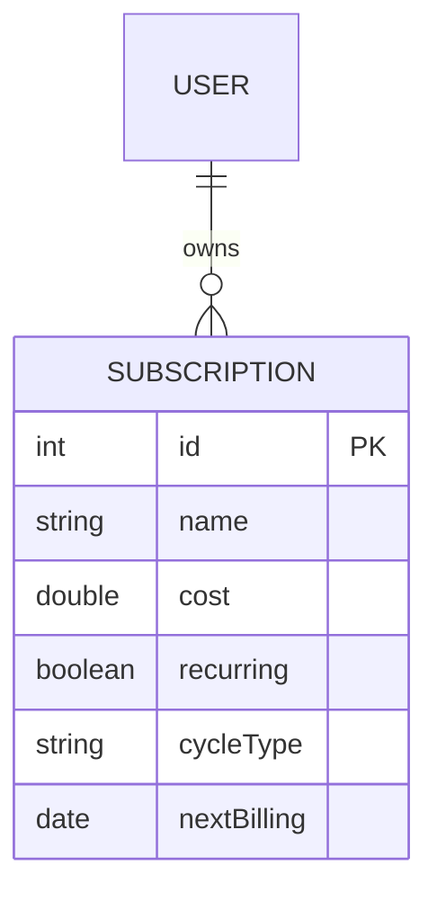
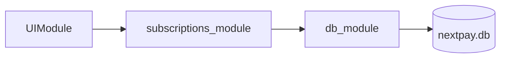
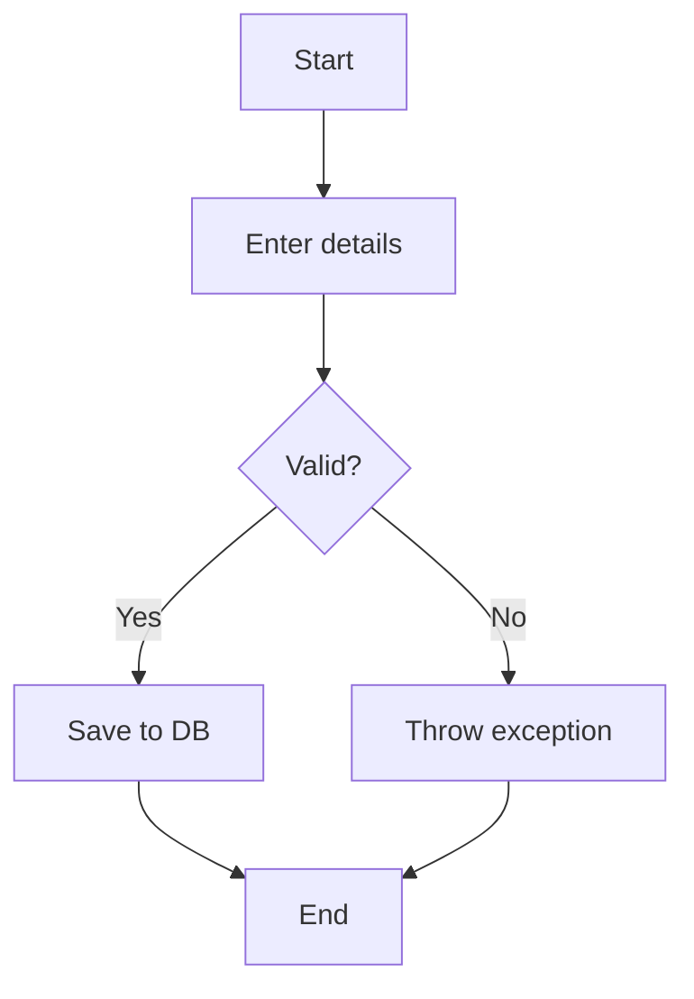
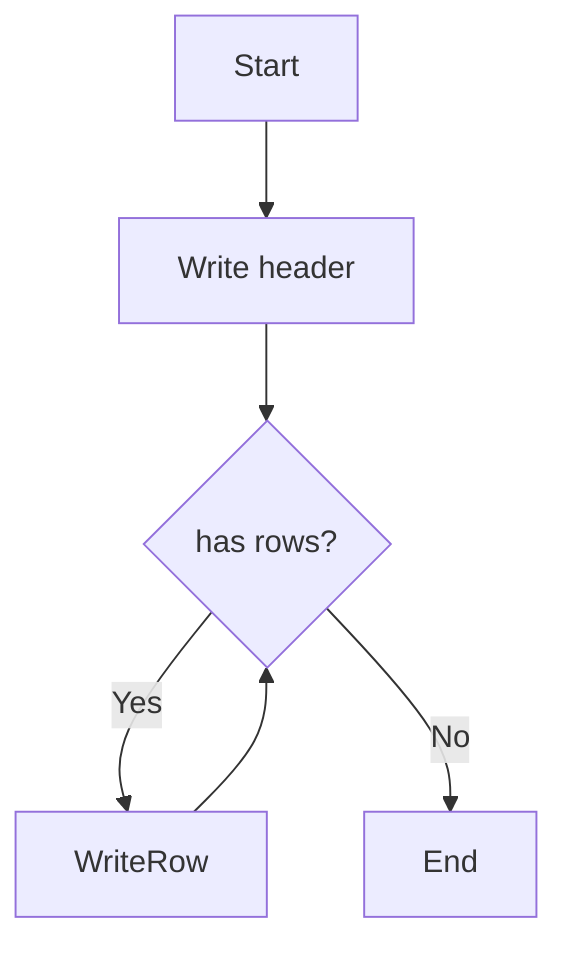
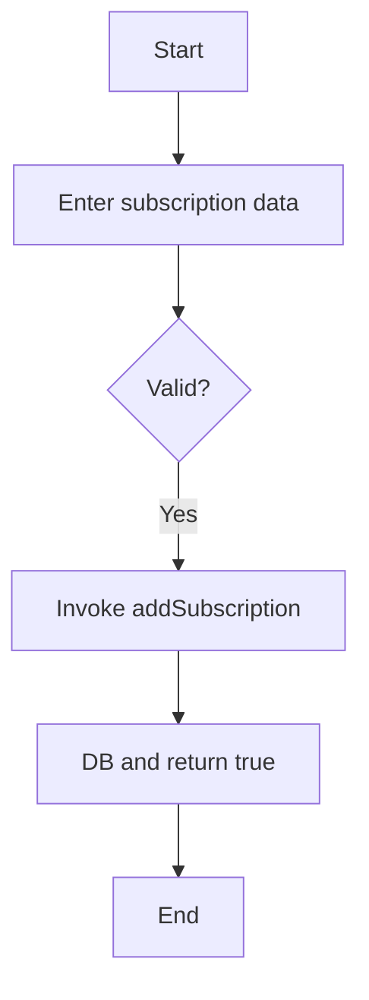
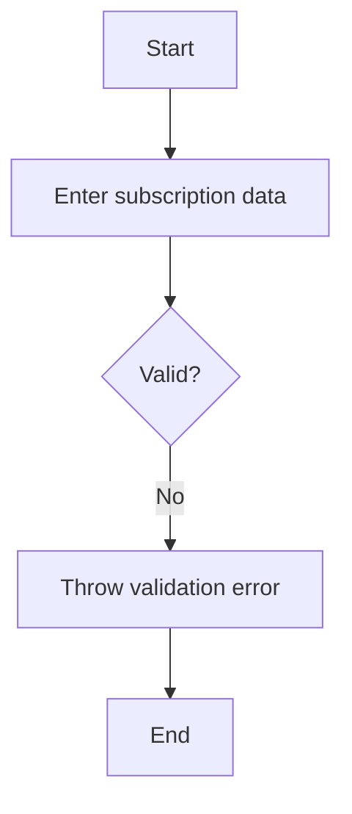
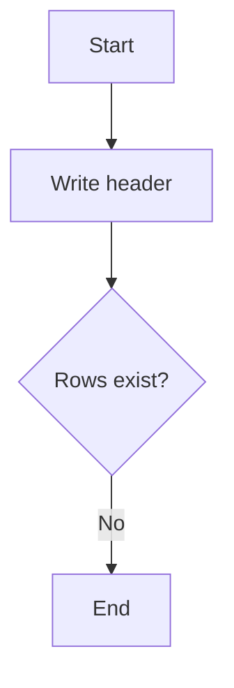
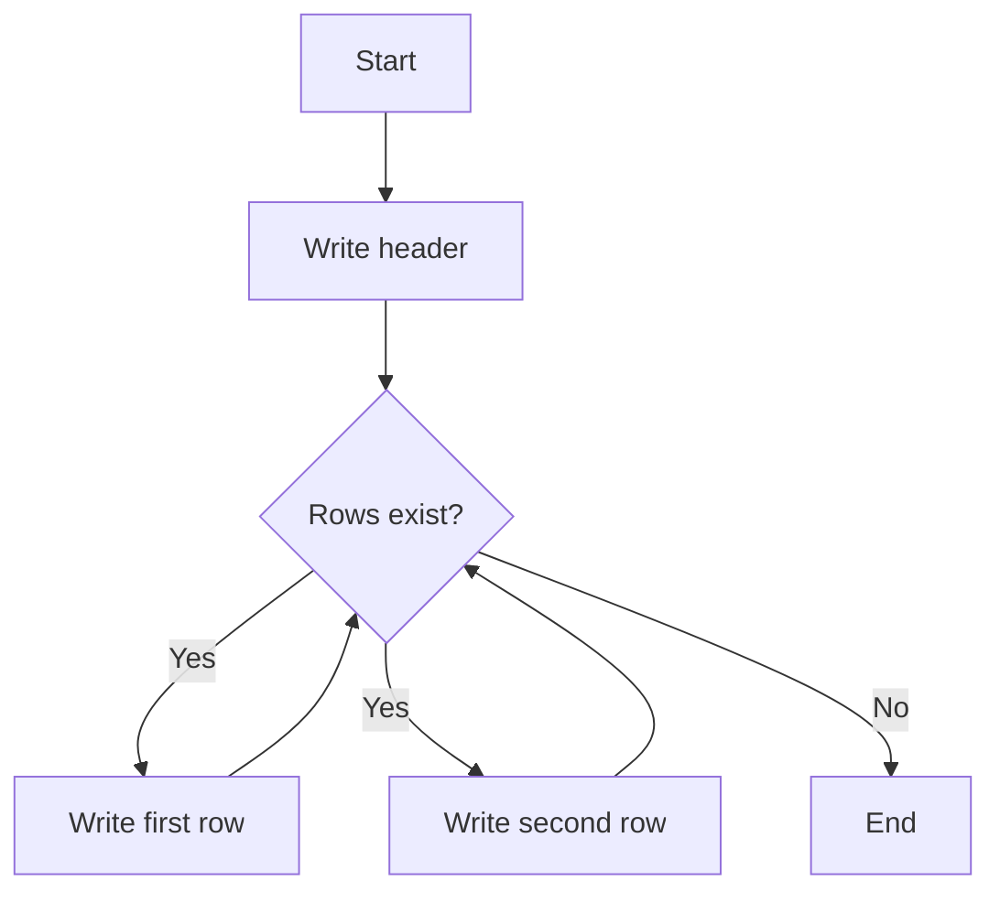
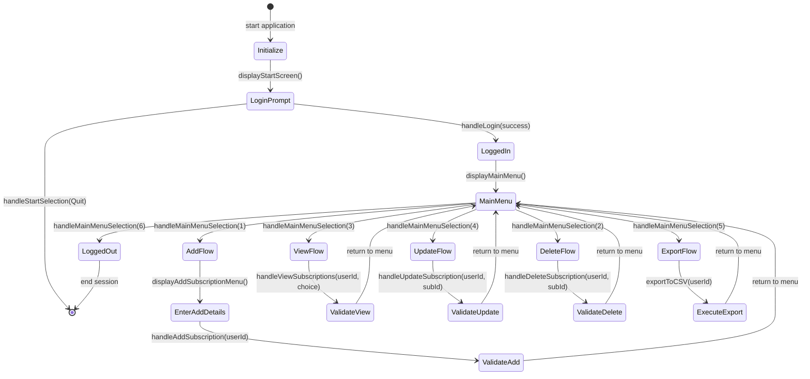
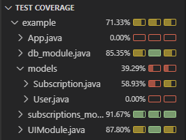

#### Scratchpad

## 5. Module & Data Diagrams
This section visualizes our NextPay system architecture through entity-relationship diagrams and module flow charts. The ERD shows the simple USER-SUBSCRIPTION relationship with key attributes, while the flow diagram illustrates data movement through our three-layer architecture from UI to database.

### ERD & Flow Diagrams

---

## 6. Control-Flow Graphs
Control-flow graphs visualize the execution paths through key methods, showing decision points and possible outcomes. These diagrams map directly to our prime path testing strategy and help identify edge cases for comprehensive test coverage.

---

#### 6.1 addSubscription

---

#### 6.2 export CSV

---

## 8. Test Paths & Cases
This section documents specific test paths and cases for our core subscription and CSV export functionality. Each test case maps to specific execution paths through the application, with corresponding flowcharts showing the decision points and outcomes for both successful and error scenarios.

---

### 8.1 Subscriptions

| ID  | Path              | Description                   | Expected Outcome |
| --- | ----------------- | ----------------------------- | ---------------- |
| TC1 | Start→Input→Save  | Add valid subscription        | Saved            |
| TC2 | Start→Input→Error | Add invalid (empty name/cost) | Exception        |

#### 8.1.1 Test Case Diagrams

---

### 8.2 CSV Export

| ID  | Path                   | Description        | Expected Outcome |
| --- | ---------------------- | ------------------ | ---------------- |
| TC3 | Start→Header→End       | Export empty list  | Header only      |
| TC4 | Start→Header→Write→End | Export two entries | Header + 2 rows  |

#### 8.2.1 Test Case Diagrams

---

| ID  | Path                   | Description            | Expected        |
| --- | ---------------------- | ---------------------- | --------------- |
| TC3 | Start→Header→End       | Export empty list      | Header only     |
| TC4 | Start→Header→Write→End | Export 2 subscriptions | Header + 2 rows |

---

## 9. System Testing & Coverage
System testing validates the complete NextPay application through end-to-end CLI scenarios and finite state machine modeling. We achieved 93 JUnit tests with zero failures, covering full user workflows (Login → Add → List → Update → Delete → Export), CLI navigation paths, and data persistence verification. Node coverage ensures all application states and transitions are tested through comprehensive FSM analysis.

We performed **system testing** across the full CLI application, driving end-to-end scenarios via the UI module and verifying persistence in SQLite. 93 JUnit tests ran with zero failures, covering:

* **Login** → Add → List → Update → Delete → Export flows
* CLI menu navigation and error paths
* Data persistence and CSV output

---

### 9.1 Finite State Machine & Node Coverage

We verified **node coverage** of the key application states via a finite-state machine (FSM). Each numbered transition maps to a UI action:

Every state and transition was exercised by at least one test, ensuring complete node coverage.

---

### 9.2 Test & Coverage Summary

**Total Tests:** 94 JUnit tests across all modules with zero failures.

| Test Class | Target Module | Coverage | Key Testing Areas |
|------------|---------------|----------|-------------------|
| `UITest` | `UIModule.java` | **87.80%** | CLI navigation, menu handling, user input validation, login flows |
| `db_moduleTest` | `db_module.java` | **85.35%** | Database operations, JDBC connections, CRUD operations, SQL queries |
| `subscriptions_moduleTest` | `subscriptions_module.java` | **91.67%** | Business logic, subscription validation, user ownership checks |
| `AppTest` | `App.java` | **0.00%** | Application entry point, module wiring (limited coverage by design) |
| N/A | `Subscription.java` | **58.93%** | Model class getters/setters, toString() methods |
| N/A | `User.java` | **0.00%** | Simple getters/setters only (trivial methods) |

**Coverage Notes:**
- Core logic methods exceed 85% coverage across all main modules
- Model classes have lower coverage due to trivial getters/setters and untested `toString()` methods
- UI display methods are difficult to automate but navigation handlers are fully tested
- App.java intentionally has lower coverage as it primarily wires modules together

---

### 9.3 Limitations
- **Model classes** (`Subscription`, `User`) have minimal testing (getters/setters, `toString()`)—low risk but lowers overall coverage.
- **UI menus** and CLI prompts are difficult to fully automate; while we test navigation handlers, the `display*` methods are not directly asserted.
- **Main entry point** (`App.java`): not covered by unit tests, as it simply wires modules and would require heavier integration tooling.

---